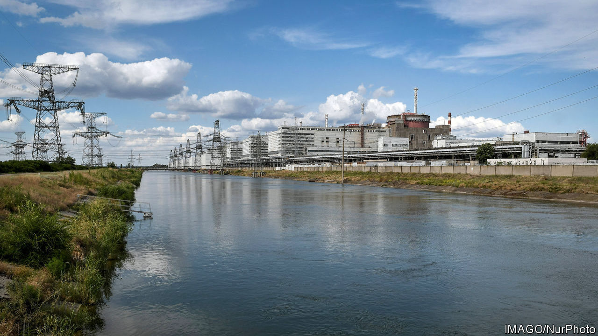
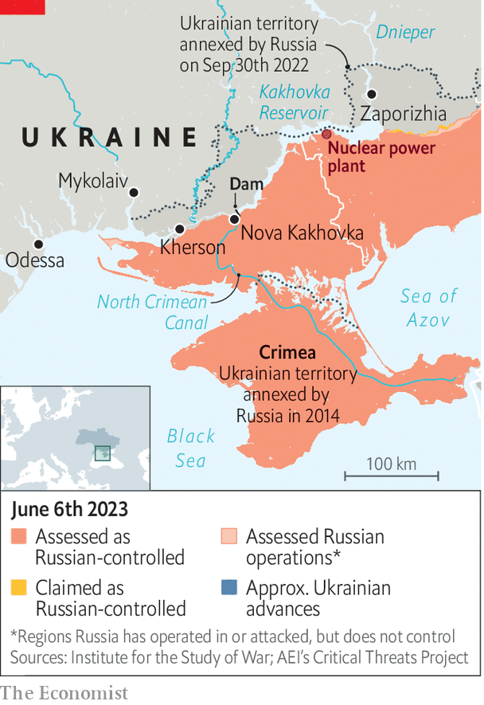

###### The Economist explains

# How the breach of Ukraine’s Kakhovka dam could affect a nuclear plant 

##### Water that would cool the Zaporizhia power plant is rushing out of the reservoir 

 

> Jun 7th 2023 

THE BLOWING up of  in occupied southern Ukraine in the early morning of June 6th has had devastating consequences downstream. On June 7th the Ukrainian government said that 42,000 people were at risk from flooding: thousands have been evacuated. Volodymyr Zelensky, the president, has said that hundreds of thousands are “without normal access” to drinking water. But the destruction could pose risks upstream, too, at the Zaporizhia nuclear-power plant. Europe’s largest nuclear plant draws water to cool its reactors from the Kakhovka reservoir behind the breached dam. The reservoir’s water levels are falling rapidly. How serious is the threat to the plant?

The Zaporizhia plant was  in March 2022. For more than eight months its six reactors have been in “shutdown” modes, meaning that they are well below their operational temperature but still require water to cool them. Five are in “cold shutdown”. According to Mark Wenman, a nuclear expert at Imperial College London, that means that the heat produced by the decay of the reactors’ radioactive fuel is not sufficient to boil off cooling water, which greatly reduces the need for new water in the system. The sixth reactor is in “warm shutdown”; it requires more water. And cooling water must also circulate through ponds containing spent and fresh fuel, lest they boil off. The plant requires anywhere from nearly 500,000 litres of water an hour to double that.

 


The United Nations’ nuclear watchdog, the International Atomic Energy Agency (IAEA), which has a team of monitors at the plant, says that there is “no immediate risk” to the facility. This is because water drawn from Kakhovka reservoir is held in an artificial lake near the plant. Leonid Oliynyk, a spokesman for Energoatom, Ukraine’s nuclear operator, which is based in Kyiv and ran the plant until Russian forces seized it, says the lake holds enough water for a few months. Others are less optimistic. In Enerhodar, a Russian-controlled town near the Zaporizhia plant, a former employee says use of the water and evaporation caused by warm weather could deplete it in just one month.

The Kakhovka reservoir’s waterline has been falling by as much as 9cm an hour, according to the IAEA. Others report faster depletion. Teams are working to channel as much water as possible from the reservoir to the plant’s reserves before the water level drops below valves that lead to the artificial lake. On Tuesday evening the IAEA reckoned that this could happen within a couple of days. Non-essential use of water at the nuclear facility has been restricted. But an advisor to Energoatom criticised the plant’s Russian management for keeping one of the reactors in hot shutdown. He attributes the decision to “an escalation of risks” strategy: a hotter reactor would pose a greater risk of meltdown if it were damaged in fighting at the plant, thereby complicating Ukraine’s efforts to recover the site.

For all that, the situation at the plant appears manageable. Some water can still be sucked out of the reservoir with mobile pumps even after the water there falls below the level of the valves. Water can also be diverted from Enerhodar’s municipal network. If it was indeed Russia that destroyed the dam, as most Western analysts suspect, the goal was probably not to trigger a meltdown.

One aim instead may have been to divert Ukraine’s resources towards evacuation, and thus . Another was probably to prevent the plant from generating electricity in the future, says the former employee in Enerhodar. It once generated 13% of Ukraine’s electricity. After the dam burst it is hard to imagine, she says, how the reactors could be fired up again. 

The IAEA has stressed the importance of protecting the plant’s water system. That seems obvious enough. But Russia might decide to create chaos to cover a retreat. If Russian forces lose their grip on the area, might they “blow something up again?”—perhaps the plant’s artificial lake, asks Mr Oliynyk. Sadly, such a scenario seems less implausible now than it did just a few days ago. ■

