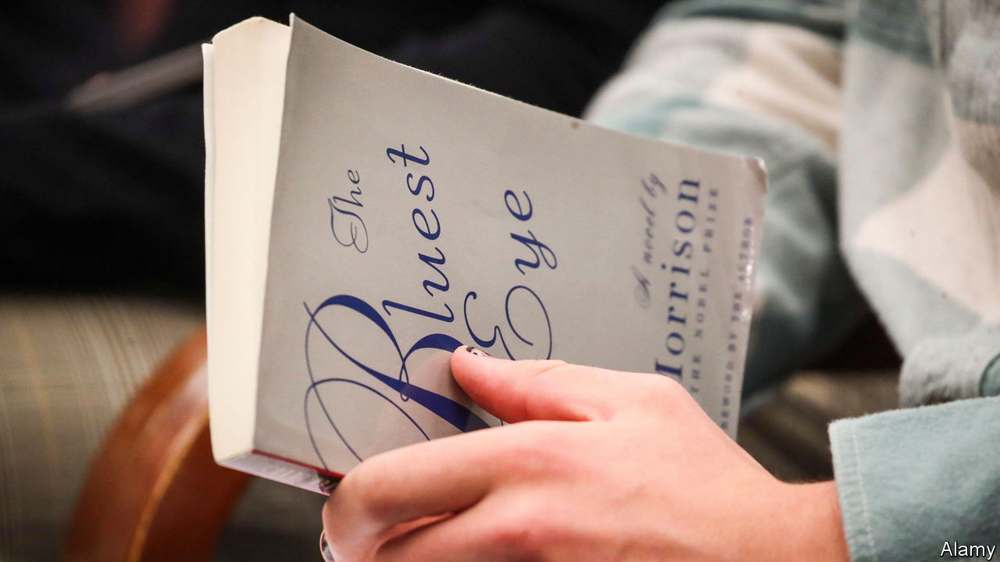

###### Banned books

# Eight books you are forbidden from reading 

##### In some places, at least. A brief world tour of book bans in the 21st century 

 

> Feb 24th 2023 


OVID WAS exiled by Augustus Caesar to a bleak village on the Black Sea. His satirical guide to seduction, “The Art of Love”, was banished from Roman libraries. In 1121 Peter Abelard, known for his writings on logic and his passion for Héloïse, was forced by the Catholic church to burn his own book. And in perhaps the most famous modern example of hostility to literature, Iran called for the murder of Salman Rushdie, author of “The Satanic Verses”, in 1989. For its perceived blasphemy, the novel remains banned in at least a dozen countries from Senegal to Singapore. Book-banning remains a favourite tool of the autocrat and the fundamentalist, who are both genuinely threatened by the wayward ideas that literature can contain. In democracies books can provoke a different sort of panic. Armies, prisons, prim parents and progressive zealots all seek to censor literature they fear could overthrow their values. Bans on books that shock, mock or titillate reveal much about a time and place. They invariably attract legions of curious readers, too. Here are seven books you shouldn’t read.

. By Taslima Nasrin. Translated by Anchita Ghatak. 

Lesser-known than the  condemning Sir Salman to death, but probably inspired by it, is that aimed at Taslima Nasrin for “Lajja” (Bengali for “shame”). Her novel depicts the revenge meted out by Muslims to  Hindu minority after a Hindu mob tore down a mosque in Ayodhya in India in 1992. It observes the Dutta family, who still bear the scars of earlier spasms of anti-Hindu violence; each member of the family deals in their own way with the latest. Bangladesh’s government banned the book. Ms Nasrin fled to Sweden and won the European Parliament’s Sakharov prize for freedom of thought in 1994. Photocopies of “Lajja” spread in Bangladesh; in India, Hindu fundamentalists distributed it as propaganda on buses and trains. Yet her novel was less about the conflict between Hindus and Muslims, said Ms Nasrin, than about that “between humanism and barbarism, between those who value freedom and those who do not”. The story still reverberates: a , a Hindu god, will open in 2024 on the site of the destroyed mosque.

. By Paek Nam Nyong. Translated by Immanuel Kim. 

“Friend” is the first novel approved by North Korea’s totalitarian regime to be available in English. Published in 1988, it is a beloved classic there. A compassionate account of characters caught up in marital strife and disappointed by their spouses, it is based on Paek Nam Nyong’s experience of sitting in on North Korean divorce hearings. An illuminating afterword by the book’s translator, who has met Mr Paek, situates it within North Korea’s literary output. It is the government of the country’s democratic neighbour, South Korea, that has banned the book for some readers. “Friend” is sold in the South’s bookstores. But its defence ministry includes it in a list of 23 “seditious books” banned for reading in the  (among them are two by Noam Chomsky, a linguist with radical politics). This prohibition applies to all male citizens for the 18 months, or more, of their mandatory military service. The ministry’s apparent fear is that a sympathetic portrait of South Korea’s hostile northern neighbour could undermine soldiers’ resolve to defend their country. Readers of “Friend” can expect some socialist-realist moralising. But this novel’s power is in its depiction of ordinary lives.

. By Hamid Ismailov. Translated by Donald Rayfield. 

When Hamid Ismailov was forced to flee Uzbekistan in 1992, he stood accused by his government of “unacceptable democratic tendencies”. In exile ever since, Mr Ismailov has written more than a dozen novels. All are banned in . Aptly, “The Devils’ Dance”—the first of his Uzbek novels to be translated into English—reimagines the lives of real Uzbek dissident intellectuals during their time in prison before their executions in 1938. They include the protagonist, Abdulla Qodiriy, a poet and playwright, and Choʻlpon, who translated Shakespeare into Uzbek. When Qodiriy was locked up by Stalin’s secret police a novel he had been writing on 19th-century khans, spies and poet-queens was destroyed. Mr Ismailov imagines that Qodiry reconstructs in his cell the novel he had been writing. (We  the book in translation in 2018.)

. By Toni Morrison. 

 celebrated novel about beauty and racial self-hatred has long appeared on lists of books banned in some of . Parents complain about passages that depict sexual violence; teachers counter that such topics are best broached in the classroom. “The Bluest Eye” was the fourth-most-banned book in the school year ending in 2022, says PEN America, a free-speech body. (Ahead of it were two on LGBT themes and a novel about an interracial teen couple.) The American Library Association (ALA) says that its tally of ban requests from school boards and removals from library shelves has never been so high: 1,600 titles in 2021. The political stakes have grown. In 2016 Virginia’s legislature passed the “Beloved bill”—named for another of Morrison’s controversial novels—to allow parents to exempt their children from reading assignments if they consider the material to be sexually explicit. The state’s Democratic governor vetoed the bill; his opposition to it was one reason he lost a bid for re-election to a Republican in 2021. “There is some hysteria associated with the idea of reading that is all out of proportion to what is in fact happening when one reads,” Morrison said—more than 40 years ago.

. By Yu Hua. Translated by Allan H. Barr. 

 government keeps tight control over printed matter: publication codes such as ISBNs are allocated, with rare exceptions, only to state-run publishers; censors scrutinise works before they go to print. But the boundaries for fiction can be more fluid. That let Yu Hua become a best-selling author in his native country of novels that depict China’s journey from the brutality of the Cultural Revolution to the dislocations wrought by materialism. But Mr Yu saw commonalities between history and the present, and to expand on these he turned to non-fiction: “China in Ten Words”, a collection of essays each built around a Mandarin term, is a mixture of memoir and meditation on past and contemporary China. It could not be published there. The first chapter, “People”, refers to the bloodshed at Tiananmen Square in 1989. Mr Yu refused to excise it. In expounding on words from “Revolution” to “Bamboozle” he offers a view of how China got to where it is.

. By Francesca Pardi. Illustrated by Altan. 

. By Peter Parnell and Justin Richardson. Illustrated by Henry Cole. 

What harm could one small, anthropomorphic egg do? A lot, if you ask the mayor of Venice. In 2015, within days of being sworn in, Luigi Brugnaro ordered  to ban 49 children’s books deemed a threat to “traditional” families. Uproar ensued, and Mr Brugnaro agreed to reinstate all but two of the books. One still off-limits is “Piccolo Uovo”, a delightful tale inspired by the real story of a penguin egg adopted by two male penguins in New York’s Central Park Zoo. Piccolo uovo (“Little egg”) is afraid to hatch because it wonders what its family will look like. It goes on a journey to meet families of many compositions and colours, and is satisfied that all are magnificent. Readers old and young who do not speak Italian might instead seek out an American children’s book about the same penguins that makes the same point: “And Tango Makes Three” has appeared on nine occasions in the ALA’s annual list of top-ten books banned from . 

 By various authors. Translated by various people. 

Parts are deemed by some religious traditions to be the word of God. Others bring the good news of Jesus. But the two-volume work has its first murder in its fourth chapter. And there is no mistaking the erotic charge of the Song of Songs. In June 2023 a school district in  removed the King James version of the Bible from the shelves of elementary and middle-school libraries under a state law that permits the ban of “instructional material that is pornographic or indecent”. But this petition was brought by a parent frustrated with bans of other books, including “The Bluest Eye”. Upset by the stunt, conservatives accused the parent of seeking to undermine Utah’s efforts to protect children from pornography. The Bible banner seems to share the perspective of Leviticus 24: “eye for eye, tooth for tooth”. ■


