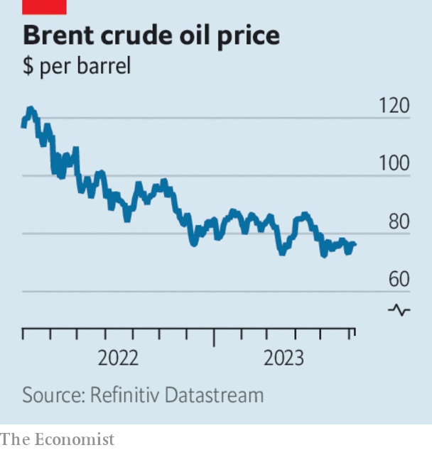

###### The world this week

# Business 

#####  

 

> Jun 8th 2023 

 unveiled the Vision Pro, a headset for virtual and augmented reality, at its developers conference in Cupertino, California. The new gadget, which is controlled by hand gestures, voice commands and eye movements, is pitched as a leap forward in “spatial computing”. When it hits the market next year it will cost $3,499. Pricey, too, are shares in the technology giant, which hit an all-time high on the day of the announcement, nudging the firm’s market capitalisation close to $3trn.

Putting differences aside

A  between ,  and  marked the end of a bitter schism in golf. LIV was launched last year by Saudi Arabia’s sovereign-wealth fund, luring star players away from the sport’s traditional tournaments with big cheques. The deal will end legal disputes between the groups and give the Gulf state another controversial foothold in global sport.

 slumped by more than expected in May, fuelling fears that the country’s economic recovery is losing steam. In the face of weak global demand, exports fell by 7.5% year-on-year. Exports to America were particularly hard hit during the period, declining by 18.2%.

America’s Securities and Exchange Commission took aim at two  in the latest blow to the industry. On June 5th the markets watchdog sued  and its boss, Changpeng Zhao, alleging violations including operating an unregistered securities exchange and mishandling customer funds. The next day it also charged  with breaking securities rules.

As geopolitical tensions increasingly disrupt cross-border investment, , an American venture-capital giant, announced it would split into three firms. By March 2024 the firm will shed its Chinese and Indian businesses. It told investors that it has become “increasingly complex to run a decentralised global investment business”.

, an American pharmaceutical giant, has sued authorities in an attempt to block rules for negotiating drug prices introduced last year as part of the Inflation Reduction Act. In its lawsuit Merck said that the measures are “tantamount to extortion”. 

, a Canadian miner, said it has received several proposals for deals involving its steelmaking coal business. The announcement comes after Teck’s plan to separate its coal business from its copper- and zinc-mining operations was disrupted by a takeover offer from , a commodities giant, in April.

Persistent inflation led the  to raise interest rates by 0.25 percentage points to 4.1%, in a move that took most economists by surprise. The  also surprised investors, raising its policy rate from 4.5% to 4.75%.

Volatile commodity prices since Russia’s invasion of Ukraine have meant big profits for traders such as , which reported record results for the six months to March. The firm pocketed net profits of $5.5bn, more than twice as much as during the same period last year. 

 


 announced a surprise cut to oil production in an attempt to boost falling prices; it will lower its output by 1m barrels per day in July. Other members of OPEC, which met in Vienna on June 4th, also agreed to extend previously announced cuts by a year to December 2024. 

The , Britain’s most prominent business lobby group, won its members’ endorsement for a plan to reform its governance and culture. The group was backed by 93% of votes cast following months of crisis involving allegations of misconduct and the departure of its boss, Tony Danker.

 reached a settlement with America’s Federal Trade Commission after being charged with illegally collecting data from children using its Xbox gaming system. As part of the deal the firm will be required to pay $20m to the authorities and take steps to bolster privacy protections for children using its consoles.

Industrial action shot

The , a union that represents movie and TV directors, reached a tentative agreement on pay with Hollywood studios to avert further disruption in the industry. Writers remain on strike after members of the  downed pens on May 2nd.

Chris Licht stepped down as boss of . Mr Licht’s departure follows a week of high drama at the news network after the publication of an explosive profile of the executive His exit is the latest headache for bosses at Warner Bros. Discovery since the completion of the blockbuster tie-up between WarnerMedia, CNN’s parent company, and Discovery last year. 

