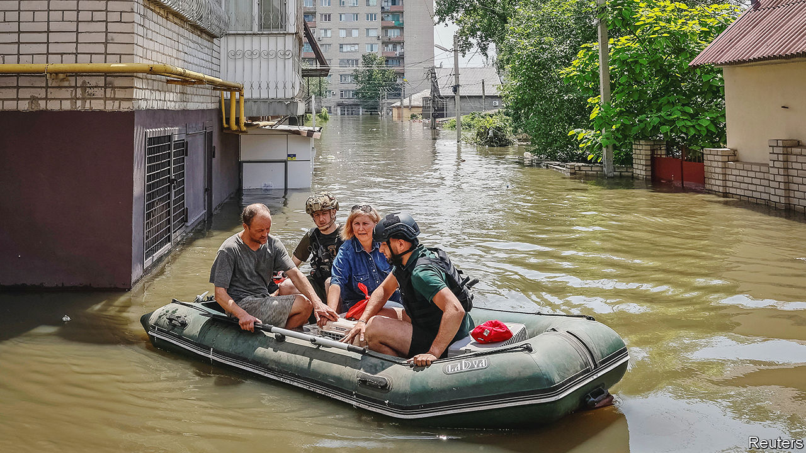
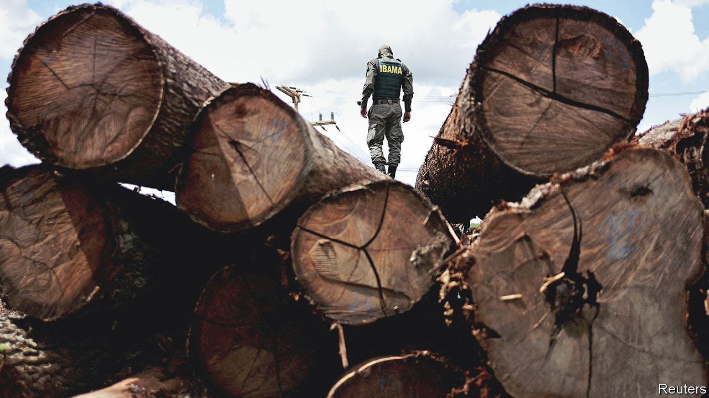

###### The world this week

# Politics 

#####  

 

> Jun 8th 2023 

The  on Ukraine’s Dnieper river was breached, leading to disastrous flooding in downstream cities that displaced thousands of people. Ukraine said Russia had blown it up, and America promised to release evidence backing that claim. Russia denied the accusation.

  its highly anticipated counter-offensive to recapture territory held by Russia in its east and south. In a few places its forces penetrated several kilometres into occupied areas. So far the attacks have been small, and a full-scale assault is believed to be yet to come.

It’s the economics, stupid

President Recep Tayyip Erdogan appointed mainstream economic thinkers to his government in. , the new finance minister, promised to pursue “rational” policies. The Turkish lira plunged, since markets expect this will mean less intervention to prop it up.

 became the first senior member of the British royal family to be cross-examined in court since the future Edward VII in 1891. The Duke of Sussex is suing Mirror Group Newspapers, claiming its journalists obtained information about him unlawfully, notably by phone-hacking.

moved to moderate a law creating a commission that could ban allegedly pro-Russian politicians from running for office, after massive street protests in the capital, Warsaw. Opposition parties think the law could be abused to block their members.

At least 23 people were killed and many more injured in  in clashes between security forces and protesters, according to Amnesty International. The violence began after Ousmane Sonko, a leading opposition figure, was sentenced to two years in prison for the “corruption of youth”. The sentence is expected to rule Mr Sonko out of next year’s presidential election.

Warring factions in  are reportedly restarting ceasefire talks sponsored by America and Saudi Arabia. Previous attempts have failed to hold for long. The conflict is now in its eighth week. 

officially reopened its embassy in , seven years after the two countries broke off diplomatic relations. Their rapprochement was brokered three months ago by China.

At least 288 people were killed in a  and derailment in Odisha, a state in eastern India. The disaster is potentially embarrassing for the central government, which has invested heavily in road and rail development. In general, India’s rail safety record is fairly impressive.

The Taliban were reported to have launched a successful crackdown on poppy production. Analysis of satellite imagery has suggested the opium harvest this year will be less than 20% of last year’s. In many fields, wheat has been planted in place of poppies.

At the , the most important security summit in Asia, held in Singapore, the world’s two biggest powers failed to communicate. Lloyd Austin, America’s top defence official, blasted China for refusing to hold military talks. China, in turn, blamed America for ramping up tensions by placing sanctions on Chinese officials and reinforcing its military presence in Asia. America released a video of a Chinese military vessel crossing the path of one of its destroyers in the , calling it an “unsafe” manoeuvre.

Wildfires in left swathes of North America choked in hazy smog. The New York City region recorded its worst-ever air quality, people were forced indoors and flights bound for New York-area airports were grounded due to low visibility. 

 president, Gustavo Petro, accepted the resignations of his chief of staff, Laura Sarabia, and ambassador to Venezuela, Armando Benedetti. The resignations follow revelations that intelligence services had wiretapped the mobile phone of Ms Sarabia’s former maid and the leak of a recording in which Mr Benedetti suggested money he helped raise for Mr Petro’s presidential campaign came from drug traffickers. The president denied all allegations of wrongdoing.

 


Luiz Inácio Lula da Silva, Brazil’s president, unveiled a plan to end illegal deforestation in the by 2030. The policy aims to strengthen law enforcement against environmental crimes, regularise land titles, and set up a tracing system for wood, livestock and other agricultural products from the Amazon. Lula, as the president is known, also promised to achieve net zero deforestation by planting as many trees as are cut down.

s foreign minister, Marcelo Ebrard, said he would step down to focus on the race to become the candidate for Morena, the ruling party, in presidential elections next year. Although he is respected, and currently second in the polls, he will struggle to beat Claudia Sheinbaum, the prominent mayor of Mexico City who is President Andrés Manuel López Obrador’s favoured successor. 

 was hit by a 4.9-magnitude earthquake and torrential rains that caused widespread flooding. Over 50 people died in the country, which is already racked by poverty and famine. 

Courtier turns contender

Chris Christie and Mike Pence launched long-shot bids for the  for president. Both were lieutenants of Donald Trump. Mr Pence served as his vice-president but broke ranks over his refusal to concede the presidential election in 2020. They face the tricky—arguably impossible—task of courting Republicans tired of Mr Trump without antagonising his many supporters.

 lawyers met Jack Smith, the special counsel investigating the Republican former president at the Department of Justice, signalling that Mr Smith may soon decide whether to file charges over the handling of classified documents. Mr Smith is also leading the probe into attempts to overturn the result of the election in 2020.

A gunman killed two people outside a high school graduation ceremony in Richmond, Virginia. There have been at least 279  in America in 2023, according to the Gun Violence Archive, a nonprofit research group.

Five countries were elected to the 15-strong : Algeria, Guyana, Sierra Leone, Slovenia and South Korea. They were elected for regional slots, each unopposed, except for Slovenia, which kept out Belarus, a close ally of Russia. Their two-year-long stints will start in January.

