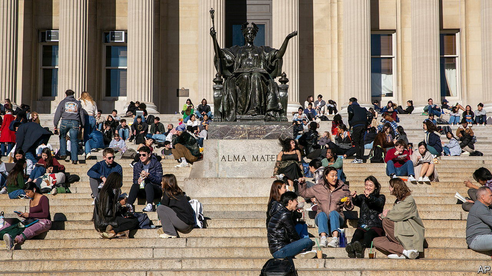

###### Opting out

# Columbia University ditches the college-ranking system 

##### The Ivy League departure could signal a turning-point in higher education 

 

> Jun 8th 2023 

On June 6th Columbia University announced that it will no longer co-operate with ’s undergraduate rankings. It is the first top-notch institution to do so. Might its departure be the start of a mass exodus?

Columbia’s decision follows a rankings scandal last year. In February 2022 one of Columbia’s own maths professors, Michael Thaddeus, accused the college of fudging its data in several areas. The university later admitted to having used “outdated and/or incorrect methodologies”.

 began ranking America’s top universities in 1983, and has released its findings annually since 1988. In the 1980s prospective students started to expand their college search beyond their local area, and it was hard to learn about universities and compare them, says Michael Sauder, a professor of sociology at the University of Iowa. “ filled an information gap at that time,” he adds. 

Colleges have gone to great lengths to move up in the ratings. Richard Freeland, Northeastern University’s former president, capped class sizes and hired faculty to improve its spot; it moved from 127th in 2003 to 44th this year. Others went too far. A dean at Temple University’s business school was sentenced to prison and was ordered to pay a $250,000 fine after being convicted of fraud in relation to artificially inflating his programme’s rankings. 

The ranking system used to seem unstoppable. Universities have tried to ditch it before, only to find that doing so can backfire badly.  still ranks non-participating universities, using publicly available information, and the data often do not go in their favour. Reed College, a liberal-arts college, stopped taking part in 1995. It tumbled from the top quartile to the bottom. Columbia did not submit data for this year’s analysis, citing concerns about Dr Thaddeus’s claims, and its ranking fell from second in 2021-22 (tied with Harvard University and Massachusetts Institute of Technology) to 18th in 2022-23 (tied with the University of Notre Dame).

Recently the mood has begun to change, however, especially among graduate schools. In 2022, 17 medical schools and 62 law schools did not submit data to . Yale and Harvard were the first leading law schools to leave, in November. By the release of the rankings, of the 15 highest-ranked law schools, only the University of Chicago submitted data. Some undergraduate schools have already opted out this year (Rhode Island School of Design, Colorado College, Stillman College), but none are as prestigious as Columbia. 

Its departure could give others cover for the decision to leave. Meanwhile another pillar of undergraduate education is under threat: standardised testing. Many universities made the SAT and ACT optional because of covid-19, then extended the policy beyond the pandemic’s end. In March Columbia became the first Ivy League university to no longer require such tests at all.

In May announced changes to its rankings methodology. It is moving away from metrics that rely on reputation (such as alumni giving scores) and towards student outcomes (such as graduating people from different backgrounds). One way or another, the rankings—and universities more broadly—are in flux. ■


