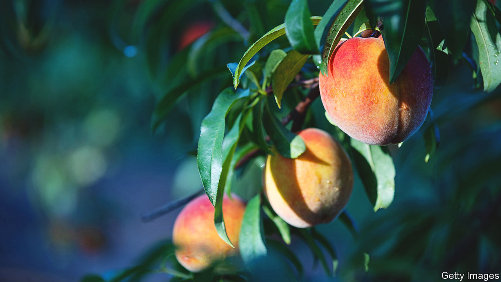

###### Slim pickings

# Georgia, the Peach State, has no peach crop this year 

##### But the fuzzy fruit is more cultural icon than economic export 

 

> Jun 8th 2023 

On a Monday in March Robert Dickey went to bed feeling sick to his stomach. After a few tropical weeks the temperature was dropping, and when it got numbingly cold, he knew that his thousand acres of blooming peach trees would be icy by morning. 

This year 90% of Georgia’s peach crop was destroyed by the freeze—an unusually balmy winter meant trees blossomed early, only for spring frosts to kill the flowers. The trio of orchards in middle Georgia, that grow 95% of the state’s peaches, typically ship more than 150m peaches to grocery stores. This summer trees are bare and no commercial trucks are being packed. The last time the farmers lost an entire crop was in 1955. 

Though the peach is a fussy plant to begin with—a characteristic that awards successful growers prestige in husbandry circles—climate change is giving farmers conniptions. In order to bear fruit, peach trees need 600 to 1,000 “chill hours” a year, when temperatures drop below 45°F (7°C). But winter averages have been climbing in Georgia and since 2016 crisp nights have become rare. 

Horticulturists are experimenting with spraying early buds with insulating goo to shield them from spring freezes and farmers are planting varieties that require less cold. Switching to pecans and strawberries (both far less temperamental crops) and chopping down timber helps growers get by. 

You might expect such a devastating harvest to bode badly for Georgia’s economy. In fact, the Peach State has a perplexingly small market for stone fruit. Cotton, peanuts and corn each bring in far more revenue. (Peaches generated $34m in 2022; cotton $1.4bn.) Nor is Georgia the main domestic supplier of peaches. Last year California dominated the market and South Carolina took second place. Why, then, does the fruit loom so large in the state’s identity?

Before the Civil War peaches grew wild on plantations and roadsides. On the eve of Reconstruction, with slavery scrapped and the Southern economy in shambles, businessmen were looking to rebrand themselves to attract Northern investment. Cotton-growing stank of the Confederacy, but peaches were sweet. Soon Georgians took to growing them. Since spring came earlier down South, farmers could get fruit to the New York market before others, and buyers paid a premium for that. Yankee investors got hooked on the yellow, meaty Elberta variety, newly bred in Georgia, and by the 1920s refrigerated railcars hauled fruit north. Newspapers declared that “queen peach” had “dethroned king cotton”. 

As a cultural marketing ploy the peach was a hit, says Tom Okie, a historian at Kennesaw State University. By the 1950s images of the fuzzy fruit were on licence plates, peach festivals drew crowds and men called women they fancied “Georgia peaches”. The fruit symbolised a progressive, sophisticated and economically open new South. 

The peach harvest was always unpredictable, but as demand grew it became harder to promise stock to merchants. Farmers in the milder California valley offered more consistency. Profits in the Southeast fell. According to farm records, in 1885 Georgia farmers sold peaches for $15 a bushel. Though that is nearly $500 in today’s dollars, farmers claim they now struggle to charge $15.

Pam Knox, a climatologist at the University of Georgia, says that orchards should be fuller next summer, since an El Niño cool phase is headed to the Southeast. But farmers see every year as a gamble, with the odds getting a tad worse each play. The occasional bumper crop fuels addiction. “A year like this makes me want to double down,” says Lawton Pearson, a fifth-generation peach farmer who vows to never walk away. “That’s the drug, that next year will be better.” ■


