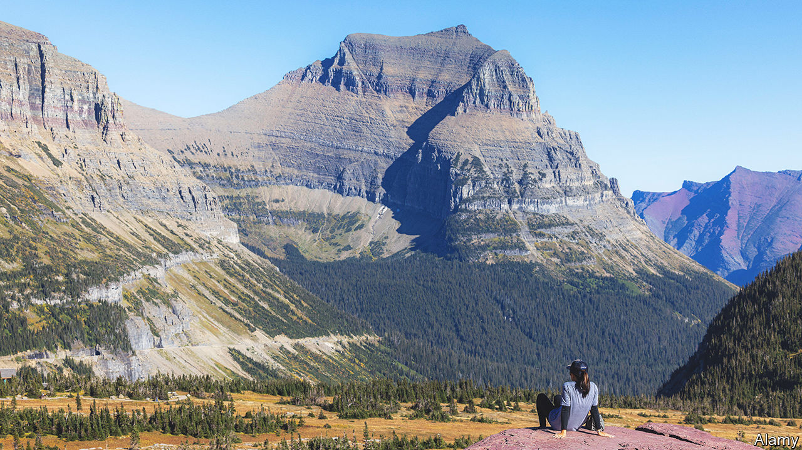

###### Constitutional convulsions

# Montana, climate-change pioneer 

##### The state’s politics pit liberals trying to preserve the state constitution against conservatives trying to rewrite it 

 

> Jun 8th 2023 

MAE NAN ELLINGSON was a widowed 24-year-old graduate student when she was elected to be a delegate to Montana’s constitutional convention. She was from Texas but her late husband had taken her back to his home state. They spent their honeymoon car-camping through Montana, snowshoeing in Glacier Park. When Ms Ellingson co-wrote the constitution’s preamble in 1972, she put the state’s natural assets at the very top. The people of Montana are “grateful to God for the quiet beauty of our state, the grandeur of our mountains, the vastness of our rolling plains”.

Montanans dress as though a hike may present itself at any moment, and indeed one might. Mountains envelop the freeway. Pickup trucks park on the shoulders of I-90 while their drivers fish the Clark Fork river. Their relationship with the outdoors is codified in the state’s constitution. The legislature is tasked with ensuring that the state “maintain and improve a clean and healthful environment…for present and future generations”. Pointing to this document, a group of 16 youth plaintiffs are taking the government to court on June 12th, arguing that, by favouring fossil fuels over renewables, the state’s energy policies have violated their constitutional right. 

One spokesperson for the state’s top prosecutor has called this case, , a “show trial”; another accused Our Children’s Trust, the non-profit firm behind it, of “exploiting” children. When the suit was filed in 2020, the plaintiffs ranged in age from two to 18. One of the older plaintiffs, Grace Gibson-Snyder, is a sixth-generation Montanan. She talks of the wildfire smoke that has kept her from backpacking and the glaciers that she has seen melt over the years.

Nationally, Democrats generally wish to amend constitutions and Republicans to preserve them. In Montana, it is the other way round. When Ms Ellingson and her fellow delegates travelled to Helena in 1972, it was a heady time for social and environmental radicalism. Four other state constitutions were redrafted to guarantee environmental rights during the period between 1965 and 1980.

Montana’s legislators can change the constitution by approving amendments with a two-thirds vote, then securing the majority of the electorate. But the legislature put no such amendments forward this session, opting instead to pass laws that its own legal researchers flagged for not conforming to the constitution. For example, Montana grants citizens an explicit right to privacy. The state’s Supreme Court has interpreted it to mean that abortions are protected. Nevertheless Republican legislators passed multiple bills restricting access to the procedure, including one that in effect created a 15-week abortion ban (it was temporarily blocked by a judge).

“I call it trying to amend the constitution from the bottom up,” says Evan Barrett, the former head of Montana’s Democratic party. “You force statutory change and you hope nobody challenges it.” Steve Fitzpatrick, the state Senate majority leader, rejects allegations of a backhanded amendment strategy. But the document, he concedes, “reflects its times”, and “obviously we’ve gotten more conservative over the years.” 

The result is a lot of lawsuits: over 20 laws passed in the last legislative session were challenged on constitutional grounds, according to a database from the Montana Free Press. Raph Graybill, a lawyer in Helena whose grandfather was president of the 1972 convention, estimates that “about half the work I do is constitutional challenges.” He represents Planned Parenthood, which has challenged at least four abortion-related laws this session. He says the barrage has stressed the court system, which “is not set up to just routinely be assessing constitutionality of laws”.

In March the legislature dissolved the energy policy at the core of the case, a move some said was designed to derail the trial. The judge said that it could proceed, but narrowed the scope of the lawsuit. The plaintiffs are seeking declaratory relief, asking the judge to weigh in on the constitutionality of the state’s policies. No more, and no less, than words on a page. ■


