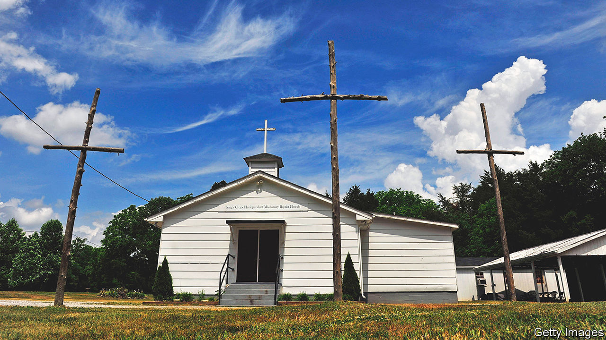
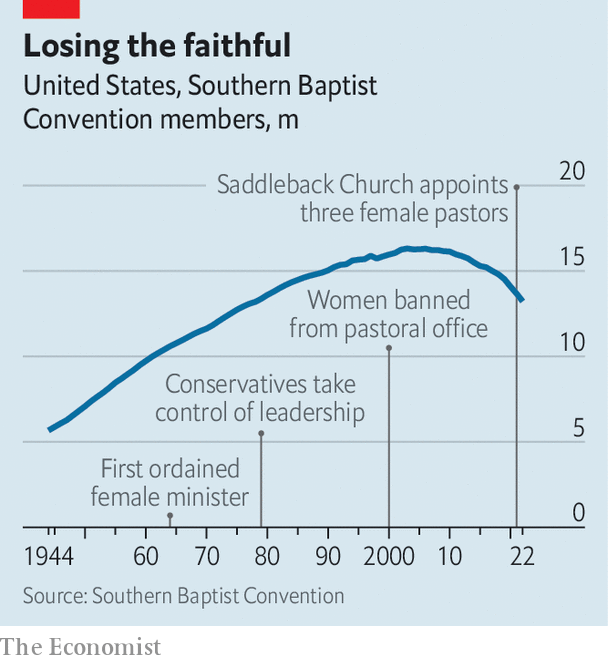

###### The Big Uneasy

# Southern Baptists are arguing about the extent of male authority 

##### Getting ready for a row at their annual meeting in New Orleans 

 

> Jun 8th 2023 

As the pastor of a small church in a small city, Jennifer Brown is warm and solicitous. But at the mention of Mother’s Day she turns exasperated: she hates it. For years, in the Southern Baptist churches in which she was raised, it was the only time that she was permitted to take the pulpit. Even then it was called a “reflection”, not a sermon, and a male pastor would introduce her, signalling that he authorised her presence there. 

Among Southern Baptists, preaching to both sexes is a man’s job. When Beth Moore, an evangelical celebrity, tweeted in 2019 that she would be leading a Mother’s Day service, she added, wryly, “please don’t tell anyone”. She was amazed at the uproar that followed. Vilified, she stopped calling herself a Southern Baptist two years later.

The Southern Baptist Convention (SBC), America’s largest Protestant denomination with 13.2m adherents, which begins its annual meeting on June 13th in New Orleans, has long treated women as subordinate to men. “Complementarianism”—the idea that men and women occupy distinct but equal roles, with men exercising spiritual authority—is the preferred term. Women can be Bible teachers, not preachers, and instruct only other women or children. “I thrive under my husband’s headship,” says Erin Wheeler, a Bible teacher and pastor’s wife in Fayetteville, Arkansas. “There’s no oppression in it.”

 


Things were not always so doctrinaire. By the mid-1980s, 200 women had been ordained as pastors. A confab in 1978 to identify job opportunities for women in the church had a distinctly “feminist feeling”, reported a Baptist newspaper. But a year later conservatives commandeered the leadership of the SBC, and began to purge women from seminaries. In 1998 the SBC amended its statement of faith to affirm that a wife should “submit herself graciously” to her husband. In 2000 it said that only men can be pastors. Churches that disagreed were hounded out.

Ms Brown’s story illustrates that fraught history. Her mother had attended the SBC’s flagship seminary in Louisville and served as ordained clergy. By the time Ms Brown felt her own pastoral calling, it was clear that her career would be made outside the denomination. The progressive, LGBT-affirming church that she now leads, University Baptist in Hattiesburg, Mississippi, left the SBC years ago. Mozella Conville, a congregant of 44 years, notes with pride that it was the first Southern Baptist church in Hattiesburg to desegregate and that the people in the pews were just fine with ordaining female pastors: it “didn’t mean a thing” to them.

Complements all round

The Baptist confession of faith is a guideline, not a mandate; local autonomy is central to the religious tradition. Some churches continued ordaining women discreetly and calling them associate or youth pastors. Now the fight has flared up again. In February the SBC expelled five churches over the issue. Among them was Saddleback, a megachurch in California (the second-largest in the denomination) founded by Rick Warren, one of the most prominent evangelicals and the closest approximation to a modern-day Billy Graham. He plans to contest Saddleback’s ouster at the gathering in New Orleans.

Ultra-conservatives are girding themselves for a fight. They want to amend the convention’s constitution to bar women from serving as a “pastor of any kind”, not just the top job. What seems like an abstruse row reveals a big, symbolic one about liberal creep. “Once a denomination has female pastors, it’s usually just a matter of time until they ordain homosexual pastors,” warn the leaders of the effort.

All this is a distraction from the SBC’s real problems. In recent years hundreds of sexual-abuse allegations have surfaced, implicating pastors directly and in the cover-up. And ever more people are leaving the faith. In 2012 there were three baptisms for every congregant who quit. Last year the SBC lost two-and-a-half members for every baptism. Ultra-conservatives think doctrinal purity will restore the denomination’s strength. In truth that dynamic—where decline spurs fundamentalism—looks self-reinforcing. 

Courtney Reissig, who designs the Sunday-school curriculum at a Southern Baptist church in Little Rock, Arkansas, sees hypocrisy among some pastors who fixate on the question of whether women can do the job. She agrees that would be unbiblical. But then she whips out her Bible and reads from the First Epistle to Timothy, which exhorts church leaders to be self-controlled, above reproach and sober-minded. There are male pastors, she tuts, who are “disobeying scripture too”. ■


