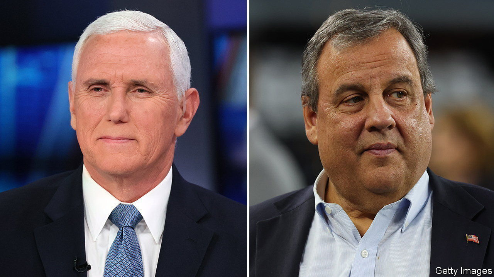

###### The Republican pack

# The bad bind bedevilling Mike Pence and Chris Christie 

##### Former courtiers to Donald Trump try to take down their old boss 

 

> Jun 6th 2023 

Whether they grimace or they grin as they say it, more and more Republicans seem to agree that  is likely to capture the party’s presidential nomination. But that has not deterred others from hoping against hope and entering the contest. Chris Christie, a former Republican governor of New Jersey, announced his candidacy from New Hampshire on June 6th; Mike Pence, a former vice-president, announced his own bid from Iowa the following day. A less prominent contender, Doug Burgum, the North Dakota governor, also entered the fray. 

Study the histories and motivations of Messrs Christie and Pence—with all due apologies to Mr Burgum—and you quickly see the problem with much of the effort to dethrone the former president. Pitching Trumpism without Trump is much harder when you were a devoted courtier to him.

The two men will confront the same problem differently. Mr Pence is a polite, midwestern evangelical Christian who loyally served as deputy to the brash boss. Throughout almost every scandal of the Trump administration, he remained remarkably supine. But in the aftermath of the election of 2020, Mr Pence’s spine stiffened even as most elected Republicans were seen to be made of spongier stuff. Rather than accede to Mr Trump’s demands that he hijack the procedural transfer of power on January 6th 2021 and declare him the winner, Mr Pence certified Joe Biden’s victory. A crowd of Trump supporters descended on the Capitol, some intending to lynch the vice-president. “Mike Pence didn’t have the courage to do what should have been done,” Mr Trump tweeted from the White House, mid-riot. 

And yet, even afterwards, something servile remained about Mr Pence. His memoir, titled “So Help Me God” markets itself as “the most robust defence of the Trump record of anyone who served in the administration.” His announcement video criticised Mr Biden at length, but was silent on Mr Trump. Mr Pence hopes his actions on January 6th will endear him to the Trump-sceptical minority of the party; and that his subsequent refusal to say bad words about Mr Trump will endear him to MAGA devotees. He may find that in fact he appeals to neither camp.

Mr Christie is in a similar bind. After his  failed in 2016, he was the first candidate to endorse Mr Trump, lending valuable credibility to the New York mogul. Mr Christie earned himself the reward of several high-profile advisory jobs. But in September 2020 he became critically ill with covid-19 after attending a reception at the White House that turned out to be a superspreader event. Mr Trump called him in intensive care to ask that he not tell reporters where he was infected; Mr Christie did so anyway. 

It was the beginning of the end of a beautiful friendship. Like many Republicans who served under Mr Trump, Mr Christie experienced public pangs of conscience after January 6th, blaming the president’s rhetoric for the violence. But unlike the ever-polite Mr Pence, Mr Christie will probably seek to escape his awkward past by going on the attack. 

The former New Jersey governor was seen as astoundingly pugnacious for a would-be president—up until Mr Trump arrived and broke the scale. Having scored one of the more memorable debate demolitions in recent memory (in 2016 he made Marco Rubio, a Florida senator, look like a broken automaton), Mr Christie may be one of the few men who can stand up, rhetorically and physically, to Mr Trump on a debate stage. At an event announcing his candidacy this week, Mr Christie castigated his former boss in unusually direct terms as “a bitter, angry man”. Other contenders have calculated that assaulting Mr Trump head on is a suicidal strategy; Mr Christie may stand out by doing so. 

As for the front-runner, Mr Trump has been relatively welcoming to new challengers. Each of them fractures the field a little more and makes an upset a little harder to achieve. Instead of attacking the president head-on, some candidates are hoping to first bulldoze , the Florida governor and current runner-up in the polls, before confronting their biggest obstacle. (Mr DeSantis does appear to be an easy mark for Mr Christie’s talents.) All long-shot candidates tend to dream of a breakthrough debate performance or of surprising strength in  after a Stakhanovite feat of campaigning. But at least one of those paths may be harder than usual to pursue. Rather than deal with the mass of candidates chasing him at the first televised primary debate, to be held in August, Mr Trump may elect to skip it altogether. ■


