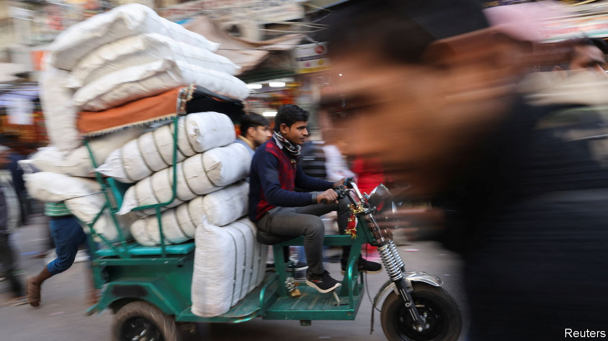
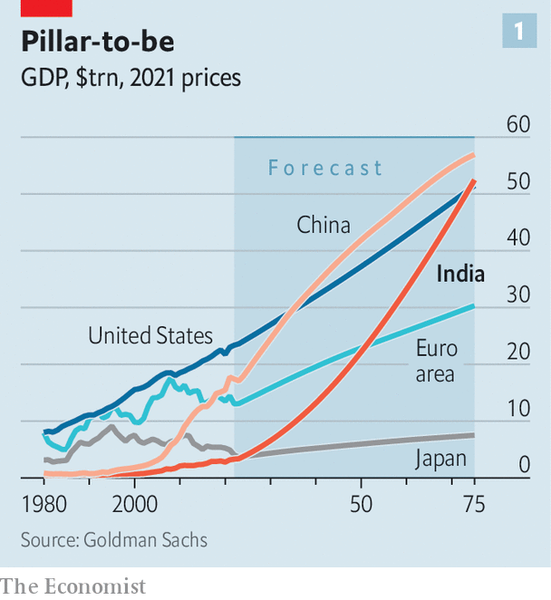
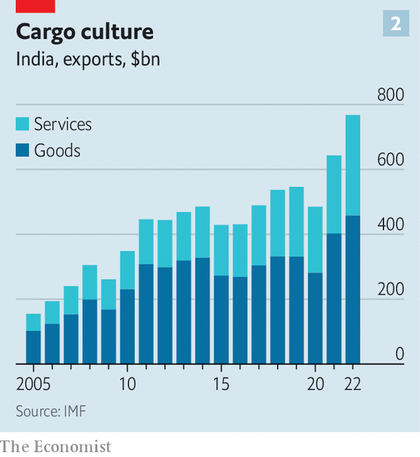

###### The elephant in a boom

# America is courting India in part for its growing economic clout 

##### But a young population may not be enough to sustain rapid growth 

 

> Jun 13th 2023 

FEW visitors can expect the sort of welcome , India’s prime minister, will receive in Washington later this month. Joe Biden, America’s president, is throwing a formal banquet for him at the White House. The leaders of the two chambers of Congress, not to be outdone, have invited him to address a joint session for the second time—an honour previously accorded only to the likes of Winston Churchill. The visit will, in the words of a gushing White House press release, “affirm the deep and close partnership between the United States and India”.

In fact, the partnership between India and America has never been that deep or close. But America’s leaders, both Republican and Democratic, . They see India as an indispensable accomplice in their rivalry with China. After all, India recently became the world’s most populous country. Its  has become more assertive and more hostile to China of late, even if it remains opposed to the idea of an American-led order. Its diaspora is the world’s biggest, and . But India’s allure also rests on the sense that its economy may at last be starting to fulfil its potential. It is already the world’s fifth-biggest. Mr Modi has promised growth of a sort that would turn it into a pillar of the world economy, on a par with America, China or the European Union. Despite the many failings of his government’s economic management, it is not an implausible target.

India’s economy will boom, Mr Modi’s lieutenants argue, because of its young workforce, muscular industrial policy and the opportunities presented by Western firms’ sudden wariness of China. Many high-flying businessmen are persuaded. Tim Cook, Apple’s boss, who has just opened its first store in India, declared to investors last month, “The dynamism in the market, the vibrancy, are unbelievable…India is at a tipping point.” Days later Foxconn, a Taiwanese electronics firm, broke ground on a $500m factory. India’s GDP grew by 6.1% in the first quarter, year-on-year. Investment as a share of gdp is at its highest for over a decade.

There is no shortage of sceptics. Some point to cronyism and protectionism, which hold the economy back; others complain that dodgy statistics exaggerate its growth. India was hit badly during the pandemic, causing enduring suffering among the poor. Westerners see Mr Modi’s erosion of democratic norms and growing sectarianism as potential threats to growth. Chinese officials, meanwhile, think India is not authoritarian enough. In March your correspondent heard one tell an audience of global bosses that India’s linguistic diversity, its layers of legislation and its poorly educated workers made it an unattractive place to do business.

 


But for India to become a pillar of the world economy, no miraculous improvement on all these scores is required. It just needs to keep growing at roughly its present pace. Goldman Sachs projects India’s GDP will overtake the euro area’s in 2051 and America’s by 2075 (see chart 1). That assumes a growth rate of 5.8% for the next five years, 4.6% in the 2030s and lower beyond.

Goldman’s confidence rests partly on demography. The workforces of China and the eu are shrinking as their populations age. But according to projections from the oecd, a club mostly of rich countries, India’s will grow until the late 2040s. The swelling supply of labour accounts for a full percentage point in Goldman’s forecast of India’s annual economic growth over the next five years. India will, however, remain relatively poor. Even by 2075 its output per person will be 45% lower than China’s and about 75% below America’s. 


In 1700 India’s economy was the world’s biggest, eclipsing even China. But its share of global output declined throughout the colonial era and in 1993, after a financial crisis, hit a humiliating low of 1% when measured using market exchange rates. Since then it has grown fast, a trend that has continued after Mr Modi’s election in 2014. India now accounts for 3.6% of global GDP, the same as China in 2000. By 2028, the IMF forecasts, it will hit 4.2%, overtaking both Germany and Japan. India’s heft is growing in other ways, as well: its stockmarket is the fourth-biggest after those of America, China and Japan. Its annual exports of goods and services relative to GDP are near record levels. They have grown by 73% over the past decade, and as a result India’s share of global exports has gone from 1.9% in 2012 to 2.4% in 2022.

Transport infrastructure has  under Mr Modi and his recent predecessors. Investment in it has more than tripled as a share of GDP compared with the mid-2010s. The length of the road network has increased by about 25%, to 6m kilometres, since 2014. The number of airports has doubled—and many of the new ones rival the sleekest in the rich world. Digital infrastructure has also blossomed, with 832m broadband connections as of last year and a range of state-sponsored digital services, from e-banking to welfare payments, that reach hundreds of millions of people. There is a build-out of energy infrastructure, too: India will add more solar generating capacity in 2023 than anywhere else bar America and China, according to Bloomberg New Energy Finance. 

 


India is unusually reliant on services for a developing economy: they account for about 40% of all exports (see chart 2). That makes India the world’s seventh-largest exporter of services, accounting for 4.5% of the global total, up from 3.2% a decade ago. Its big tech-services firms have been on a growth spurt since the pandemic began, hiring eagerly and honing their software, which is sold around the world. Links to Silicon Valley via India’s vast diaspora help maintain the pace of innovation and support a nascent startup culture. 

The catch is that the IT-services industry, while earning a huge $200bn-odd in export revenues, directly employs a mere 5m or so people. Indeed, out of a total of over 900m people of working age, only about half are in the labour force and perhaps 60m have formal jobs. One way to remedy this would be to create more blue-collar employment by fostering manufacturing. This has been a preoccupation of Indian policymaking for three decades.

Mr Modi’s manufacturing push, under the slogan “Make in India”, aims to seize on Western firms’ desire to diversify their supply chains away from China. India’s infrastructure has improved, it offers a sizeable domestic market and it is awash with potential workers. An IMF study in April concluded that it would be one of the few places to benefit if supply chains were split by a geopolitical divide. To that end, Mr Modi launched a $33bn subsidy scheme in 2020, using “production-linked incentives” (PLIs), which reward firms in 14 industries, from pharmaceuticals to solar panels, if their sales hit certain targets. 

Some manufacturing is booming: exports of machinery, electronics and vehicles or parts have risen by 63% in the past five years and are now a fifth of all goods exports. Apple assembles 7% of its handsets in India, according to Bloomberg. Indian conglomerates, including Tata Group, are investing in electronics. Nonetheless, although PLIs have prompted plenty of announcements, actual capital deployed so far is probably below $10bn. One big project, a $19bn semiconductor plant in Gujarat, has stalled, according to some reports. 

Manufacturing grew by only 4.5% year-on-year in the last quarter of 2022, and as a share of GDP, at 17%, is only a little above the average for the past decade. About a third of the increase in exports of goods by value since 2019 reflects India’s growing purchases of Russian oil, some of which is refined and re-exported. Vietnam has captured more activity displaced from China than India, whose share of global goods exports has risen only marginally, to 1.8% in 2022 from 1.6% in 2012. In short, there is no big bang in manufacturing in India, although steady growth may continue.

Is this unusual pattern of growth sustainable? Elements of the formula seem sure to endure, including an abundant workforce, strong elite education, an entrepreneurial culture and valuable links to an influential diaspora. Mr Modi is expected to win a third term in office next year. That will provide continuity in economic policymaking at the central level, especially for the infrastructure splurge. Closer relations with America are also helpful for the economy. America, after all, is the buyer of many of India’s exports of services. And with a relatively closed banking system, India will continue to rely on Western networks for cross-border payments.

East lenders

Meanwhile financial instability, a plague in the past, seems less of a risk. The  has been cleaned up and corporate debt is low. Like China, India has large currency reserves. It also inhibits foreign investment in its banks and government-debt markets to diminish the risk of destabilising capital flight. An attack by short-sellers in January on , a well-connected conglomerate, revealed flaws in India’s capital markets, such as opaque governance, but also a degree of resilience: they shrugged off the episode.

But three threats do loom. First, the boom in IT services could run out of steam. India’s firms have access to a huge pool of skilled labour, and so have adopted a labour-intensive model. But new technology, including artificial intelligence, could undermine this strategy. In preparation, the industry is diversifying into new fields, such as data-science, often provided through “global capability centres” for foreign firms. And it is expanding in accounting and consulting: non-tech services made up about a fifth of all services exports in the last quarter.

The second risk is that Mr Modi’s promotion of domestic champions and erosion of institutions, including the courts, may begin to deter foreign investment. Many Chinese tech firms have been banned. Multinationals have long had to deal with India’s fluid tariffs, rules and taxes. Now they increasingly feel the need to strike deals with big domestic firms: Holcim, a European cement firm, sold its Indian arm to Adani; Meta invests in Reliance Industries, which has a large digital arm. 

Fear of an uneven playing field may explain why gross inflows of foreign direct investment have slowed from a rough average of $7bn a month for the past few years to below $5bn in February and March. There are other signs of tentativeness from big foreign investors. We examined the exposure to India of the four global banks most active there, which often cater to multinationals. On average their exposure to India fell by 11% in 2022 in dollar terms.

But India’s government probably reckons that in the longer term it is big enough to draw Western firms, however warped the rules of the game. Their subsidiaries there have sales of almost a quarter of a trillion dollars. Over the past five years the profits of all multinationals in India rose by 80% to $56bn, according to our analysis of central-bank data. That’s enough to compensate for a lot of headaches. 

The final risk is that India’s implicit strategy of “trickle-down” economics may cause a popular backlash. Instead of manufacturing jobs, it relies on wealth from the relatively small amount of formal industry to flow through the economy to benefit a bigger share of the population, who are often poorly educated. This is not necessarily pie in the sky: as more housing is built for the well-off, for example, the construction industry is growing fast, drawing in unskilled workers. And part of Mr Modi’s agenda has been to augment trickle-down economics. The government has forced hordes of tiny firms to start paying tax, giving them an incentive to merge, formalise and invest. India’s digital welfare schemes have made the provision of aid to the poor more efficient, and could be used to supplement incomes on a bigger scale. 

Young and restless

Still, better administration and tech may not make ill-educated people more productive workers. And if the aspirations of India’s vast army of the underemployed are not at least partially satisfied, India’s growth is likely to suffer. Even if widespread social unrest is averted, it may be because politicians try to satisfy or deflect frustration in unhelpful ways. Mr Modi has combined economic modernisation with illiberalism and religious chauvinism. To placate the jobless, he and his successors may become even more repressive and sectarian. Public opinion could also turn against economic openness. And the Western countries which India is befriending could be put off by such developments. India’s economic rise is real, and probably durable, but not without its pitfalls. ■

