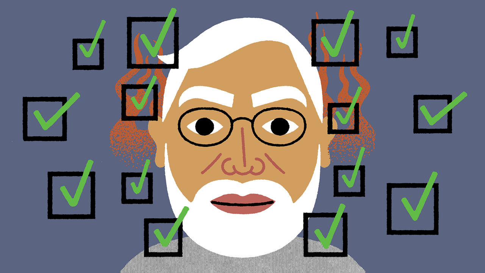

###### Banyan

# Narendra Modi is the world’s most popular leader 

##### The prime minister’s odious Muslim-bashing is not the main reason 

 

> Jun 15th 2023 

Ganesha Kanojia does not consider himself a Bharatiya Janata Party supporter. The 58-year-old auto-rickshaw driver has mostly voted for the Congress party, as members of his low-caste Dalit group tend to. In local elections in Delhi, where he lives, he still disdains the BJP, because he dislikes its Hindu supremacist ideology. But in general elections, including one due next year, Mr Kanojia is a safe BJP vote. “Because of Modi-ji,” he explains.

This illustrates one of the most remarkable developments in global politics. Over the past nine years the BJP has emerged, in two general elections and dozens of state ones, as India’s biggest party. Yet it is far short of having a popular majority. It controls only half of India’s 28 states. In general elections, it seems nonetheless to have a lock on power, for the next five years and probably more, thanks to the popularity of Narendra Modi. With an approval rating of 77%, the prime minister is more than twice as popular as his party. He is by far the world’s most popular elected leader.

Conversations with political scientists and a cross-section of Modi fans suggest three main reasons for this phenomenon. Mr Modi is benefiting from a combination of good luck, political brilliance and ruthlessness.

He is lucky in his opposition, which is not merely a shambles, but a sort of shambles that plays to his strength. Contrary to the story he tells,  has not done better under his government than under its Congress-led predecessors. Yet under its weak, uncharismatic fourth-generation dynastic leader, Rahul Gandhi, Congress has failed to lay claim to this success, let alone promise a repeat performance.

It has also been tarred by Mr Modi’s most effective populist claim, that he represents the triumph of vernacular, battling India over its complacent Anglophone former rulers. Mr Gandhi is half Italian and, like his father, grandmother and great-grandfather, all Indian prime ministers, Oxbridge-educated. Mr Modi was born poor, is largely self-taught and, partly because that describes millions of Indians, hugely admired for it. Another Cambridge-educated Congress luminary once dismissed him as a  (tea-seller)—which he was. No political barb has backfired more disastrously.


Mr Modi’s genius is his ability to capture the political narrative in such ways. He is adept at reading mass sentiment and, as a relentless campaigner, courts it as no other Indian leader has since Indira Gandhi, or ever. Also like Mrs Gandhi, he claims credit for everything his government has achieved—and much that it has not. His smiling image, ubiquitous on billboards, is the face of welfare schemes, infrastructure projects and diplomatic shindigs. In a time of tumultuous change, many Indians crave a kingly figure whom they can thank for the progress they hope for, and trust to manage the uncertainties they fear. “Only Modi knows how to implement things,” says Rajdip Ghosh, a 34-year-old IT professional in Kolkata (who was named after Mr Gandhi’s father, Rajiv). “Modi-ji is providing so many houses for the poor,” says Narendra Yadav, a 55-year-old driver in Delhi. “During the pandemic Modi-ji saved so many lives.”

Asked to give a relative weighting to these factors, Sanjay Kumar, a psephologist, attributed 20% of Mr Modi’s popularity to the ineffectiveness of his opponents and 65% to his political skills. He attributed only 15% to the prime minister’s ruthlessness—which could seem surprising, given how conspicuous it is.

Mr Modi is closely associated with his party’s Hindu chauvinism, owing to a vicious pogrom against Muslims in Gujarat in 2002, while he was the state’s chief minister. He denies having any link to the atrocity, but has never really condemned it. Nor does he chastise the Hindu zealots who man his campaigns while openly inciting violence against Muslims. It is good to know most Modi fans are not mainly drawn by his party’s Muslim-bashing. It is sobering to ask why, then, does he not stop it?

Mr Modi has also ranged into other sorts of illiberalism. His critics in the media have been cowed into silence. India’s parliament, civil service and judiciary have been bent to his will—as demonstrated in March, when Mr Gandhi was convicted of bogus charges levelled by a BJP lawmaker and disqualified from parliament. Again, the fact that Mr Modi’s popularity is not dependent on such activities is comforting only to a degree. It suggests his illiberalism is less strategic than compulsive.■


