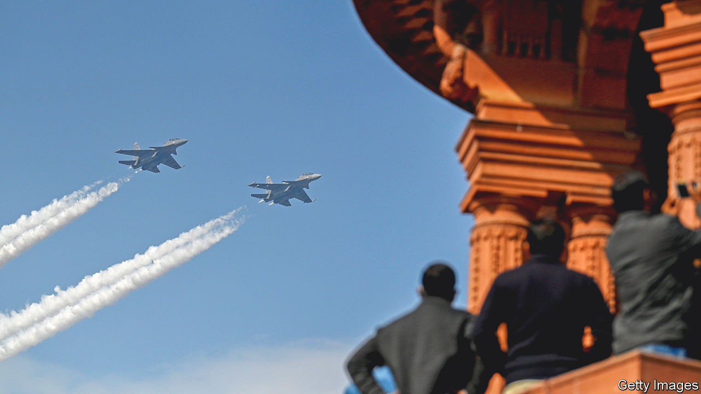

###### Too good to refuse

# On defence, America and India edge closer together 

##### India is being weaned off its dependence on Russian weaponry 

 

> Jun 15th 2023 

BOTH AMERICA and India were unmistakably satisfied with the outcome of a visit to Delhi on June 5th by America’s defence secretary, Lloyd Austin. When Mr Austin met his Indian counterpart, Rajnath Singh, he offered a deal. The Americans see it as their most generous proposal since a controversial pact in 2005 to co-operate on nuclear power despite India’s nuclear-weapons programme. The hope is that India’s prime minister, , will sign a range of agreements on defence during his state visit to America next week.

A pressing concern for both  is China’s growing assertiveness in what American strategists call “the Indo-Pacific”. China’s growing navy is more active in the Indian Ocean and its armed forces have been reinforcing on India’s northern border (and clashing with Indian troops). Mr Austin’s most important offer is a so-called roadmap for defence-industrial co-operation covering technology in such areas as air combat, armoured vehicles, munitions and ISR (intelligence, surveillance and reconnaissance). 

India, the world’s biggest importer of weapons, has long been desperate to expand its indigenous defence industry. It has not been easy. A “Make in India” defence policy was launched eight years ago, followed in 2020 by “Atmanirbhar Bharat” (Self-reliant India), when the government raised the maximum stake that could be held by foreigners in joint ventures in defence from 49% to 74%. 

However, by the start of last year, foreign direct investment in the defence industry had reached only $380m, against a target of $10bn by 2025. Rahul Roy-Chaudhury of the International Institute for Strategic Studies (IISS), a British think-tank, doubts it will be reached, as most big foreign defence firms will balk at the technology-transfer requirements, especially because of fears that their intellectual property might end up in Russian hands.

The other big lever the Indian government is pulling is to allocate around 75% of the armed forces’ capital budget to home-grown purchases. The country’s official defence-acquisition arm recently earmarked $8.5bn for spending with local manufacturers by the end of the decade, in the hope that new indigenous light tanks, artillery, missiles and helicopters might reach service by then. There are also four “positive indigenisation lists” that together ban imports of 411 types of weapons and equipment, as well as thousands of components. But it is not yet clear whether the Indian defence industry can provide suitable substitutes, nor whether the country’s sometimes picky armed forces will accept them. 

That is why America thinks its offer is attractive. The most eye-catching element could be a deal for India to manufacture under licence General Electric’s GE-F414 jet engine, which is found in Boeing’s F-18 Super Hornet and Saab’s Gripen. The powerful turbofan engine would be produced at a new factory by the state-owned Hindustan Aeronautics Ltd (HAL) and would be used to power hal’s Tejas Mk2 light combat aircraft, which is still under prototype development (and possibly the highly ambitious Advanced Medium Combat Aircraft, a proposed fifth-generation fighter with radar-beating stealth characteristics). But to get the amount of technology transfer India wants from GE requires both America’s Congress to issue an exemption and GE to go along—both possible roadblocks. 

Mr Austin’s proposals may also be welcome in Delhi because India’s faith in Russia, by far its biggest arms supplier, has ebbed, especially since the invasion of Ukraine. According to SIPRI, a think-tank, Russia’s share of India’s weapons imports fell in the four years to 2022 from 64% to 45% (France is second with 29%; America has only 11%). But data from IISS’s Military Balance show how much India still depends on Russia. More than 90% of its armoured vehicles, 69% of its combat aircraft and 44% of its surface warships and submarines are Russian or made under a Russian licence.


Russian weapons cost less than Western ones, and Russia imposes fewer conditions on their use and fusses less about technology transfer. However, Russia’s largely state-controlled arms industry has prioritised Russian forces in Ukraine over even its biggest customers. India is still awaiting delivery of two of the five S-400 surface-to-air missile systems for which it agreed to pay Russia $5.4bn in 2018. Much worse, an increasing number of India’s combat aircraft are grounded for lack of spare parts. Back in March of last year, an air force officer told parliament’s defence committee that “a very large number” of India’s 272 Su-30s, the country’s most potent jet fighters, were inoperable. The “sick list” will have grown since then. Sanctions on Russia have also sapped the capacity of its arms industry.

But reducing India’s dependence on Russia will take time. India will still need Russia for some technology, such as the nuclear reactors for submarines, that it will not get elsewhere. Fully reshaping India’s armed forces with Western and home-made equipment could take decades rather than years, even if India buys no big new weapons systems from Russia.

India has also shown itself in the past to be a difficult customer. After France reached an agreement to sell Rafale fighter jets to India in 2012, it took nearly nine years for the first planes to arrive. During that time the order was cut from 126 to 36, partly because the original manufacturer, Dassault, feared that HAL would struggle to make the complex plane under licence. Over the years, every aspect of the deal became mired in mutual accusations of cronyism and corruption. On a trip to France next month, Mr Modi is expected to sign a new deal for up to 50 Rafales. However, it seems they will all be made in France. 

Mr Austin’s proposed roadmap sets America and India on what may still be a long and winding path. But the map’s very existence suggests both sides see the relationship as vital. And, adds Mr Roy-Chaudhury, the direction of travel is clear. ■


