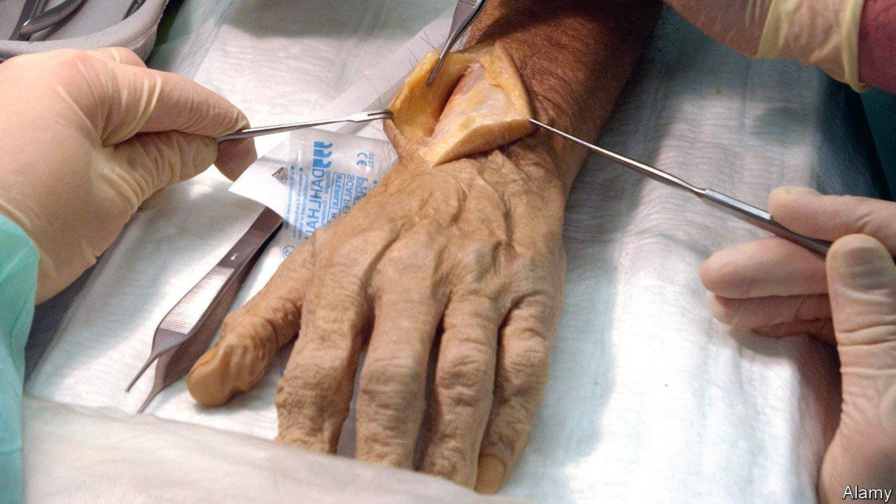
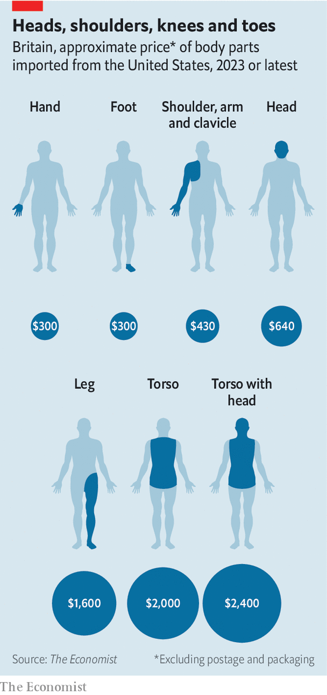

###### Costing an arm and a leg

# How much is a human head? 

##### The business of chopping up cadavers is important, but too little talked about 

 

> Jun 14th 2023 

A human head will set you back about $640. An arm is less: that costs roughly $430. A leg, by contrast, is $1,600; while a torso costs around $2,000. A hand, however, is a mere $300. Postage and packaging, as so often online, add considerably to the cost of these American imports—at times to the tune of thousands of dollars. And not wholly without reason, for transporting fresh-frozen corpses can be tricky: they need a lot of ice. They can defrost at awkward moments. They can puzzle customs officials. But overall, human body parts come surprisingly cheap: getting an arm and a leg rarely costs an arm and a leg. 

There exists a surprisingly lively international trade in dead human bodies for medical dissection. This trade is rarely discussed and relatively lightly regulated: there is no one head, or body, that directly oversees the imports of heads and bodies. This trade is also important, for it allows doctors to practise on real, dead humans before they practise on real, live ones. As one doctor puts it, “would you rather a surgeon learned on you, or on a cadaver?”

Most would rather ignore that question altogether. A combination of sanctity and squeamishness meant dissection was forbidden in Britain until the 16th century, while an early attempt by two Edinburgh-based entrepreneurs, William Burke and William Hare, to invigorate the market in corpses (by killing people) merely sullied the reputation of anatomists. If death remains a taboo then the remains of the dead are even more of one. This is not, says Peter Dangerfield, the president of the British Association of Clinical Anatomists, “the sort of thing you’d talk about over…dinner in the evening over a glass of wine”.

 


Which is a pity, as cutting up corpses matters. It is not essential to use dead bodies to teach medical students: computer generated anatomical simulations exist. But for all the digital brilliance there are still things that flesh and blood can do that computers cannot—such as making medics faint. Looking at a model “isn’t quite the same as seeing the real thing in front of you”, says Professor Dangerfield. Corpses offer more muted emotions, too. To hold a human skull in your hands is, Hamlet-like, to be underwhelmed rather than awed. A head, emptied of human, is surprisingly small; you will have eaten from more substantial cereal bowls.

Bodies help with practical considerations as well as emotional ones. Textbooks tend to offer anatomy that is just that: textbook. Similarly, computer models, like the human kind, tend to have square jaws, broad shoulders and impressively toothy grins. Reality is much messier, and the visible variation on humans is as nothing compared with what lies beneath. Textbooks will tell you that there are three branches coming off the aorta but, says Claire Smith, head of anatomy at Brighton and Sussex Medical School, it is “really common to see four [or] to see two branches”. To do their job as well as possible, surgeons need to be aware of such variations in viscera. 

The demand for bodies, then, is there—but in many countries it is not matched by supply. Around 1,300 donors (anatomists are careful to call the bodies “donors” rather than “cadavers”) are accepted each year in Britain. But not all that are donated can be used. Bodies might be rejected for many reasons, including being HIV positive; being too thin; too tall; too fat; or having an open wound (embalming fluid pours out). At other times, demand can simply be too sudden to meet: finding 20 human heads in a hurry is hard.

The invisible hand

Which is where the international trade comes in. What determines whether a country is a net importer of body parts (like Britain) or exporter (like America) is chiefly what form of consent it allows. Britain allows only first-person consent, by which someone may donate their own body to science while of sound mind. America allows second-person consent, through which someone—or the state—can donate a deceased person on their behalf; in some places, dead prisoners can legally be used.

Second-person consent has its advantages. Give up a relative and you save on funeral fees (the cost of dying, like the cost of living, has risen) and also on bother, for such companies are slick operators. “If you are calling for a patient or a loved one that has passed away…” says a softly-spoken American voice message of one bodybroker, “please press ‘one’ now.” Technically, such companies do not sell bodies; they merely charge fees for procuring, handling and shipping them. But to use their services is, for British doctors “a last-resort sort of situation” according to Professor Dangerfield. Until recently, however, they had little alternative. 

That is changing. At the end of an underwhelming looking corridor in Nottingham City Hospital, behind a clinical white door, is a large white room. Its temperature is a refreshingly cool 18°C; its smell is cleanly chemical; its air hums quietly with the sound of refrigeration. It might be a commercial kitchen—but on a steel tray, beneath a shroud-like covering, lies a body. And in the freezers around its walls are human legs, arms, heads and torsos.

This is the National Repository Centre, created in 2011 by a Scottish shoulder surgeon, Angus Wallace, because he was “unhappy about…the principle of buying body parts from other countries”. After a slow start (people were “very cautious”) he eventually obtained the support of his hospital—and a relationship with a local frozen food delivery company (“Obviously they weren’t allowed to transport body parts at the same time.”) The pioneering Repository is the result. 

Practically, what the Repository does is similar to American firms: it stores bodies, en masse, for surgeons who need them. The cost of British parts is (depending on currency movements) slightly lower than American ones: a head is £500; a leg £650. Just as in America, the cost of each part generally depends on its size: parts tend to be costed by the kilo rather than by any more emotional evaluation. A leg is pricier because it is bigger, says Steve Gill, an intensive-care consultant and the current head of the Repository.

But legally, and arguably ethically, Nottingham is different. The Repository (unlike many American firms) is not for profit and all its donors are just that—willing, first-person benefactors. Like America, it does not technically sell body parts. Instead, it merely loans them: when surgeons have finished with the parts they are sent back to Nottingham; each body is gathered together, cremated and given a committal service. And its transport costs are small by comparison: hundreds of pounds rather than thousands.

Speak to British medical professionals and they explain that they prefer to use the Repository because it feels more ethical. Yet there remains a hint of hard-headed commercialism. Another reason that British surgeons instantly preferred his Repository was, as Professor Wallace points out, because “we were cheaper”. ■


