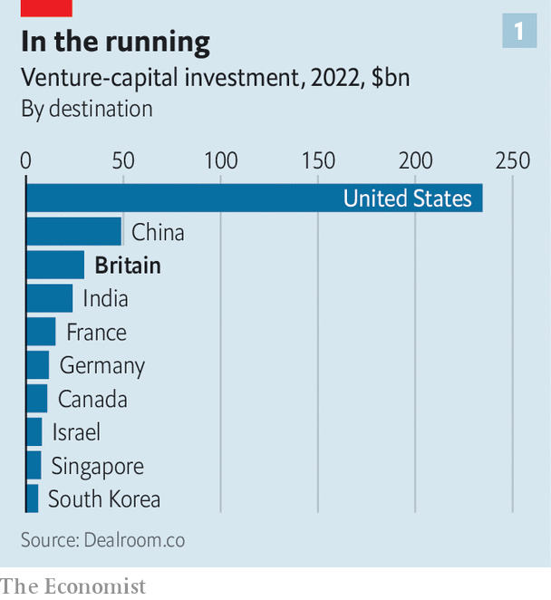
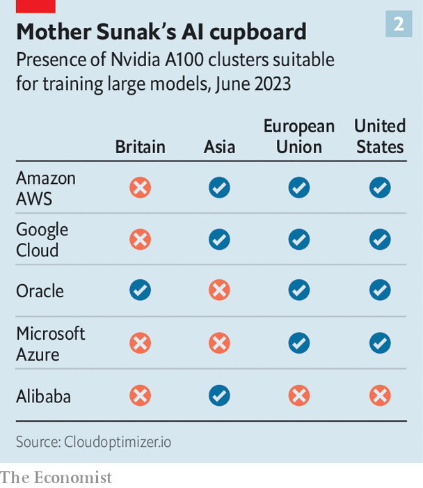

###### Britain’s AI future

# How to make Britain’s AI dreams reality 

##### Rishi Sunak’s bet that Britain can prosper from AI requires a new approach 

 

> Jun 14th 2023 

RISHI SUNAK dreams of Britain becoming an AI superpower. The prime minister says the technology, the subject of intense global interest thanks to successes of large language models such as GPT-4, could unlock economic growth and improve sclerotic public services. AI-related announcements these days gush from Downing Street faster than commentators can keep up. In March Jeremy Hunt, the chancellor, vowed to spend £1bn ($1.3bn) over five years on AI and supercomputing. In May Mr Sunak met the bosses of leading AI companies in London. On June 7th, while visiting Joe Biden in Washington, he said that Britain would host the “first global summit on Artificial Intelligence” this autumn.

 


His broadest ambitions are well placed. AI has great potential, and Britain has an edge that could help it to prosper. The country is arguably the foremost location, outside China and America, to start a new tech company (see chart 1). It is home to important AI outfits, most notably DeepMind, an AI research lab owned by Alphabet, an American tech giant, and Stability AI, a generative-AI startup, both in London. Its excellent universities churn out capable graduates who are keen to toil in AI. In London, too, it has a globally appealing city that draws investors and high-skilled migrants.

Data collected by its public bodies—crucially that from the enormous National Health Service (NHS), for example on drug-use outcomes, hospital logistics, or scans of the body under different conditions—could provide a goldmine for training health-focused AI. The government also has a decent record of finding ways to use tech well. Just over a decade ago it launched the Government Digital Service, which digitised public services such as the issuing of passports or driving licences. That has been copied by governments around Europe and in America.

But for all the well-intentioned zest for the big new thing, Mr Sunak’s government has yet to confront reality: enormous hurdles still block Britain’s path towards AI success. AI systems are built from three ingredients: computation, clean datasets and the work of people who know how to wrangle vast quantities of both. A successful industry, in turn, needs the right regulation. Britain has serious difficulties to overcome in all those areas, and especially in the first two.

 


The most pressing problem is over “compute”, the term AI researchers use for the vital infrastructure, lots of computing power, required to train the new sort of AI models. None of the big three cloud-computing companies—Amazon, Google, Microsoft—has built a large, advanced cluster of graphical processing units (GPUs) for compute to happen at scale in Britain (see chart 2). Only Oracle, a relative newcomer to the field, offers a cluster. This is in part because of Britain’s smallish domestic market and its lack of access to the large one on its doorstep.

The fate of DeepMind, the country’s most hopeful AI company, illustrates the compute problem. It had about 80 staff, all in London, when bought by Google (now Alphabet) in 2014. Today it is vastly bigger, with over 15% of its employees in America, mostly at Alphabet’s headquarters, according to information on LinkedIn, a social-media platform. For Demis Hassabis, one of DeepMind’s founders, this growth couldn’t have happened with domestic resources alone: the pressing reason for selling to Google was the need to access the compute for training models. Today, DeepMind trains them in Oklahoma. What it faced roughly a decade ago persists today. Pitifully little has been done to tackle the shortfall. The lack of access to compute remains the biggest problem for AI growth, and for winning the wider economic benefits of Mr Sunak’s dreams.

Politicians say that they are acting on this. Mr Hunt says he will spend £900m on a supercomputer, probably at the Edinburgh Parallel Computing Centre, “because AI needs computing horsepower”. The EPCC is indeed world class in supercomputing for scientific research. But, sadly, not all such horsepower is created equal. The new computer won’t be ready before 2026 and the centre has no experience in building the kinds of GPU clusters used to train large AI models. And whereas the cloud clusters provided by Amazon, Google and Microsoft (who are also known as hyperscalers) are routinely updated with the latest chips, the EPCC, in contrast, will be stuck with whatever GPUs it can obtain now. It will then live with them until 2031, when its funding runs out. That is an eternity in AI time.

Beasts with horsepower

Mark Parsons, an eminent computer scientist who runs the EPCC, is right to say supercomputers and GPU clusters are increasingly similar beasts, but even he accepts that the government plan has disadvantages. “The hyperscalers pride themselves in continuously updating their GPUs,” he concedes, adding that the cost of doing that is too high for others to match. Others are less polite. For the government to claim a single, powerful computer in Edinburgh would solve Britain’s compute woes is “borderline dishonest,” says a well-connected techie who understands the mix of data, compute and skills required.

An alternative option exists: renting compute. No companies or government agencies are entirely locked out from using AI. Anyone (at least when a global shortage of chips eventually eases) may rent time on cloud supercomputers used to train models. Anyone can download Common Crawl, an internet-scale database on which GPT-4 was trained, and start training a model. And anyone can use GPT-4 or a host of excellent open-source models to generate text or code.

“Compute is not like oil,” notes the techie. “You can call Amazon and rent it. It’s a problem that money solves in perfectly continuous increments. It’s not this magical thing that if you don’t buy it you can’t have,” he says. Some companies do exactly this. The boss of Stability, Emad Mostaque, says his firm in London trains its models on Amazon’s compute clusters based in Ohio and Virginia, for example.

The trouble is that Stability’s behaviour is more exception than rule. Too often, British officials or companies require—for reasons of politics, national security, privacy or something else—that their data remain in the country. Neither the Ministry of Defence nor the NHS, for example, is about to upload sensitive data to foreign clouds. The boss of one large tech company with several public-sector contracts describes going “on bended knee” to the hyperscalers, begging for access to compute in Britain. He was offered GPU time in the Netherlands or Ireland. But without local GPUs, he is not permitted to help his government customers train or run AI models based on their unique datasets.

Nor is sensitivity about data the only downside to renting compute abroad. Being physically close to compute at home brings real benefits. AI engineers and companies gain expertise by experimenting regularly on it. Techies seeking innovations need hands-on time. “A country generates large benefits beyond access from having technology assets physically located there. ‘Learning by doing’ and the compounding of process knowledge is key to having a vibrant deep tech ecosystem and the high value jobs and companies that come with it,” says Matt Clifford, chair of the Advanced Research and Invention Agency, a government skunkworks that helps to fund research in tech.

The most ambitious progress, therefore, depends on getting hyperscalers to set up GPU clusters in Britain. So how to do that? In the first instance, says one tech boss, Mr Sunak should know better what to ask for. He could start by launching a “global lobbying unit” to press for Amazon, Google or Microsoft to set up shop. The government should consider what hyperscalers would need to build in Britain.

Building entire new datacentres is not necessary. Instead Amazon, Google or Microsoft could replace servers in their existing (older style) British-based centres with ones that include the new chips produced by Nvidia, ideally the latest A100 or H100 models. Obtaining those chips may be the biggest problem in the short term, given a global supply crunch. 

Another challenge would be ensuring sufficient supplies of electricity, at low enough cost (and ideally green), because training AI models devours a lot of power. Such tasks don’t look insurmountable, even if there would not be a quick fix. (Though it is hard to imagine it would take longer than building Mr Hunt’s supercomputer). In the meantime Britain will have to limit itself to using foreign compute.

The longer the delay, however, the lower the chances of success. Without hyperscale GPU clusters, another set of British companies misses out: those attempting to supply picks and shovels in the AI boom. Nigel Toon, the boss of Graphcore, a young British company based in Bristol which makes AI chips, notes that his American competitors have great advantages that he lacks in selling their products to local, big stacks of compute.

Unsurprisingly, he also wants the new supercomputer in Edinburgh to favour British suppliers like his firm. The hour grows late, though. Sequoia, one of Graphcore’s biggest investors, wrote down the value of its stake to zero in April. Meta, another American tech giant, has already scooped up some of the Graphcore team. The Bristol firm has plenty of cash in the bank, but desperately needs to get its chips into data centres.

After the difficulty of the compute desert, the other challenges look more manageable. One priority is improving the datasets available for AI developers. Data generated by public agencies should be the most appealing raw material for those working on AI. Unfortunately, they are too often a mess, including those within the NHS. Data to do with welfare are no better. Officials say that the computer systems running the Department for Work and Pensions are so feeble, for example, that six months are needed to adjust recipients’ benefits for inflation. Trying to build BenefitsGPT atop a creaking 20th-century infrastructure looks like a fool’s errand.

At least cleaning up the valuable datasets is within the control of the government. Officials could also look for benefits from generating new ones. “States don’t leverage their only advantage: the sovereign right to produce data about things companies don’t have,” says Benjamin Bratton, who has written a book on the state’s relationship with technology. He observes that states have the means to “produce models of their societies”, but Britain’s government (like most) lags behind tech companies in being able to model its own people’s behaviour, the country’s environment and its resources.

The NHS is particularly ripe for a data retrofit, though the road to doing this is littered with the bodies of politicians and companies who tried and failed. NHS IT, an effort to centralise medical records that was launched in 2002, ate up at least £10bn before it was quietly dumped in 2011. New companies are popping up, attempting to solve the problem in a bitesized manner. At least one new startup wants to be paid to clean up government datasets, to make them useful for training AI models and to improve the more mundane services those data flows allow.

 


The last £100m of Mr Hunt’s £1bn on AI may help with this. It is to be spent through a new Foundation Model Task-force. The outfit will focus on finding ways to train big models for the public sector and on making “strategic investments in the full AI stack,” says an official. That is encouraging, even if the amount of money available is small; training a single large model once could eat up much of the funds Mr Hunt has set aside. “Sovereigns have the most interesting leverage on data, for sure,” says the official. The task-force may direct some of money to kick-starting a data-hygiene industry, something for which there has not, to date, been a business model.

Making all of this happen in turn requires having enough skilled people around: British universities produce lots but, given the huge draw of Silicon Valley, there is also a steady flow of techies across the Atlantic. And as talent flows West, it takes its intellectual property along. “The reality is that the number of people who have seen GPUs melt because of 24/7 training jobs is very small,” says Nathan Benaich of Air Street Capital, a London VC firm. “Certainly they don’t work for the government, and they can’t be hired by the government to do a deal with the cloud vendors. These are the guys who know how it works.”

Neither Wild West nor rabbit hole

One step to better retaining talent (as well as attracting investors) is to get the regulation of AI right. This means avoiding the path that the European Union is expected to follow, with ever-expanding swathes of horizontal rules, ones that cut across sectors, on how AI can be used safely. Britain’s existing sector-by-sector, common-law approach, which would regulate different industries differently, looks like a better bet. Given global anxieties about the power and impact of AI, “there’s an opportunity for Britain to move quickly and establish itself as a pragmatic place,” says the tech boss who is struggling to access compute. Mr Sunak’s summit in the autumn should be a good place to start.

“I do buy the Sunak picture,” says the tech boss. “In keeping with common law. You have these context-specific regulators. You don’t have broad cross-sectoral statutory regulations. The EU is not going to do it; it has disappeared down the EU rabbit hole and is going to be down there for a couple of years. The US is going to be the Wild West. Britain is the one place that’s going to combine that concern around ethics of models and their application with a deep pragmatism and openness to innovation. We have courts and regulators that are globally respected.”

Achieving more of this, and faster, also requires having more people in positions of power who understand computation. “We lack competence and confidence at the heart of government,” says one adviser. “The people who run compute policy in the Department for Science, Innovation and Technology really just don’t understand it. They don’t understand the difference between general and specific computing.” Hence the trumpeting of a supercomputer built by computer-science researchers as an answer to the country’s AI woes.

For an example of what savvy techies with official support can do, look to the United Arab Emirates. Its government-backed Technology Innovation Institute used Amazon’s cloud to train an open-source large language model called Falcon which is competitive with the best models trained by American companies, such as OpenAI. TII grants access to its compute to people with new ideas for training models and starting companies. Every nerd in the world has taken notice, and many now contribute their brain power to a project whose benefits—such as attracting computer graduates to work on AI projects—broadly accrue to the UAE.

The closest thing Britain has to this is Stability, the startup whose models generate photorealistic images. Its open source Stable Diffusion model produces pictures which have driven many on the internet into a frenzy (think fake pictures of Donald Trump’s arrest, or the pope in a Balenciaga jacket). But the gravity of America’s tech scene is exerting itself on Stability. The firm started in London but the majority of its employees are now in America, according to LinkedIn data. American backers provided all of its most recent funding. 

Mr Sunak’s route to British AI superpowerdom will not run along paths where the most promising companies add most of their jobs overseas. Much remains to be done to make Britain more attractive, but the race has already begun and, for now, the country lags. ■


