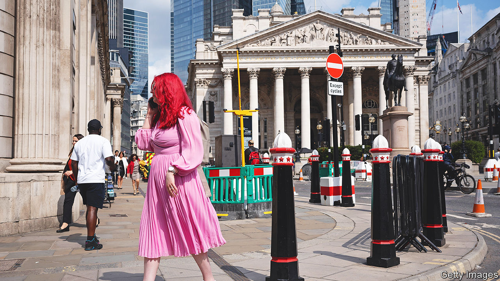

###### Britain’s economy

# Wage growth, inflation and more place Britain’s central bank in a spot 

##### Britons brace for pricier mortgages 

 

> Jun 14th 2023 

PARTS OF Britain are growing uncomfortably hot. On June 13th the Met Office, a weather monitoring outfit, gave warning that large swathes of the country were officially in a heatwave. Data published the same day by the Office for National Statistics (ONS), keeper of other sorts of official figures, suggest that the labour market swelters, too: private-sector wages, excluding bonuses, were 7.6% higher than a year before. That was one of the fastest rates of growth of the past two decades—just shy of a headline inflation rate, including housing costs, of 7.8% in April. 

Economists had expected wage growth to increase after the main minimum wage climbed by 9.7% at the start of April, from £9.50 ($12) an hour to £10.42. Pay rises were, however, concentrated in higher-paid sectors. Compared with last year, earnings in finance and business services were 9.2% higher while those working in hospitality or retail saw median pay rise by only 5.1%. The ONS has revised up its estimates of wage growth for all three months. 

 


That is despite the Bank of England’s efforts to chill the labour market. Companies’ demand for workers, as measured by open vacancies, has lessened. But the economy still added 250,000 jobs in the past quarter and total working hours have at last exceeded their pre-pandemic level. Labour supply is recovering only gradually. Inactivity due to long-term sickness, meanwhile, has reached a record high. Following the publication of the figures Andrew Bailey, the central bank’s governor, told the House of Lords that the recovery in activity was going “very slowly, frankly.”

Traders expected that the bank will do more to dampen demand. The cost for the government to borrow for two years reached 4.9%, above its peak in the aftermath of the disastrous September 2022 mini-budget. That has a knock-on effect on homeowners, raising costs for anyone renewing or starting a mortgage. Moneyfacts, a data provider, says the cost of fixing a mortgage for five years has risen to 5.5% a year, up from 5% at the start of May. Circumstances this time are different. Unlike after the mini-budget, when the pound collapsed as traders took flight, the currency strengthened against the dollar, which should help bring inflation down. Rather than fretting about the soundness of the country’s economic policy, traders reckon inflation is more stubborn and rates will rise further. 

That will cause problems. The Office for Budget Responsibility, the fiscal watchdog, suggests that every percentage-point rise in interest rates reduces the amount the Treasury has to spend annually by £20bn. Since the chancellor, Jeremy Hunt, delivered his budget in March the cost of borrowing for ten years has risen by that much. He has little chance to cut taxes ahead of an election that is due next year. 

Faster growth than expected may explain some of the stubborn inflation. It may also be that the bank’s previous rate rises are having less effect than predicted. New mortgages may be far more expensive but fewer have them: according to the English Housing Survey, roughly 30% of homes were owned with a mortgage in 2022, compared with 56% in 1993. More of these mortgages are fixed for a few years, too. The central bank estimates that the effective rate on mortgages has increased by only 0.7 points, despite the central bank putting up rates by 4.4 points, since December 2021. It says higher mortgage costs have squeezed household consumption, in aggregate, by only 0.3%. 

That makes the central bank’s job harder. The effect of its previous rate rises will be felt more strongly over the coming months as more fixed-rate mortgages end. If the bank puts up rates again it could slow the economy more than it intends. Then again, if it delays then higher inflation could become more embedded. The Met Office warned that thunderstorms and flooding could follow the heatwave. Britons should hope a similar fate can still be avoided for the jobs market.■


