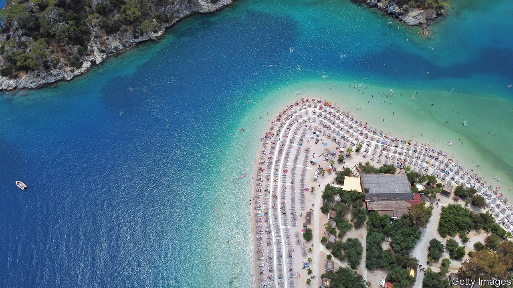
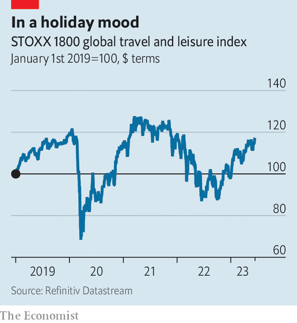

###### Summer holidays

# How long will the travel boom last? 

##### Will demand for sunny getaways wane with economic turbulence? 

 

> Jun 15th 2023 

REVENGE HOLIDAYS are in full swing and the travel industry is cashing in. After a rocky few years, the urge to splurge on airline tickets and hotels is set to bring in bumper earnings. Tour operators are inundated with bookings; hotel chains are raking in record profits. EasyJet has raised its earnings forecasts twice this year; IAG and Ryanair have both returned to profit for the first time since the start of the pandemic, and Singapore Airlines is handing out some of its record profits as bonuses worth eight months’ salary. With air fares rising faster than inflation, global airline bosses now expect $9.8bn in net income this year, more than double the amount initially forecast, according to the International Air Transport Association, an industry body. 

The holiday boom has lifted the outlook for international travel. Worldwide tourist arrivals this year are expected to reach up to 95% of pre-pandemic levels, up from 63% in 2022, estimates the UN’s World Tourism Organisation. Share prices of travel companies, which tumbled in early 2022 amid fears of rising inflation and a looming recession, are soaring again (see chart). High prices have not deterred sunseekers so far. “People are prioritising travel over other discretionary spending,” says David Goodger of Oxford Economics, a consultancy. Still flush with cash saved during lockdowns, many are splashing out on holidays, even as they trim spending on clothes or dining out. 

 


A few factors will determine how long the good times roll on for. Some have to do with the industry’s supply side: shortages of airport staff, soaring jet-fuel costs and crumbling IT systems, which buckled under the weight of demand last year, leading to hours-long flight delays or cancellations at short notice. A quarter of all flights in America were scrapped or delayed last summer. Such meltdowns erode trust. They are also costly. Southwest Airlines estimates that the cancellation of nearly 17,000 flights in December led it to incur around $800m in losses.

A bigger question concerns demand. After a glorious summer, appetite for holidays could come crashing down as fast as it has risen. Although America’s Federal Reserve has paused interest-rate rises, it is expected to lift rates again in coming months. As the Fed and other central banks in rich countries keep fighting stubborn inflation, holidaymakers may eventually throw in the beach towel. 

Chinese tourists, the third-biggest group after Americans and Germans in 2019, according to Oxford Economics, may not pick up the slack. Since covid restrictions in China were eased last year, nearby destinations such as Macau and Thailand have proved popular. Yet Chinese enthusiasm for far-flung spots remains tepid. Accor, a hotel giant, estimates that around three-quarters of Chinese travellers this year will opt for “staycations” instead. 

A lull in holidaymaking would be bad news for a heavily indebted industry already facing escalating expenses and recovering from past losses. Airlines alone lost $138bn in 2020. Moody’s, a credit-rating agency, expects their labour costs to increase by nearly a fifth this year. Short-staffed hotels are struggling to fill positions despite raising wages. In Britain, wage bills are 15% higher than before the pandemic. After a years-long holiday, day-to-day economic reality may be setting in for the travel industry. ■


