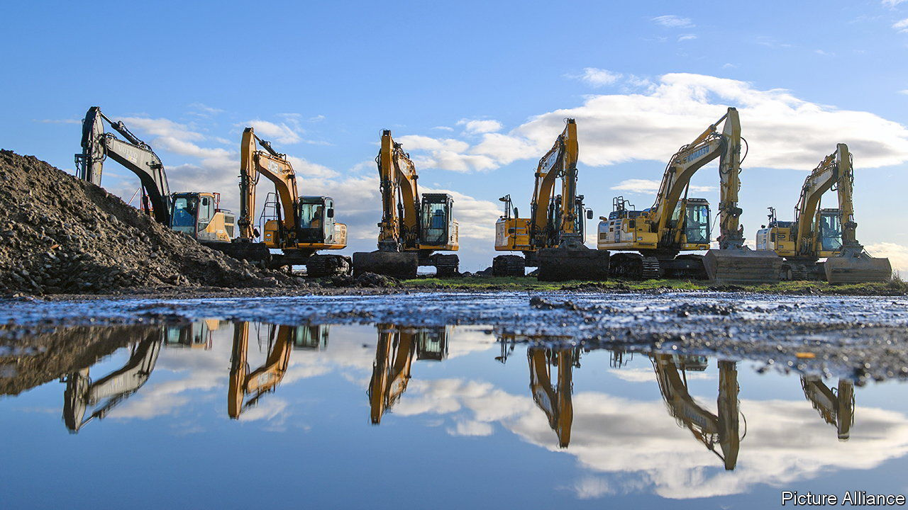

###### The Magdeburg gambit

# It is make or break for Intel’s giant bet on Germany 

##### The American chipmaker’s capital spending would constitute the biggest foreign direct investment in German history 

 

> Jun 15th 2023 

RARELY DO GERMANY’S top economists see eye to eye on a big economic-policy controversy. But when it comes to the government’s decision to spend billions on subsidies for Intel’s mega semiconductor factory in Magdeburg, Reint Gropp of the Halle Institute for Economic Research, Marcel Fratzscher of the German Institute for Economic Research and Clemens Fuest of the Ifo Institute all agree. They consider lavishing billions on the American firm a spectacular waste of taxpayers’ money. 

The wonks’ consensus is falling on deaf ears. Olaf Scholz’s centre-left coalition government has agreed to prop up Intel’s mega-site in Magdeburg to the tune of €6.8bn ($7.4bn), a big chunk of Intel’s €17bn investment in the east German town. Christian Lindner, Germany’s pro-market finance minister, recently said there was no money in the budget to meet Intel’s demands for an extra €3bn or so in state aid to close a “cost gap” caused by the higher prices of energy and construction. Yet the Social Democratic chancellor appears open to loosening the purse-strings, provided that Intel expands its project.

Pat Gelsinger, Intel’s boss, is touring Europe in mid-June. According to sources close to the government, he is expected to meet Mr Scholz in Berlin on June 19th to make his case. The talks could seal the fate of the giant endeavour, which would be the biggest foreign direct investment in German history. He will also visit Magdeburg, where 30 Intel employees, including Bernd Holthaus, head of personnel in Germany, are already beavering away.

Mr Gelsinger’s supporters in the chancellery and the economy ministry argue that Intel’s site will create an innovation hub and spawn up to five jobs for each of the 3,000 permanent high-tech positions that Intel plans to create in Magdeburg (in addition to the 7,000 temporary construction workers it will need to build the thing). Moreover, its advocates argue, the chip plant will help to reach the EU’s goal of increasing the bloc’s share of global chip production from around 10% today to 20% by 2030. This would reduce Europe’s dependence on suppliers in Taiwan, South Korea and other countries in the backyard of an increasingly pushy China.

 


Critics of the project say that subsidising each Intel job to the tune of €1m (if you include construction workers) is lunacy, especially in a region where unemployment is low and where local industrial firms are having trouble recruiting staff. They doubt the lofty estimates of job creation. Many economists reckon that in the best-case scenario one job at Intel might create 1.5 other jobs. Mr Gropp thinks it makes more sense for Germany to buy chips from America (which is already lavishing subsidies on chipmakers). 

Does the subsidy make sense for Intel? The firm needs a fillip. In recent years it has fallen behind rivals such as TSMC of Taiwan and Samsung of South Korea in cutting-edge technology. In April it reported a quarterly net loss of $2.8bn, its steepest ever, as global demand for many types of chip cooled. Its market value of $148bn is just over half what it was in early 2021. Mr Gelsinger believes that the way to reverse the decline is by investing heavily in new capacity (see chart). At a time when chips are no longer selling like hot cakes, that is a risky gamble—with or without German generosity. ■


