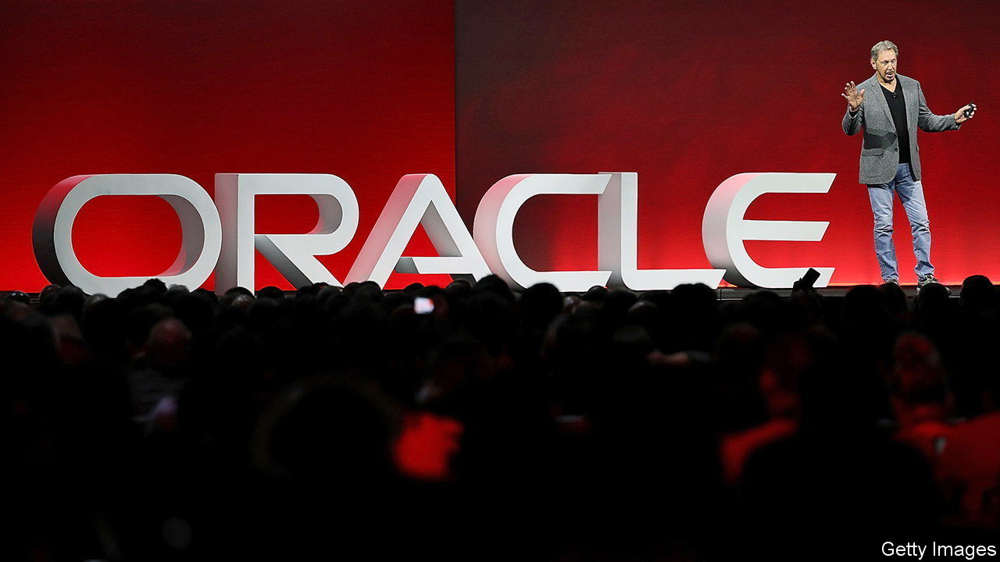
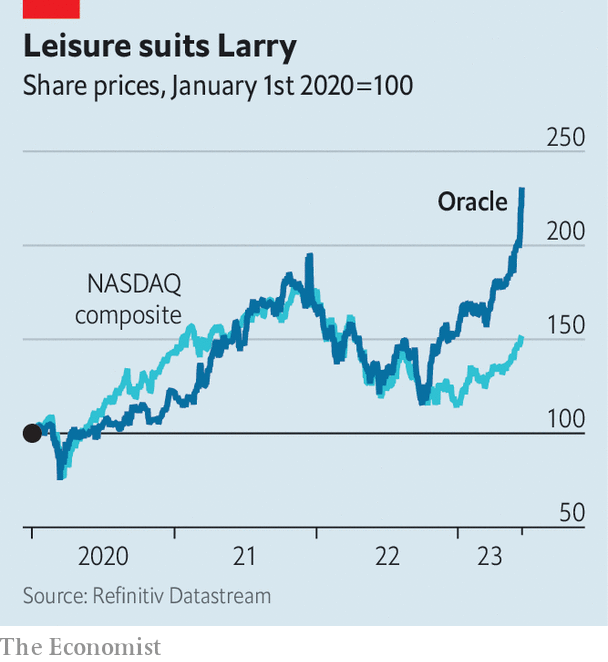

###### Ahead in the clouds

# Oracle is making Larry Ellison the world’s third-richest man 

##### Can the software giant’s winning streak last? 

 

> Jun 13th 2023 

AT 78 LARRY ELLISON, co-founder and chairman of Oracle, is still brimming with energy. During the business-software firm’s latest quarterly earnings call on June 12th the septuagenarian rhapsodised about  (AI) and the latest cloud-computing technology. He has good reason to be in high spirits. Over the past year Mr Ellison’s wealth has rocketed to more than $150bn, according to , a magazine that tracks such things, on the back of Oracle’s soaring share price. Mr Ellison has now edged past Jeff Bezos, the founder of Amazon, as the world’s third-richest man.

Like Mr Ellison, Oracle might be regarded as a dinosaur of American tech. It began life in 1977 as a database-software business, later expanding into applications for business functions such as finance, sales and supply-chain management. As a latecomer to the cloud, however, Oracle has in recent years ceded market share in its core enterprise products to Amazon, Google and Microsoft, three cloud giants that have aggressively expanded their business-software offerings. Oracle’s slice of the database-software market, which remains its bread and butter, fell from 43% in 2012 to 19% in 2022, according to Gartner, a research firm.

Now the business seems to be turning a corner. To catch up with rivals, Oracle has been investing heavily in cloud computing. Capital expenditures in the past 12 months added up to $8.7bn, or 17% of sales, up from just 5% two years ago. Last year it acquired Cerner, a cloud-based health-records business, for $28bn. The upshot has been significant growth in sales of its cloud-based products, which were up by 33% year on year in the most recent quarter, or 55% after including the Cerner acquisition. These sales have grown much faster than the cloud divisions of Amazon, Google and Microsoft. Oracle also outwitted them to snatch the cloud contract to host the American operations of TikTok, a Chinese-owned short-video app to which millions of youngsters are glued. 

 


Investors like what they see. Oracle’s share price has risen by 73% in the past 12 months, well ahead of the tech-heavy NASDAQ index (see chart). The company’s market value is $330bn, making it the world’s fourth-most-valuable business-software provider, behind only Microsoft, Alphabet (Google’s corporate parent) and Amazon. 

Mr Ellison’s company is now hoping to cash in on the latest craze in tech: generative AI of the sort that powers ChatGPT and other content-creating bots. In March it became the first cloud provider to offer access to the DGX Cloud, a supercomputer designed by Nvidia, an American chipmaker, specially for training AI models. During the latest earnings call Mr Ellison announced that Oracle will also be launching a new service with Cohere, an AI startup in which it recently took a stake, to help clients use their own data to build specialised generative-AI models. Meanwhile, the firm is embedding generative-AI features into its various business applications.

There is one potential snag. Over the past five years Oracle has returned $100bn in cash to shareholders through share buy-backs, reducing its share count by around a third. Mr Ellison, who has held onto his shares, has been among the biggest beneficiaries—his slice of the company jumped from 28% to 42% in the period. To fund those repurchases, and its cloud investments, the company has taken on hefty debts. Its net debt is now more than four times its earnings before interest, tax, depreciation and amortisation (a figure above three is considered risky). Indeed, the firm’s debts now exceed the book value of its assets, leaving it with negative shareholder equity on its balance-sheet, a telltale sign of dangerously high leverage.

For now, the company has time on its hands. Fixed interest on its debts means it has suffered little from rising benchmark rates. Its corporate bonds are priced by the market at a yield of 5.7%, but require coupon payments of only 3.8%. And just one-fifth of its debt will mature in the next three years. In recent quarters it has slowed share repurchases and started to chip away at its debt mountain.

The hope will be that the heavy investments made in the past two years will allow the company to grow out of its debt. If it pays off, Mr Ellison may continue his climb up the world’s rich list. Either way, Oracle is not about to go extinct. ■


