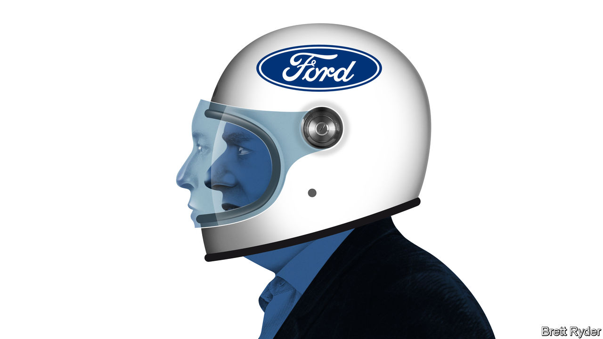

###### Schumpeter

# What Tesla and other carmakers can learn from Ford 

##### The 120-year-old company shows the importance of knowing your limits 

 

> Jun 13th 2023 

JIM FARLEY relishes a challenge. In January Ford’s boss, an enthusiastic amateur racer of historic cars, made his professional debut on the track in a powerful modern Mustang GT-4. Yet the risks of tearing round a circuit are nothing compared with manoeuvring Ford, which on June 16th will celebrate 120 years in business, through a new age of carmaking. Ford, like other legacy firms, is trying to reinvent itself to compete in an era of electrification and software-defined vehicles. It faces established rivals as well as newcomers, foremost among them Elon Musk’s Tesla. Amid this packed grid, Mr Farley is charting a singular racing line.

Established carmakers have long been written off by investors as clunkers, characterised by low growth, low margins and an unmatched ability to destroy shareholder value. Between 2014 and Mr Farley’s taking the wheel in October 2020, Ford’s market capitalisation shrivelled by three-fifths, to $27bn. After a euphoric spike in early 2022, when it hit $100bn on enthusiasm about the company’s electric plans, it is back down to $57bn. But as befits a racing driver, Mr Farley is undaunted. He has reorganised the company into three units, focusing on electric vehicles (EVs, in which Ford plans to invest $50bn between 2022 and 2026), on high-margin petrol-driven cars and on Ford’s world-beating commercial-vehicle business. He thinks that Ford can boost operating margins from 6.6% in 2022 to 10% by 2026 and turn EV-related losses, which are forecast to reach $3bn in 2023, into profits. 

Mr Farley’s plan hinges on learning a thing or two from the disrupters, whose contribution to the industry he is quicker to acknowledge than most other car bosses are. “Tesla has influenced a lot of our thinking,” he admits. Most important, he has a clear idea of where emulating rivals plays to his company’s competitive advantage and, critically, where it does not. 

Mr Musk’s biggest contribution to carmaking may be proving that EVs, which have been losing the incumbents money for years, can turn a healthy profit. Tesla’s operating margin, of 17% in 2022, was comfortably higher than those that most established carmakers enjoy on their petrol-powered ranges. To achieve his electric goals, Mr Farley is following Mr Musk and reversing years of industry practice that left the big marques’ largest suppliers to manage those lower down the value chain. 

Ford is not the only legacy carmaker to be bringing more of the supply chain in-house. Rivals such as General Motors (GM) and Volkswagen are also building battery “gigafactories” close to their big markets. But Mr Farley is, like Mr Musk, busier than most bosses in negotiating directly with mining firms to secure battery minerals. Ford has already signed deals to guarantee supplies of 90% of the lithium and nickel it needs for the 2m evs it wants to be producing annually by 2026. Ford even intends to process some of the lithium in America. This should help it reduce the industrywide reliance on Chinese refiners. It also ensures that electric Fords qualify for subsidies under the “made in America” terms of the Inflation Reduction Act, a giant green-funding law passed last year. As a result, Mr Farley hopes soon to be making the cheapest batteries in America at Ford’s plant in Michigan.

Mr Farley is also emulating Mr Musk in trying to pare back the industry’s notorious complexity. Just as a lighter, nimbler machine has a better chance of staying ahead of a big and powerful one on the track, the thinking goes, a simpler company should be able to negotiate the twists and turns of industrial change. Famously, Tesla makes just four models with few options for customisation. Similarly, Ford’s next generation of electric pickups will come with one cabin, one frame and one standard battery in just seven basic formats, says Lisa Drake, Ford’s overseer for ev industrialisation. That compares with an options list for the bestselling petrol-powered F-150 pickup that allows for millions of combinations. Rather than integrating hundreds of parts from suppliers, each with chips that need to work in harmony, Ford’s new ev architectures, set for launch in 2025, will share more common mechanical and software underpinnings.

Where Mr Farley’s thinking and Mr Musk’s diverge is over what besides manufacturing vehicles carmakers ought to be doing. Mr Musk has an expansive view of his company’s role, which stretches from designing Teslas’ infotainment system to building a charging network where owners can top up their batteries. Mr Farley, by contrast, is focusing squarely on manufacturing vehicles and is happy to outsource some of the other things. In May Ford stunned many observers when it signed a deal with Mr Musk’s firm to grant Ford EVs access to Tesla’s North American Supercharger network, with its 12,000 charging stations. 

Soft power

More surprising even than the charging deal is Ford’s decision to continue relying on outside partners for a lot of in-car software. This flies in the face of received wisdom in the industry, according to which things like infotainment systems, from satellite navigation to music streaming, will increasingly determine the car-owning experience, differentiate car brands and generate revenues from new services. Tesla does not accommodate Apple’s CarPlay and Google’s Android Auto platforms, which connect motorists’ smartphones to their cars’ dashboards. gm recently declared that it would ditch CarPlay and Android Auto and come up with its own better system. Mr Farley sees the need to keep control of computer programs in critical areas such as safety and security. But he accepts that Ford has lost the battle for the cockpit to big tech. 

There are signs that some incumbents may be becoming more clear-eyed about their limitations. On June 8th GM announced it had made a similar charging arrangement with Tesla. More would probably benefit from greater realism about their software prowess. Stick to what you do well and leave the rest to others is a lesson that many of Ford’s rivals could usefully learn. ■


