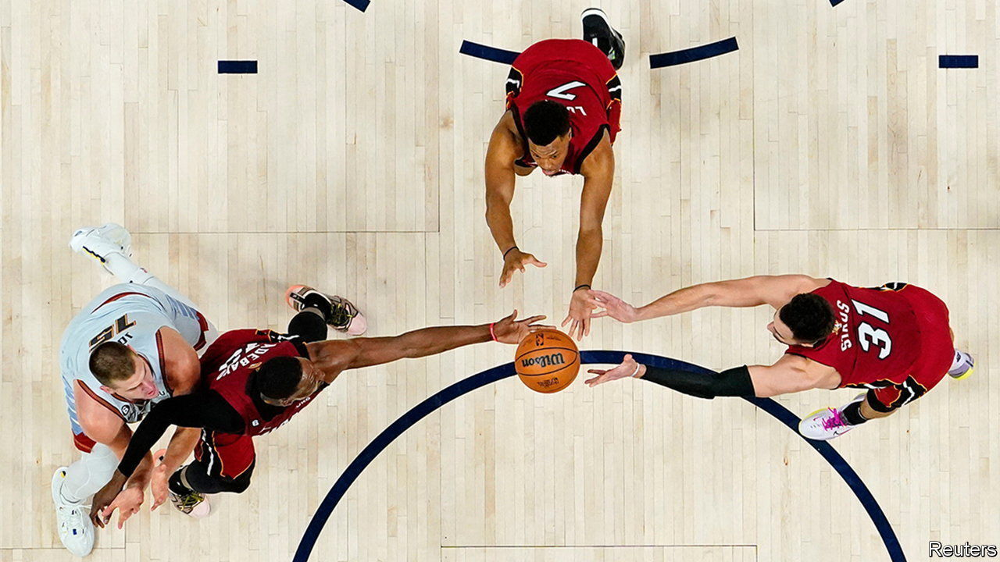
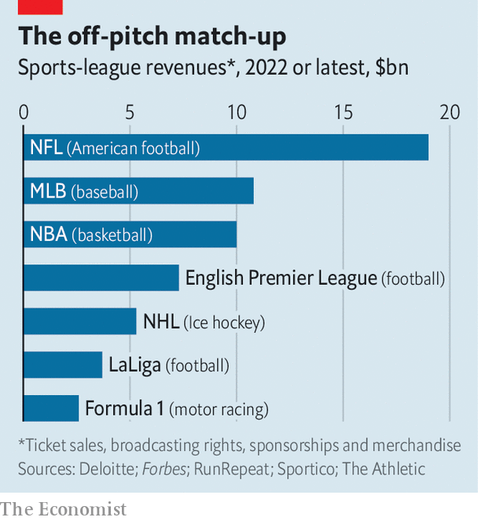

###### Ball is life

# Which sport is the best business? 

##### American sports leagues are more competitive, lucrative and monopolistic than European ones 

 

> Jun 15th 2023 

THE 2023 finals of America’s National Basketball Association (NBA) and Europe’s football Champions League were both history-making events, in rather different ways. On June 12th the basketball contest crowned a small-city team that had never before won a championship, the Denver Nuggets. They defeated an unlikely challenger in the Miami Heat, the last-seeded team in its conference of eight. Had Miami won, that would have been a first for such a lowly side. Meanwhile, the UEFA Champions League final, held on June 10th, featured a powerhouse from Britain, Manchester City, defeating a mainstay of European football, Italy’s Inter Milan. 

European and British football leagues generally let teams spend as much as they want on players, as long as they do not lose too much money. More successful sides tend to earn more money, and so have more cash to splurge on star players—which in turn translates into more success on the pitch, and so on. The week before its Champions League triumph, Man City snatched the English FA Cup, beating Manchester United, another deep-pocketed team. Man United and Man City have won 20 out of the past 31 English Premier League titles; the Champions League (or its predecessor, the European Cup) has been won by Real Madrid and AC Milan, Inter’s arch-rival, 21 out of 68 times. 

Across the Atlantic, meanwhile, the sports world’s most lucrative competition, the National Football League (NFL, which involves the non-soccer variety) has a hard salary cap, leading to more parity among teams. The top two squads have won only 12 of 56 Super Bowls, the annual tournament’s final round. The penalty for breaking the NBA’s current $124m salary cap was bumped up in 2011 and again this year in a revenue-sharing deal negotiated between the players’ union and owners. “The new deal is basically trying to prevent superteams,” says Brian Windhorst of ESPN, a television network. And it seems to be working. ’s analysis of NBA data shows that a broader set of teams have indeed made it to the playoffs in recent history. In the five years to 2023, 29 of the NBA’s 30 squads made the league’s knockout stage at least once (the Charlotte Hornets are the exception). That has not happened since the five years to 2008, itself an unusually competitive period.

American sporting socialism, then, appears to lead to more competitive contests than Europe’s winner-takes-all approach. But do more competitive leagues make for better business? Here the evidence is mixed. On the one hand, unpredictability may drive interest—why watch when you know who will win? The possibility of an underdog’s success might help small teams develop devoted fan bases. On the other hand, people love a winner. Mr Windhorst notes that seasons in which big-name teams like the Boston Celtics have dominated were some of the NBA’s most money-making years. In 2022, when the finals pitted the Celtics against San Francisco’s Golden State Warriors, another star team, the league raked in record revenues of $10bn. 

 


Another structural difference between American and European sport is easier to correlate with their moneymaking potential. Unlike European football, where teams can be promoted or relegated across various tiers of leagues, American sports tend to be “closed”—there is no way for new teams to accede to the top tournament. “The Europeans see this as fundamental to the organisation of team sports,” explains Stefan Szymanski of the University of Michigan, Ann Arbor. Count all the tiers, and more than 1,000 clubs across Europe hope to compete in the Champions League. The NBA’s 30 or the NFL’s 32 make for more concentrated markets. And concentration leads to riches. (That explains why the threat of a breakaway league of elite teams hangs over European football.) 

Last year the NFL’s revenues reached $19bn, nearly three times as much as the English Premier League, which probably boasts more fans worldwide than all the American sports put together (see chart). As a result, American teams, which partake in the bonanza, fetch higher valuations. Over the past decade the value of the average NFL and NBA teams has grown by more than 300% and 600%, respectively, compared with a rise of 170% for America’s booming stockmarket. A willingness to sacrifice profits for participation makes Europe’s sport look European, after all. ■


