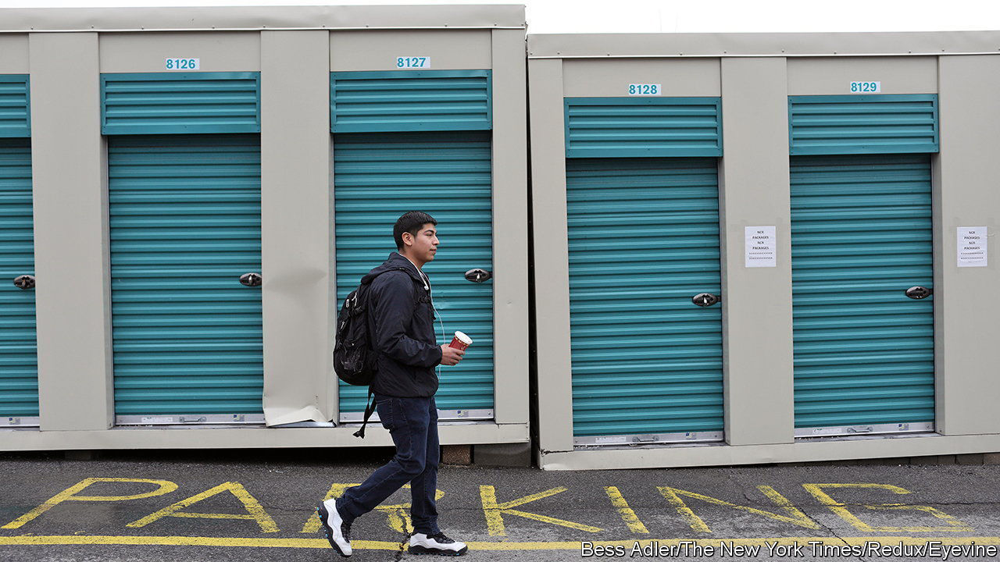

###### Unit economics

# Why self-storage is turning into hot property 

##### Working from home and supply constraints have produced outsize returns 

 

> Jun 15th 2023 

ANYONE ASKED to come up with their favourite literary home is spoiled for choice: Pemberley, Brideshead, Blandings, Jay Gatsby’s mansion, to name a few. The same holds true for workplaces on television: Los Pollos Hermanos, Dunder Mifflin and the swish Waystar Royco offices, for instance. Ask someone to come up with their favourite fictional storage unit, and expect a blank stare (the most ardent Neal Stephenson fans may recall the one where Hiro Protagonist lives in “Snow Crash”).

Ubiquitous and unremarkable, self-storage solves a deeply American problem: what to do with too much stuff. A bunch of empty rooms near a highway is not the sexiest part of a property portfolio. Yet few property assets have matched their performance lately (see chart).

 


One reason is more people moving house. (Ron Havner, former boss of Public Storage, the biggest self-storage firm, said that people seek his services for “the four Ds”: death, divorce, disaster and dislocation.) Amid covid-19, anyone living in a house or flat with no spare rooms had to convert an existing one to a home office or gym. That meant clearing out whatever was there. Many were reluctant to bin things, especially early on when nobody knew how long self-isolation would last. The alternative was to stash it in storage. Over the past three years self-storage occupancy rates have risen from around 90% to as much as 96%. Demand has been especially high in Florida, Texas and the sunbelt, where people flocked in search of larger homes and laxer lockdowns.

High demand, in turn, has given landlords pricing power. Rent bumps went from around 8-9% every six months before the pandemic to as much as 35%, according to Spenser Allaway of Green Street, an advisory firm. Facilities managers can get away with this because customers tend to be “sticky”: they may shop around and choose a facility based on price and proximity, but once their stuff is in they seldom bother moving it. As Stephanie Wright of New York University explains, “Individuals tend to think, ‘I’ll park my stuff here for a month or two,’ but the average rental duration is in excess of a year.” 

Storage firms have also embraced dynamic-pricing software. Knowing up-to-the-minute market rates allows them to avoid undercharging customers. This is of a piece with the sector’s operational efficiency (a small staff keeps labour costs low; preparing a unit for a new customer requires little more than a quick sweep) and with its drive to modernise. Indoor, climate-controlled facilities are becoming the norm. “The days of the old drive-up with a rickety fence and a Doberman for a security system, that’s not going to cut it anymore,” says Tim Garey of Cushman Wakefield, a property consultancy.

The last factor behind self-storage’s outperformance is constrained supply. Whereas the amount of available square footage rose by more than 15% from 2016 to 2019, labour shortages, high construction costs and supply-chain snags have limited new construction in the past few years. That may change as these bottlenecks ease. Even then, the self-storage business may slow but not collapse. As long as Americans keep buying things, they will continue to need places to put it. ■


