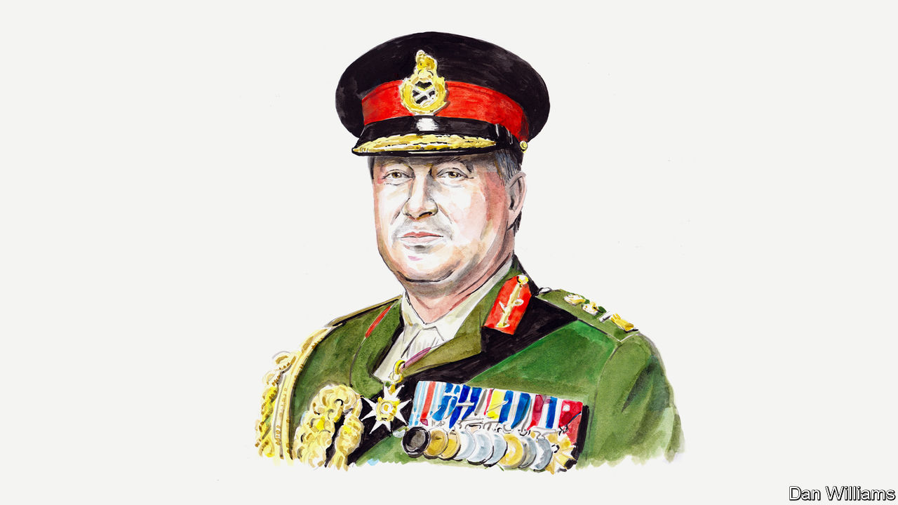

###### War in Ukraine

# Sir Richard Barrons on the broader security considerations around Ukraine’s counter-offensive 

##### It is one act in a global drama pitting democracies against autocracies, says the former British general 

 

> Jun 12th 2023 

UKRAINE’S COUNTER-OFFENSIVE is under way, and its armed forces intend to take back as much Russian-occupied territory as possible in the coming months. The outcome is hostage to the chance and emotion that characterises all wars. Whatever the result, understanding whose counter-offensive this really is will determine what happens after it draws to a close as the weather turns later this year.

There are three very broad potential outcomes. First, the offensive routs the Russian invaders and by Christmas the last occupier is back across the border. This would rely more on Russia folding than on the relatively limited force Ukraine has assembled. 

The second possible outcome is that an improved Russian defence holds and Ukrainian forces batter against it at enormous cost in blood and materiel for little or Pyrrhic gain. This would signal that the occupation is not going to end without levels of firepower unattainable by Ukraine so far. 

The third outcome, somewhere between the first two, is that Ukraine takes and holds worthwhile territory somewhere along the 1,000km-long frontline. This would not conclusively end the war, so at Christmas neither side would think they have won, lost or exhausted the will to fight. The strategic calculus would not have moved much.

If total success and total failure look unlikely, sufficient battlefield success to “prove” that the war can eventually be won by Ukraine would indicate the size of the bill for continuing, priced in military and civilian blood and equipment from supportive foreign powers. Whether and how that bill is met depends on whose interests are really at stake.

Many in the global south and some important American political figures, particularly on the right, consider the counter-offensive to be a matter for Ukraine and Russia, not the wider world. Given the choice, American politicians who hold this view would turn off the funding tap for Ukraine. 

Were that view to gain ground—the chances of which would increase if total military success looked impossible—would the West support an armistice or ceasefire? Would the political, military and financial costs of supporting Ukraine be seen as not worth the candle, despite the efforts since February 2022? If so, the day the West stopped sending the money, weapons and ammunition would be the day there was no point more Ukrainians sweating and bleeding against a much more powerful neighbour.

If this happens, then 10-20% of Ukraine will have been annexed by force by Russia. Russia will have won, no matter the extraordinary costs to it in so many ways, and taken a big step towards restoring its empire. The rest of the world may conclude that the 21st century will now be shaped by the decline of the West as a political and military force—still economically powerful but with no stomach for resisting pressure. It is hard to see many Western political leaders arguing that this is acceptable, either for Ukraine or for their own nations’ long-term security, prosperity and influence.

As the counter-offensive unfolds, a key consideration for European leaders will be the extent to which they should view its success or failure as a regional security question. That calculus would become more urgent if America, after contributing or pledging the lion’s share of Western aid (around $80bn to date) but seeing no decisive result, were to cede leadership to Europe so as to focus on its internal affairs and its relationship with China.

Picking up the bill would mean Europe having to rapidly mobilise its collective defence-industrial capacity to match the demands of bringing a long, big war in Ukraine to a successful (to be defined) conclusion. It would mean finding more than $100bn a year for at least three years, followed by the expectation of as much as $1trn more for rebuilding Ukraine when the shooting stops. Serious money—but with the GDP of the European Union alone around $17trn, the price could be afforded if governments were willing to make hard choices.

The money would underpin a new, stable security order in Europe, managing an angry, well-armed but well-contained Russia. Russia might still be the petulant junior to China in an alliance of autocracies, but after defeat on the battlefield it would no longer be able to pursue its territorial, imperial ambitions. If this is the way ahead, $100bn a year could be a bargain, a deal much enhanced by the fact that it is Ukrainians doing all the fighting and the dying for wider Western interests.

However, a broader perspective may be needed. The offensive in Ukraine is just one episode in the unfolding drama of how the liberal democracies of the West establish a relationship with assertive autocracies, led by China, to decide how the 21st century is going to work. This “discussion” is already playing out against the chronically unstable, complex backdrop of population growth, climate change, the risks and opportunities of the digital age and the proliferation of nuclear weapons.

From this perspective, the counter-offensive must be followed by the efforts of America and Europe (with their combined GDPs of more than $40trn) bearing down on Russia ($2trn), to win both on the Ukrainian battlefield and to get the better of Russia strategically over the long term. The economic disparity highlights how absurd it is that the West ever let Russia feel it could expand its territory by making war in Europe. It reflects the failure of NATO’s “deterrence by punishment” policy, which has allowed Europe’s conventional defences to be steadily weakened over 30 years in favour of reliance on nuclear weapons. 

There is a price, too, for failing to equip Ukraine after Russia’s annexation of Crimea in 2014 in order to deter further aggression. The West’s limited, off-the-shelf emergency response since February 2022 has enabled Ukraine to survive but not yet to triumph. Seen through this prism, the West is coming from behind. It needs to understand that safeguarding its own security, prosperity and values will require an unshakable commitment to restoring Ukrainian territorial integrity, even at the high price Russia has set. ■


