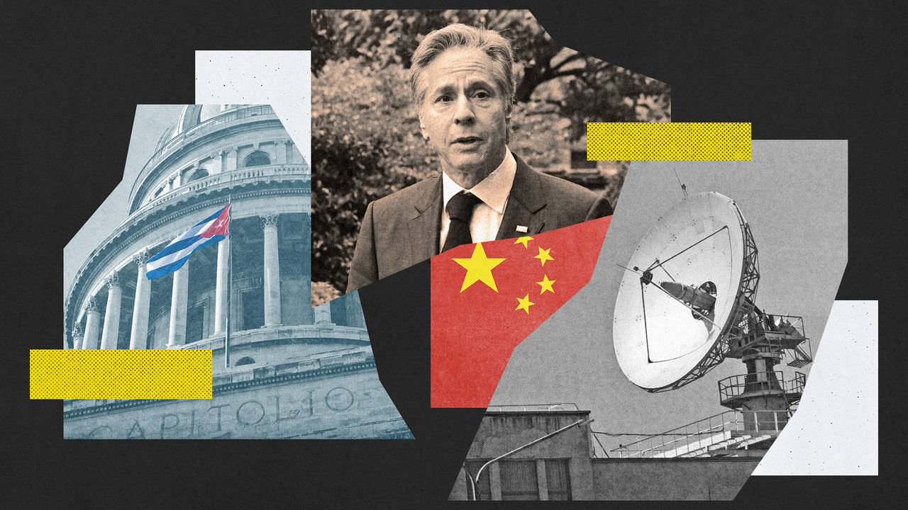
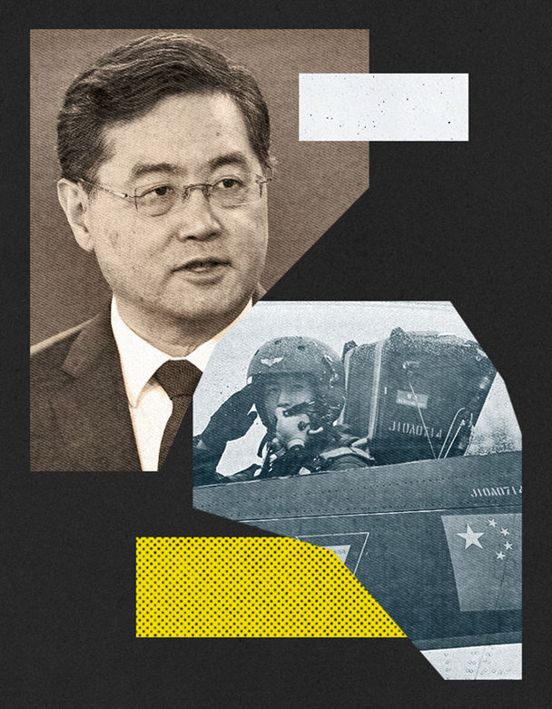

###### Not another crisis

# America and China try to move past a new bump in relations 

##### Antony Blinken is headed to Beijing despite reports of Chinese eavesdropping in Cuba 

 

> Jun 9th 2023 

Few Americans would ever forget those chilling 18 minutes in the evening of October 22nd 1962. As they gathered around their radios and televisions, their president, John F. Kennedy, revealed that the Soviet Union had moved nuclear-capable missiles to Cuba, 90 miles (140km) from the coast of Florida. America would blockade the island until they were removed, he said. It was the first the public learned of the crisis that over the next five days would bring the world to the brink of nuclear war. 

Analogies with that episode were perhaps inevitable when the , followed by several other American media outlets, reported on June 8th that China had made a secret agreement to establish a listening station in Cuba. Senators from both sides of the aisle urged the White House to take preventative action. Mike Gallagher, a Republican congressman who chairs the House of Representatives’ new bipartisan Select Committee on the Chinese Communist Party, warned that a new cold war “once again, has come to our doorstep”. He even quoted from Kennedy’s address that night in 1962. 

Yet such comparisons are undue. The White House, having initially dismissed the reports as inaccurate, now says that China has gathered signals intelligence from Cuba for some time and upgraded its facilities there in 2019. Officials say they have shared their concerns with Cuba and successfully lobbied other governments not to host Chinese military or spying outposts. Despite the furore, America’s secretary of state, Antony Blinken (pictured), will go ahead with a long-delayed visit to Beijing—his first in that role—on June 18th. 

Chinese eavesdropping in Cuba is, indeed, nothing new. A report from the US Army War College’s Strategic Studies Institute in 2011 suggested that China had access to three listening stations there, at Bejucal, Santiago de Cuba and Lourdes. It was using them to intercept radio and mobile-phone transmissions, and to conduct cyber-espionage, the report said. The Lourdes facility, just outside Havana, was the Soviet Union’s biggest overseas listening station and used by Russia until the early 2000s. 

Dennis Wilder, a former China analyst at the CIA and now a professor at Georgetown University, says he had been aware of China’s use of Cuba for electronic eavesdropping since the end of the cold war. The facilities there, he says, are most likely operated by the Third Department of the People’s Liberation Army Joint Staff Department (often referred to as 3PLA and roughly equivalent to America’s National Security Agency). Other 3PLA sites may include North Korea, Pakistan and Djibouti, where China opened its first (and only) overseas military base in 2017.

China is probably using facilities in Cuba to try to hoover up information related to American satellite systems, Mr Wilder suggests, and the recent upgrades may have involved installing bigger, more powerful data-gathering equipment, which is often contained in large round structures known as radomes. “That’s the kind of thing that I think that the Chinese are trying to put in Cuba—very large arrays with tremendous capability,” he says. “That kind of capability would be very, very useful to the Chinese military.”

Troubling as that may be for America, it has few good options to respond. China and Cuba have both denied the media reports and the Biden administration’s subsequent allegations. Anyway, such facilities do not violate international law. And America is thought to have many similar sites in countries around the world, including Japan, South Korea, Taiwan and Australia, and uses them to gather signals intelligence on China. So America is unlikely seriously to escalate its protests over any such Chinese activity in Cuba.

 


China, meanwhile, is using the controversy to highlight what it sees as American hypocrisy. “Slanders and smears” would not obscure America’s “deplorable track record of indiscriminate mass spying around the world”, a foreign-ministry spokesman said on June 12th. In a call with Mr Blinken two days later, Qin Gang, China’s foreign minister (pictured), rebuked America for harming China’s security. But both sides have confirmed Mr Blinken’s trip. And though American officials do not expect breakthroughs on a lengthy agenda, including Taiwan and Ukraine, they hope the visit will help to establish better lines of communication. “Intense competition requires intense diplomacy,” said one.

That will come as a relief to many other countries, especially in Asia. They worried that tensions were spiralling out of control in February when America shot down a Chinese high-altitude balloon that the Pentagon said had been monitoring American military bases. China said the balloon was gathering meteorological data, but the White House rejected that explanation and postponed a visit by Mr Blinken that had been scheduled for later that month.

The effect was to stall efforts to stabilise relations that President Joe Biden and his Chinese counterpart, Xi Jinping, began when they met in Bali in November. In the past few weeks, however, there has been a swirl of high-level contacts, including a visit to Beijing in May by William Burns, the CIA chief. Jake Sullivan, America’s national-security adviser, also met Wang Yi, China’s top diplomat, in Vienna that month. Economic officials have met, too. 

Resuming high-level talks is important because it means the two sides can at least communicate their positions in private. That is preferable to doing so in heated public exchanges as they have for much of the time since a visit to Taiwan in August by Nancy Pelosi, then the speaker of America’s House of Representatives. Direct contacts could also facilitate progress on some technical and commercial issues, which would smooth the way for Mr Xi’s expected attendance of the Asia-Pacific Economic Co-operation forum in San Francisco in November. Mr Blinken’s trip could open the door, too, for others whom China is more interested in receiving, such as America’s treasury secretary, Janet Yellen, and climate envoy, John Kerry. 

Even so, the Cuba controversy is a reminder that high-level strategic tensions endure—and will not be easily resolved. That was also clear when China’s defence minister, Li Shangfu, refused to hold talks with America’s defence secretary, Lloyd Austin, at a security conference in Singapore in early June (China wants American sanctions on General Li lifted first). In their public statements, General Li warned America and its allies to stop surveillance operations near China’s coast, while Mr Austin cited an “alarming increase” in unsafe Chinese intercepts of American and allied ships and aircraft. 

The Cuban contretemps also feeds into a domestic political climate in both China and America that is making it harder for their leaders to compromise on any substantial issues. And their room for manoeuvre could shrink further in the coming months, with a presidential election due in Taiwan in January and campaigning for America’s presidential poll expected to start in earnest this August with the first Republican primary debate.

The level of hostility towards China on both sides of the aisle in Congress was writ large in responses to the Cuba reports. “We urge the Biden administration to take steps to prevent this serious threat to our national security and sovereignty,” said Mark Warner, the Democrat who chairs the Senate Intelligence Committee, and Marco Rubio, the Republican vice-chairman. Mr Gallagher accused the Biden administration of whitewashing Chinese aggression. “We must make it clear that, as President Kennedy said over 60 years ago on the eve of a previous crisis in Cuba, ‘One path we shall never choose, and that is the path of surrender or submission.’” ■


