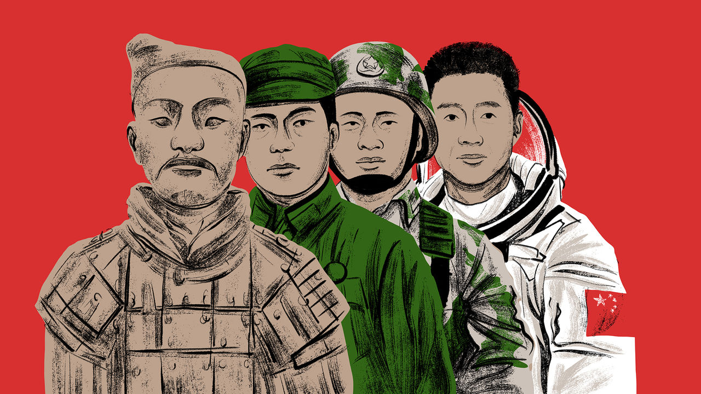

###### Chaguan

# Xi Jinping reaches into China’s ancient history for a new claim to rule 

##### The Communist Party is stuck in a legitimacy trap 

 

> Jun 15th 2023 

For decades outsiders have told a simple story about the ties that bind China’s Communist Party and its people. This story describes a bargain between rulers and subjects, in rather condescending terms. In this telling, most Chinese people, from the toiling masses to the urban middle classes, know to avoid talking or thinking about politics. And in exchange for shunning the world of power, citizens are allowed to compete for their share of the wealth and opportunities generated by a rising China. Recently—as China’s economy slows, house prices slide and job opportunities for new graduates dwindle—the same outsiders have taken to wondering whether the public might turn on the party. 

In fact, that economically focused description of China’s social compact understates the party’s ambitions, certainly since Xi Jinping took over as supreme leader 11 years ago. Mr Xi has for some time played down the pursuit of material wealth as a national cause and put politics—albeit in a strictly policed, top-down form—back at the centre of daily life. He has enjoyed considerable success, at least to date. A striking number of citizens—and especially those born after 1990, who have known only ever-growing national wealth and strength—have been ready to believe that, on balance, China succeeds because of its stern, one-party political system, not despite it. 

When unelected governments or autocracies claim that they deserve to rule because they govern well and efficiently, political scientists talk of appeals to “performance legitimacy”. In this vein, the first two years of the covid-19 pandemic were a particular gift to party ideologues. Day after day, the propaganda machine pumped out news of the latest covid death toll in America, backed by images of patients on ventilators in Western hospitals, recycled clips of President Donald Trump scorning science at White House press conferences, and protests in Western cities against lockdowns, mask-wearing and vaccine mandates. For sure, censorship was heavy and omnipresent, and locked-down Chinese chafed against thuggish enforcement of zero-covid rules, especially as the pandemic dragged on. On balance, though, boasts of Chinese exceptionalism rang true for many citizens. Party ideologues hailed Mr Xi as commander-in-chief of a people’s war against covid, offering China order and safety, in contrast with squabbling, selfish, Western democracies.

Alongside boasts about the party’s governing competence, Mr Xi has offered darker calls for China to become self-reliant and learn to struggle against foreign foes. In speeches he talks of China’s re-emergence as a great power, and how that will involve defying a hostile American-led West bent on containment. Such talk of dangers serves more than one purpose. It unifies the masses, while turning anyone with conflicting views into an enemy within. For in times of peril, dissent by underlings is a form of sabotage, like a sailor arguing with the captain of a storm-tossed ship. 

Yet a mandate to rule based on the claim that the party is exceptionally competent, and indeed is successful because it brooks no dissent, becomes a trap when top leaders mess up. A decisive, though tyrannical, captain quickly becomes a liability if he repeatedly steers the ship of state onto rocks. An unusually candid essay by two Chinese scholars, Fu Yu and Gui Yong, describes a crisis of confidence among the young. The work, based in part on surveys of social media, is flagged and translated by David Ownby of the University of Montreal on his “Reading the China Dream” blog.

Focusing on Chinese born after the 1990s, it describes a gap between their patriotism and high expectations of their rulers, and the realities of a society that seems to them cruelly unequal, to the point that hard-working provincial Chinese can never catch up with those born into privilege. First published in 2022 and reissued last month by an academic journal, the , the essay, “The Five Intriguing Paradoxes of Contemporary Chinese Young People”, describes youngsters who have turned against “evil” private capital and want a strong state to tame it. Some are suffering “crises of belief” that are leading many to shun marriage and decline to have children. Worse, since the piece was first published, the country has endured the sudden, bungled collapse of its zero-covid policy and the concealment of large numbers of deaths, further undermining public confidence.

A new pitch, for a slower-growing China

Not unrelatedly perhaps, on June 2nd Mr Xi outlined his broadest-yet claim to rule, based on China’s exceptional culture. He called China the only civilisation to be uninterrupted over many millennia. As if suggesting that convergence with liberal values would betray every dynasty that preceded him, Mr Xi declared: “The fact that Chinese civilisation is highly consistent is the fundamental reason why the Chinese nation must follow its own path.” Because Chinese civilisation is unusually uniform, Mr Xi went on, different ethnic groups must be integrated and the nation unified: code for imposing Chinese culture on Tibet and other regions, and for taking back Taiwan. For anyone puzzled that a once-revolutionary party now calls itself the “faithful inheritor” of “excellent traditional culture” (plus a dose of Marxism), the weighed in with commentaries explaining why Mr Xi’s emphasis on cultural confidence is vital in a perilous moment when “strategic opportunities, risks and challenges co-exist”. Economic heft is not enough, the newspaper added. If China’s economy develops but its spirit is lost, “Can the country be called strong?”

Take a step back, and Mr Xi is crafting an appeal to what might be termed civilisational legitimacy. When the public is disappointed by a slowing economy and by the pandemic’s incompetent ending, this gambit must be tempting. After all, who will dare challenge a mandate to rule that is supposedly unchanged in 5,000 years? How foreign governments are supposed to engage with such chauvinism is a different and worrying question. ■


