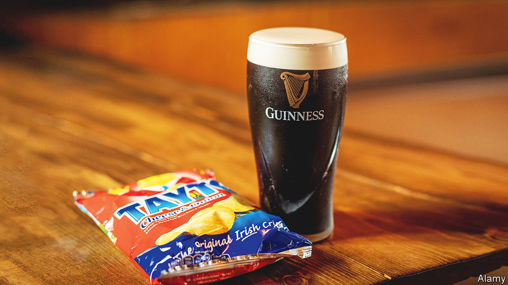

###### World in a dish

# A potato can have no finer fate than ending up as an Irish crisp 

##### There is a joy in saving foods, however quotidian, for particular times and places 

 

> Jun 15th 2023 

WHAT IS nirvana for a ? To be sliced and slivered and bathed in boiling oil before emerging as a French fry? To have its weight matched in butter and cream and be transformed into glorious mounds of mash? No. The answer is found in a plastic bag. For a potato, there is no nobler fate than to end up in a packet of Tayto cheese-and-onion crisps.

Taytos are the consummate crisps (potato chips to Americans). The company was established in Ireland in 1954 by Joe “Spud” Murphy. He was not the inventor of crisps, but he has been credited with transforming them. Until then there was no way to flavour the individual crisps themselves; instead each bag came with a small blue packet of salt to be sprinkled and shaken over the contents.

The invention after the second world war of the gas chromatograph dispensed with that DIY process. It allowed food scientists to understand the chemical compounds behind flavours such as cheese. That in turn led to the development of artificial flavours, an advance on which Murphy seized to great effect.

He started with cheese and onion. The pairing is a classic: think of the strings of Gruyère emerging from a bowl of French onion soup, or a dish of Käsespätzle, German dumplings that are mixed with cheese and topped with caramelised onions. And the flavour combines well with spuds. Potatoes, wrote , one of Ireland’s greatest poets, promise the “taste of ground and root”. The less poetic might describe them as a bit bland. Sprinkled with the salty, savoury umami of Murphy’s seasoning, however, they became a cut-price sensation.

Taytos remain the quintessential Irish crisp, but now they are available elsewhere (as, of course, are  of flavoured crisps). That is a mixed blessing. Once upon a time even industrially produced foods had a limited range. To travel was to discover not only the cooking in other places, but the snacks. Going to France was a chance to chug a bulbous bottle of Orangina, a fizzy drink. For Europeans, a trip to America—or a visit from Americans—was an opportunity to stock up on Reese’s Peanut Butter Cups. Thanks to a globalised food system and the appetites of homesick migrants, such items are now available far beyond their lands of origin.

That shift entails the loss of a modest joy. At first glance a bag of Taytos is the antithesis of a seasonal or local food, characteristics that today are prized. Encased in their silvery plastic, they survive in all seasons and locales. And yet, for your columnist at least, these potato snacks are entangled with their Irish roots.

For her, Taytos are a once-a-year treat, to be eaten on a beach in south-west Ireland shivering after an icy swim or sweating at the top of a mountain. That is not out of necessity. They can be bought in London, her home city, or ordered on the internet, albeit at a mark-up. The ingenious seasoning should taste no different in a London park than in Murphy’s homeland. But somehow it does. ■


