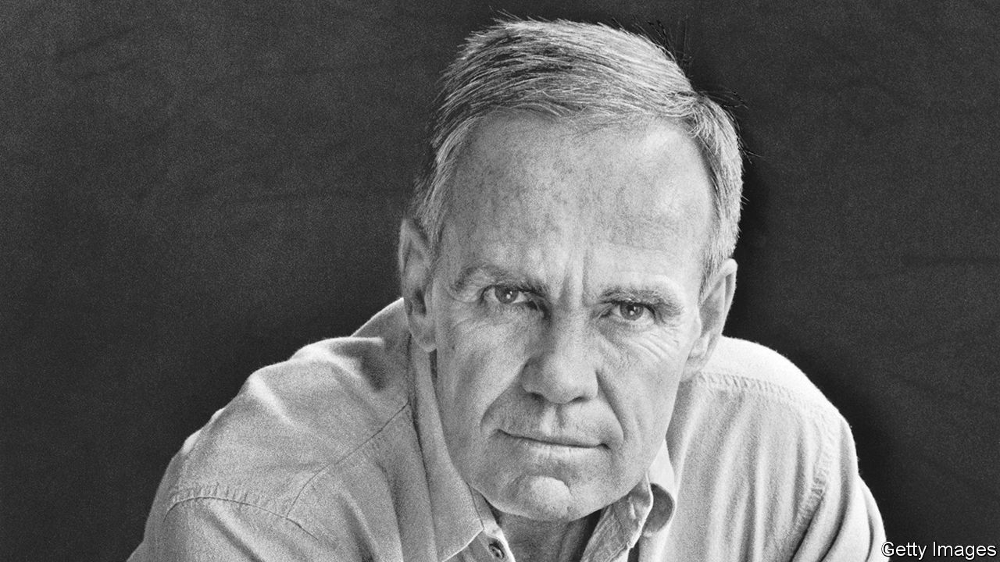

###### American bards

# Cormac McCarthy was the great novelist of the American West 

##### His fiction faces a bloody past and never looks away 

 

> Jun 14th 2023 

WILLIAM FAULKNER is the bard of the American South. Saul Bellow is the supreme chronicler of Chicago. New York is contested territory. For a long time, Wallace Stegner could have laid claim to the West. But that was before Cormac McCarthy hit his stride.

To understand the , you need to know the land and its beautiful, terrifying expanse, as Stegner did. But in his fiction Mr McCarthy, who died on June 13th at the age of 89, grasped and dramatised another essential truth: that the West was won with violence. The saga of the region’s piecemeal incorporation into America involved bravery, gumption and careful planning—but also decades of brutal, intimate bloodshed. It haunts every strip mall and stylish restaurant and housing development from Kansas City to Los Angeles and beyond. This was Mr McCarthy’s subject: the reality and implacability of cruelty and conflict.

The great theme of his career is all the more striking because this was not his native territory. He was born in Providence, Rhode Island, in 1933 with the first name Charles. At some point he changed it to Cormac, supposedly in honour of an Irish ruler, and he grew up mostly in Knoxville, Tennessee. His early novels—“The Orchard Keeper” (published in 1965), “Child of God” and “Suttree”—were deeply Faulknerian: arch, self-referential and largely plotless.

He gained fame with his “Border trilogy”: “All the Pretty Horses” (1992), “The Crossing” and “Cities of the Plain”. Like all his fiction these were demanding stories, but they won him a wider readership, especially “All the Pretty Horses”. Elegant and well plotted, it was made into a film starring Matt Damon and Penélope Cruz at the start of their careers. The best book in the trilogy was the last. It was austere, bloody and hopeless, as the West had been for those on the losing end of its conquest.

The best film adaptation of Mr McCarthy’s work was the Coen brothers’ version of “No Country for Old Men”, a slim, propulsive, noirish novel published in 2005. A wonderful film that was true to the author’s vision, it featured commanding performances from Josh Brolin as the foolish hero; Javier Bardem as his psychopathic nemesis; and Tommy Lee Jones, who imbues the sheriff of the story with a world-redeeming, plain-spoken goodness. Published in 2006, and recounting the plight of a father and son in a post-apocalyptic world,  won a Pulitzer prize and also became a film.

But Mr McCarthy’s best novel—and arguably the best work of fiction written in English in the past 50 years—was “Blood Meridian”. Its narrator, “the kid”, joins a gang of Apache hunters who are hired to collect scalps at $100 apiece. Despite his deeds the kid, like Mr Jones’s sheriff, has a stubborn decency, though it proves no match for his milieu.

Mr McCarthy based the book in part on the real-life Glanton Gang, scalp-hunters who haunted what is now Sonora, New Mexico, and bits of Arizona. It features one of literature’s most pitiless and vibrant depictions of vice, in the form of a quasi-mythical character, fat and hairless, who becomes the novel’s amoral centre. Its plot is relentlessly violent, the language almost biblical. Finishing it takes determination; at times it seems perversely intent on persuading readers to give up. The baroque descriptions of gore include a tree with dead babies hanging from the branches and a head split open “to the thrapple”. 

Persist: “Blood Meridian” makes art out of man’s inhumanity to man. To read it is to know what not to do and how not to live, but also to confront an aspect of the past that all Americans inherit. It is not exactly redemptive; rather it bears witness. Mr McCarthy does not look away. He never did.

He lived a deeply unliterary life in the south-west, preferring the company of scientists to authors. He gave few interviews and appeared uninterested in fame (though the daring of his books suggests a fierce ambition). If his , published in 2022, were too abstract and psychological for some, they were also works of striking vibrancy and originality from an author who was nearly 90. In his mature prose Mr McCarthy was wholly himself, original and distinctive. For a novelist there is no higher praise. ■


