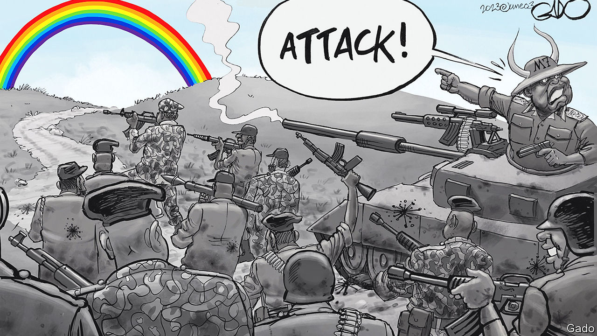
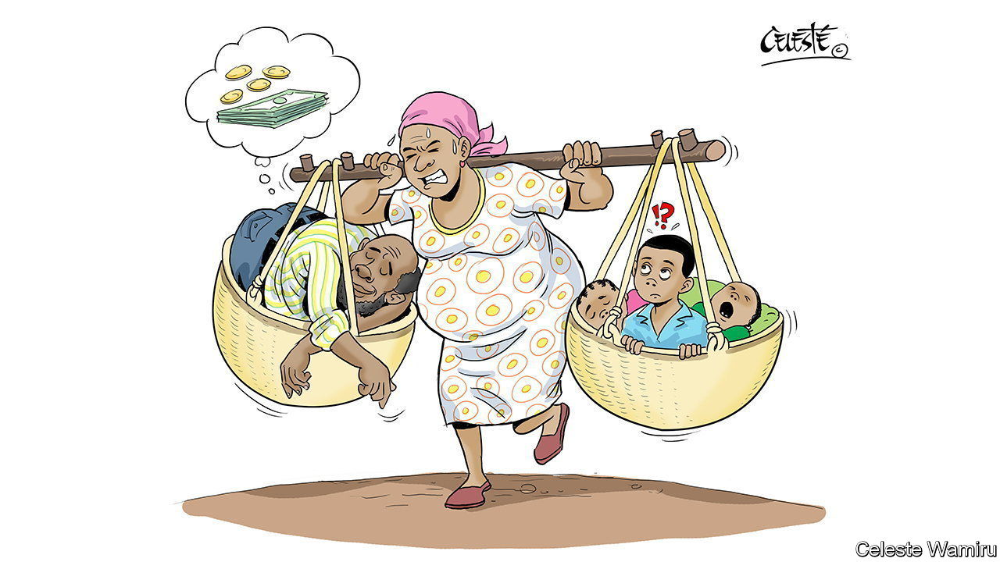

###### African political cartoons

# For the boldest commentary on African politics, look to cartoonists 

##### They go further than many of the continent’s journalists ever dare 

 

> Jun 15th 2023 

The president is a gun-toting dairy farmer who is milking his “cowntry” dry. His brother takes the form of a pair of sinister sunglasses eyeing the national pension fund. His son is a toddler in an oversize army hat who has not learned to tie his shoelaces.

Or so they appear in the imagination of Chrisogon Atukwasize, the man with the sharpest pencil in Uganda. Signing himself “Ogon”, he uses his cartoons in the  newspaper to shame the corrupt and upbraid the powerful. Last year soldiers kidnapped and tortured the  which featured one of his illustrations on the front cover. They were said to have also made inquiries about Ogon. He responded with a sketch of a torturer drawn as one of the Minions—characters in “Despicable Me”, an animated-film franchise—struggling to read the offending book.

Criticism of the authorities is not entirely silenced in Uganda. But under Yoweri Museveni, a rebel who fought his way to power and has kept it for 37 years, the real news is often hidden between the lines. Cartoons revel in such ambiguity; after all, in a picture, everything can be a kind of subtext. Illustrators use their relative freedom to probe deeper than most journalists in the region dare to. At first, Ogon just wanted to draw. Later, he says, “You find you have a cause to push.” 

That situation holds true all over Africa, where satirists are often the boldest commentators on politics and vice. “Cartoonists use visual imagery as a kind of mask, to conceal in order to reveal,” says Ganiyu Jimoh, a Nigerian cartoonist and scholar. He compares the wit and allusions in cartoons to the traditional masquerades in Yoruba culture, in which masked performers would ridicule the powerful. As an adage has it, “Oba kii mu onkorin”: the king does not arrest a satirist.

The first press cartoons in Africa were drawn by white colonialists—and were often racist. In the 1930s black artists began to publish political cartoons in Nigeria and South Africa. But African cartoons truly blossomed in the 1990s, as a democratic wave washed over the continent. In Francophone countries satirical periodicals flourished, modelled on , a French weekly. The Senegalese everyman Goorgoorlou, created by the cartoonist Alphonse Mendy, crossed from the page to the television screen, a popular hero for an age of economic hardship at the close of the millennium.

Satirists wore their politics on their sleeves. South Africa’s most famous cartoonist, Jonathan Shapiro—better known by his pen name Zapiro—was a white anti-apartheid activist who had taught himself cartooning in the 1980s after being forcibly conscripted into the army. In Kenya, the ramparts of authoritarianism were breached when cartoonists began to draw the president for the first time. “A cartoon is like that little boy that can say the emperor is naked,” says Godfrey Mwampembwa, or Gado, east Africa’s greatest satirist.

 


Today most countries in Africa have multiparty elections and an independent press. But in many places democracy is a paper-thin veneer, at which cartoonists caustically scratch away. Even in the freest societies, satire has come under pressure. Jacob Zuma, the  of South Africa, tried to sue Zapiro over a cartoon which showed him preparing to rape Lady Justice. Gado got into trouble in 2015 after drawing the president of Tanzania as a half-naked sybarite fed by women labelled Cronyism, Incompetence and Corruption. The , the paper in which the sketch appeared, was banned in the country; the next year, Gado lost his job.

But he is still drawing. His recent targets have included Uganda’s , which prescribes the death penalty for “aggravated homosexuality” and was signed by President Museveni in May (see top image). Like other cartoonists, Gado sometimes uses his art as camouflage for pithy verbal commentary. Many of his cartoons feature a tiny, squiggly figure in the corner—“my alter ego”, he quips—offering quirky reflections of its own. “When I started I would use that as a way of getting away with stuff because editors wouldn’t pay attention to it,” he says. With time it became a technique to add extra layers to his work. The inherent power of cartoons, he adds, is that they are “open to interpretation”.

Artistic licence

That ambiguity has proved useful to the Zimbabwean cartoonist Tony Namate, who says the role of satire is “to punch holes in the hot-air balloons of politicians”. On one occasion a crowd of war veterans besieged the newspaper offices where he worked. On another his editor was dragged to court after he sketched a figure that seemed to be  fleeing a mob. The prosecution could not prove that the caricature was indeed of the former president, and the case eventually collapsed.

Most African cartoonists now use the internet to share their work—especially when it is deemed too controversial to make it into print. “If it can’t run in the publication, then that’s well and good, you publish it on your socials instead,” says Celeste Wamiru, a Kenyan cartoonist. On Twitter and Facebook cartoons take on a life of their own, unmoored from newspapers and floating in a sea of memes. New kinds of satire evolve. In April Jimmy Spire Ssentongo, a Ugandan cartoonist, invited the citizens of Kampala to an online exhibition of the city’s potholes. Photographs of cratered roads flooded social media and the president swiftly promised action.

The community of African cartoonists is growing, supported by networks such as Cartooning for Peace, an association based in France. But some voices are still lacking. Most cartoonists are men, who can be too quick to deploy gendered images or sexual metaphors. Ms Wamiru became the first woman to be employed as an editorial cartoonist in east Africa when she was hired by the  in 2011. Women are taught to “take a back seat and be led”, she says. One of her cartoons shows a stooped mother carrying her husband in a basket, while he dreams peacefully of money.

A cartoonist’s work is never done. Ogon laments the fact that Ugandan politicians are just as corrupt as when he first picked up his pen. Some rage at his scabrous caricatures. But sometimes, he says, he gets phone calls from people on the inside, who know the truth and are scared to speak out themselves. “Don’t relent on your cartoons,” they tell him. ■


