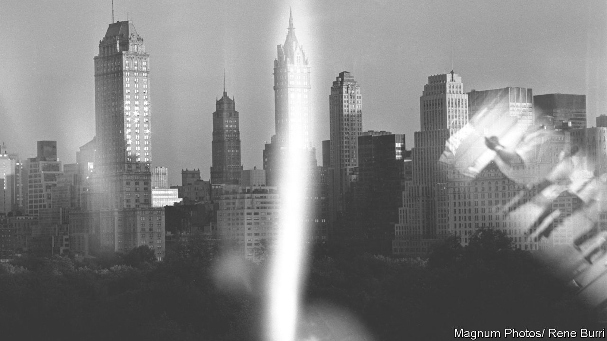

###### American cults

# Meant to be liberating, the Sullivanian community became a nightmare 

##### In his new book, Alexander Stille tells a story of experimental living and exploitation 

 

> Jun 15th 2023 

By Alexander Stille. 

“How many cults have reunions?” So muses a former member of the Sullivanians, a therapeutic community that thrived in New York in the 1960s. As Alexander Stille shows in this absorbing account of the group’s rise and fall, many of its alumni do indeed remain in close contact with each other. But others regard it as a failed utopia or even “the most traumatic experience of their lives”. One interviewee tells Mr Stille, whose previous books have covered his own parents’ marital woes and the Sicilian Mafia, that he “joined a movement that turned into a business, that became a racket”. Another describes the Sullivanians’ driving force, Saul Newton, as “a sexual monster”.

The Sullivan Institute for Research in Psychoanalysis was named after Harry Stack Sullivan, a psychiatrist who was heavily influenced by the work of . Isolated as a child, Sullivan took a keen professional interest in the problem of —and in its antidote, which he called “chumship”.

In 1957 Newton and his wife, Jane Pearce, both followers of Sullivan, founded a centre that would expand on the radical implications of his ideas. Then a highly regarded therapist, Pearce shaped the group’s theoretical framework and gave it credibility. Meanwhile Newton, who liked to brag about his exploits fighting fascists in the , lent it his charisma. Together they acquired a handsome town house on the Upper West Side and built a summer retreat on Long Island.

Newton and Pearce believed that the nuclear family was an instrument of “deadening conformity”, which trapped children and stifled parents. Instead they favoured “group marriage”, a mode of polyamory that allowed adults to luxuriate among “alternate validators”, while their offspring were brought up by baby-sitters or sent away to boarding schools.

At first the Sullivanian community prized creativity. Notable patients included the artist Jackson Pollock, Lucinda Childs, a choreographer, and Clement Greenberg, an art critic who championed Abstract Expressionism. In the mid-1970s the focus narrowed: its main artistic channel became the Fourth Wall Repertory Company, which staged shows such as “The King of the Entire World”, a musical which appeared to shed light on Newton’s autocratic mindset.

Many of those who took part in Sullivanian therapy, and especially the men, were drawn by the prospect of easy sex. But this was not a zone of unfettered hedonism. Rules abounded. These extended to food, prompting one member, who had been required to travel to a conference in Indiana with provisions from New York, to contemplate his wilting salami and reflect: “I don’t think Armageddon is going to happen if we have a cheeseburger.”

Rigid codes were supposed to foster closeness. Yet what to some members seemed the atmosphere of a tight-knit village struck others as a grotesque culture of surveillance. The leaders purported to be communists but revelled in hierarchical privilege. As disciples fretted about status and earning “prestige points”, Newton—who was divorced from Pearce in the early 1970s and married six times in all—ran amok. (A serial predator, he demanded sexual favours from a woman who had very recently given birth.) He died in 1991, aged 85; in his declining years his appetites became violent and abusive. 

Mr Stille carefully documents the institute’s unravelling and eventual collapse in the 1990s, as Newton’s last two wives feuded over his legacy. The author is sensitive to the human cost of this experiment, even if occasionally his language is rather breezy (one character goes on a “wild paternity rollercoaster”; the state of mind of others is “somewhat schizophrenic”). He elicits zinging critiques from his sources—not least one of Newton’s daughters, Esther, who remarks that her father’s project “combined the worst of , psychoanalysis and the musical theatre”. ■


