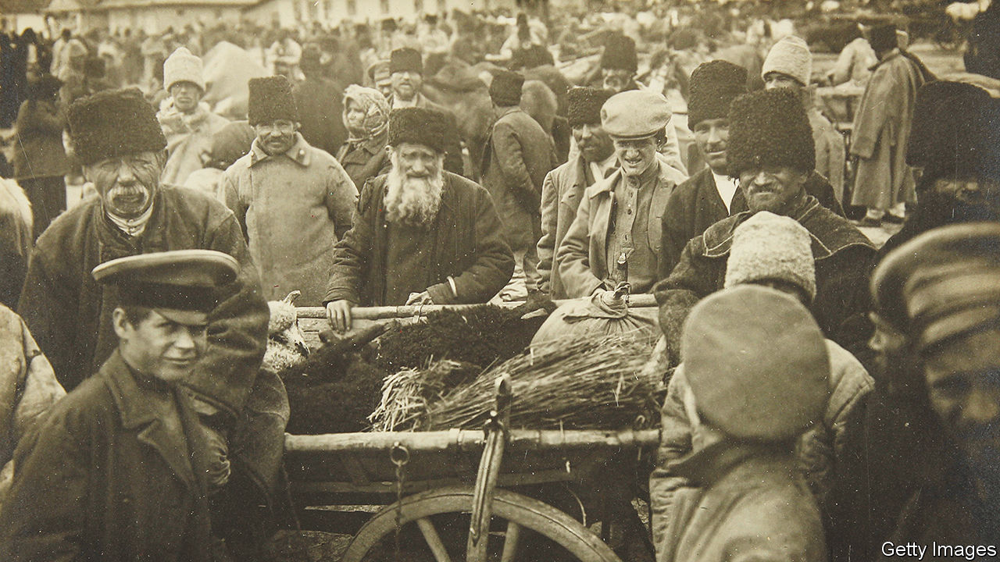

###### European history

# The eastern half of Europe is united by its diversity 

##### So says Jacob Mikanowski in his insightful chronicle, “Goodbye, Eastern Europe” 

 

> Jun 15th 2023 

 By Jacob Mikanowski. 

For most of the past three decades, the received view of eastern Europe, defined roughly as the territory between Germany and Russia, has been breezily optimistic. A region that exemplified the cultural and intellectual vim of the old continent had escaped a cruel communist yoke. It was now free to make an uneven but inexorable recovery, joining the West’s institutions and following its political and economic models.

Among Eurocrats, multinational lenders and NATO strategists, any difference between the countries in “central and eastern Europe”, to use the new nomenclature, mattered less than their common recent past and collective destination. Even the  were seen as a nasty blip rather than a reversal of these trends. Ditto the emergence of chauvinist politics in  and : that was a disappointment, not a sea-change.

One of the merits of “Goodbye, Eastern Europe” by Jacob Mikanowski, an American writer and scholar brought up partly in Poland, is that it challenges this glib view from several angles, some of them unexpected. Distilling more than a decade of research, he carefully argues that if something marks out Europe’s eastern half, it is not homogeneity but wild, glorious diversity, including the long presence of Judaism, Islam and religious practices that blended Christianity and paganism. More edgily, he contends that communism, including the Soviet sort, was not an alien phenomenon but had been deeply rooted in the region since the early 20th century. 

Both his Polish grandfathers, Mr Mikanowski notes, became communists after considering a narrow range of other options, including Zionism, emigration and staying in a traditional Jewish community, or . With disarming openness, he shares the story of one of them, a partisan fighter with an impressive war record—he helped free several hundred fellow Jews from a camp in Belarus—who in the 1950s assisted in a communist sting that embarrassed Poland’s underground opposition and its Western friends.

Readers might wonder how the author’s emphasis on cultural and ideological variety squares with his title, which seems to suggest that the east of Europe was in the past a distinct, coherent region. His answer is implied rather than spelled out. In describing pre-industrial history, he stresses how diversity and bouts of sectarian hostility co-existed with fusions and overlaps. Thus for all the social barriers between them, Jews and Christians relied on each other’s folk remedies, faith healers and exorcists. They formed a single religious ecosystem. In communist times, another odd symbiosis developed between dissidents and the secret police who devoted huge resources to monitoring and circumscribing their lives. 

In this way—and for all the power of dynasties, emperors and 20th-century tyrants—the region spawned distinctive grassroots cultures and hosted an ingenious interplay between groups and ideologies. That talent was not entirely eliminated by the , nor by Soviet-led communism, but may now be threatened by globalisation. Such, broadly, is the author’s view (though he makes the last point more explicitly elsewhere). 

He yearns for the survival of an east European world in which people react unpredictably to their geopolitical or economic masters. In practice, though, the line between downward pressure and local ingenuity is harder to draw than he allows.

Take the book’s final section on . Mr Mikanowski makes the familiar point that after Ukraine became independent in 1991, its leaders struggled to form a nation out of the Russophone east of the country and the post- west. Then the Kremlin simplified that task by claiming Ukraine had never existed and should never exist. The courage, and creativity, of the Ukrainians’ response is visible to all. 

Not for the first time in the region’s history, a common struggle to defy annihilation is forging new social, cultural and psychological realities, which neither external nor domestic leaders can control. The fallout from that life-and-death conflict is being felt in every adjacent land, creating new fissures and new transnational bonds. It may still be too soon to say goodbye to eastern Europe. ■


