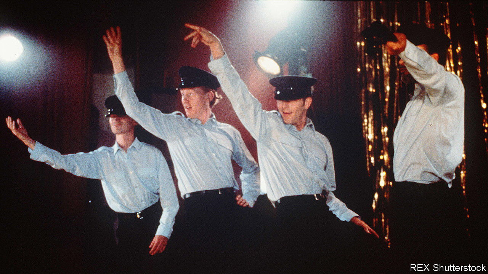

###### Back Story

# “The Full Monty” gang are back 

##### In a new TV series, they can leave their hats on 

 

> Jun 14th 2023 

Unemployment, attempted suicide, sexual dysfunction, the impending repossession of a sunbed: in “The Full Monty” all manner of woes inspired six former steelworkers to strip to their birthday suits for a raucous paying audience. Gaz, their ringleader, played by Robert Carlyle, was an ex-con at risk of losing contact with his son. Overweight and depressed, his best pal Dave (Mark Addy) feared for his marriage. All six were adrift and emasculated in the post-industrial world. It was a hoot.

And not only because of the penis jokes and the fact that they got their kit off. Released in 1997, the film exemplified two winning genres. First, a tale in which a posse of misfits seek salvation in a shared endeavour—a brass band, a choir—as the clock ticks towards a showdown. Second, as  was to Philadelphia, “The Full Monty” was a paean to an unlovely place that is loved nevertheless, in this case Sheffield, Yorkshire, in all its rusty glory: the sun rising behind the smokestacks, the polluted canals, derelict mills, grimy terraces, grey tower blocks and garden gnomes.

It was also a toe-tapping ode to the dance music of the Seventies and Eighties, from “Hot Stuff” to “You Sexy Thing”. (“Look at that,” Dave complained of Irene Cara’s welding technique in the video for “Flashdance”, “her mix is all to cock!”) Coming out at a moment when British culture had clout, the film was an international hit. A quarter of a century on, the gang are back in an eight-part series of the same name, out on June 14th on Hulu in America and Disney+ elsewhere.

Seeing them after all these years is like meeting long-lost friends, albeit the kind who make you think: if that’s what you look like, how the hell do I look? Life has continued to come at them, in the form of bereavement, adultery and loan sharks. Still skint, Gaz lives in a caravan and has a teenage daughter, Destiny, or Des (Talitha Wing, the best thing here). Like her old man, Des makes mistakes but tries to make up for them, struggles to go straight but has a heart of gold. The story is again anchored in Gaz’s friendship with Dave and Dave’s marriage to Jean (Lesley Sharp). She is now the head teacher of a school where Dave is the caretaker.

Closeted in the movie, Lomper (Steve Huison) has a husband and runs a café that is the chums’ hq. It is a homely version of the mobsters’ meat-shop hangout in , with less ultraviolence and more cake. The six wrestle with 21st-century mores such as automated supermarket checkouts and political correctness. Once again they get into harmless scrapes; again Gaz’s children are father to the man. Along with the children come assorted animals (a stolen celebrity dog, a prize racing pigeon). 

This sounds twee, and it is. At the same time the mood is much grimmer than the original’s, and not only because everyone keeps their clothes on. The film had decay and despair but also the gentleness of a fable. Here, beneath the antics and confectionary, the wider world is desolate. The school’s ceilings leak. Hospitals are creaking. The welfare system is a cruel obstacle course. People go hungry.

As a result, the tone whiplashes between doleful and cute, the comedy veering from whimsical to screwball to macabre. Dramatic tension suffers. For all the post-Thatcher political consciousness, the real battle in 1997 was between the six men and themselves. Several almost pulled out of the striptease because of their neuroses, psychological or anatomical. Baring all became, for them, a sort of gaudy apotheosis.

In the new series, the antagonist is the pitiless, skinflint state, a foe you can dodge and bait but not defeat. The clock the men race is the tick-tock of mortality. “Tomorrow’s another day. Might be shit too,” Gaz tells Des, expressing the limit of the drama’s optimism, “but at least shit in a different way.” 

As for the thongs and Velcro-seamed trousers: this show knows it can’t dance in the same dole queue twice, and doesn’t try to. Nods to the gyrations of yore are sparing; only one scene comes close to reprising the old routine, and then in circumstances bleak enough for . Instead it updates and amplifies the politics and deepens the characters.

Does it work? It grows on you. And there is a brave kind of integrity in this approach to making a sequel. Most sequels run on nostalgia, peddling the dual pleasures of a gauzily revisited past and a sense of progress and resolution. Boldly, “The Full Monty” offers little of either. The past is past and, even with the crutches of friendship and gallows humour, the present is scarcely a remedy.■


