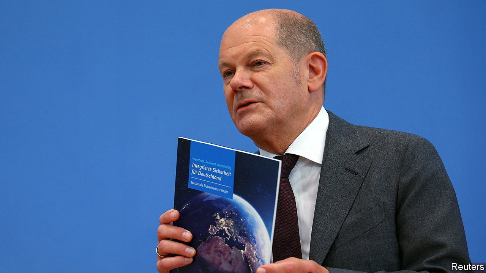

###### Big words

# Germany’s new national security strategy is strong on goals, less so on means 

##### Olaf Scholz unveils a long-delayed review 

 

> Jun 15th 2023 

The Danes do it. The Dutch do it. Even Jamaica, Honduras and Papua New Guinea regularly state the formal goals of their defence and foreign policies. And so now does Germany. Long squeamish about flexing its muscles despite being the world’s fourth-biggest economy and a pillar of European stability, the country bit the bullet on June 14th and launched its first-ever national security strategy. 

The 76-page document, meant to bring coherence and a sense of purpose across the breadth of government, does not make for exciting reading. Predictably, it stresses Germany’s deep commitment to the European Union and to NATO, as well as relationships with key partners such as America and France. Understandably, it fingers Russia as “the most serious threat to peace and security in the Euro-Atlantic area”. And somewhat daringly for a country whose biggest businesses depend heavily on trade with China, it does not shy away from blaming the Asian dragon for “acting time and again counter to our interests and values”, though it insists that China “remains a partner without whom many challenges and crises cannot be resolved.”

Yet while the strategy usefully clarifies Germany’s perceptions and goals, it is less clear about whens and hows. Almost a decade ago, for instance, Germany joined other NATO members in pledging to boost defence spending to 2% of GDP. In the face of Russia’s invasion of Ukraine, the gravest threat to European security since the end of the cold war, and in the unwonted light this has cast on the woeful state of Germany’s own army, the strategy paper does no more than restate the same promise. It hedges a bit, too, adding that 2% should be a multi-year average and that the government would strive to implement this “at no additional cost to the federal budget”. 

At the press conference that accompanied the policy document’s launch Christian Lindner, the finance minister, carefully explained that for at least the next few years the 2% goal would be made up not from the regular budget but via top-ups from a temporary €100bn ($109bn) special fund. In other words, it will be up to some future government to commit to permanently bolster Germany’s shrunken armed forces. “No party would agree to cuts in welfare to spare more for defence,” comments Thorsten Benner of the Global Public Policy Institute, a Berlin think-tank. “This question is just being kicked down the road.”

The strategy also lacks what some had hoped would be a key component, the creation of a body with implementing power akin to America’s National Security Council. This idea, say insiders, fell victim to wrangling inside the ruling three-party coalition as the foreign ministry, currently held by the Green party, resisted ceding influence to the Social Democrat-headed chancellor’s office, where such a council would logically be housed. 

The national security strategy’s slogan—”Robust, Resilient, Sustainable”—is also a reflection of coalition politics. Short on specifics about defence, the document touches necessary notes of budget probity for Mr Lindner’s liberal Free Democrats, as well as of commitment to climate-change goals for the Greens. More important than the wording of the document, however, is the fact that it was written at all. 

Since its resurrection as a Federal Republic on the ashes of the second world war, Germany has flinched from bold stands. After reunification in 1990, caution was replaced by complacency. Prosperity seemed assured under a trinity of blessings: American security, cheap Russian energy and a growing Chinese market. Even before Russia smashed into Ukraine last year, however, it was clear that the good times could not last. When the current coalition was elected in 2021, its pledge to issue a national security strategy was meant as a signal that it understood the growing precariousness of Germany’s situation. The biggest perceived danger then, however, was of America drifting into Trumpian isolation. Yet even though Trumpian isolation is hardly a spent force, it merits nary a mention in the review. ■

