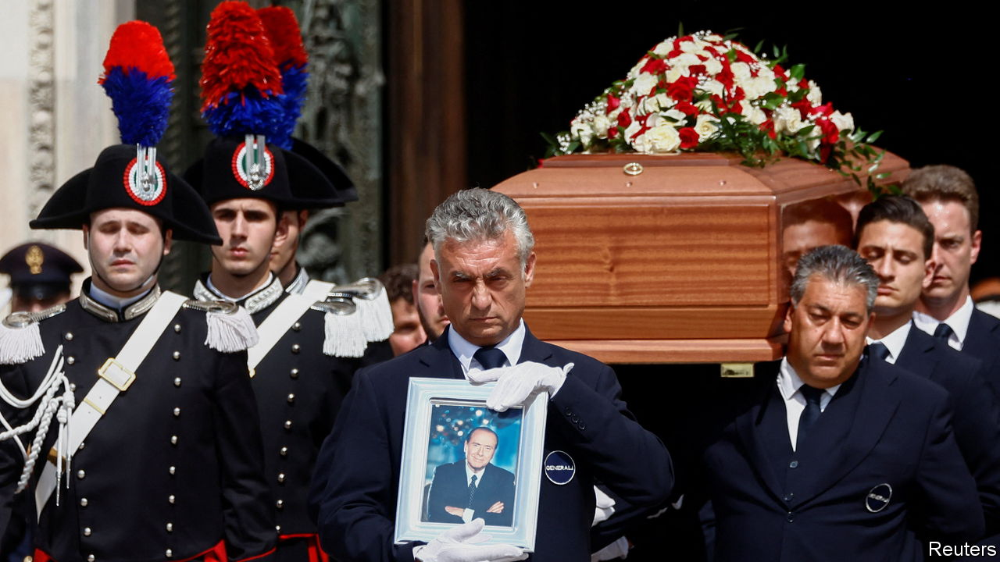

###### After Berlusconi

# The death of Silvio Berlusconi creates uncertainty for his party 

##### But it might strengthen the hand of Giorgia Meloni within the ruling coalition 

 

> Jun 13th 2023 

Silvio Berlusconi had a political career of rare longevity. He first became prime minister in 1994, when Helmut Kohl, François Mitterrand and others who have long since passed into history led Europe’s powerhouses. Almost 30 years later, he still headed a party with significant parliamentary representation, having come and gone as prime minister in four administrations. His  on June 12th will thus inevitably alter Italy’s political landscape. The likelihood is that the changes will benefit Italy’s current prime minister, Giorgia Meloni. But not without exposing her to new risks.

Most obviously, Mr Berlusconi’s departure from politics removes a source of intermittent, though acute, discomfort. Italy’s longest-serving post-war prime minister had an ego of pharaonic dimensions. He never truly reconciled himself to the fact that, following last year’s general election, his party, Forza Italia, had become part of a coalition government in which, for the first time, . Even before Ms Meloni took up her new post in October, he had embarrassed her by slyly making public a list of characteristics—”patronising, bossy, arrogant and offensive”— that he later, and unconvincingly, denied were hers.

As the new leader strove to convince Italy’s allies that her government , Mr Berlusconi not only alluded to his friendship with Vladimir Putin but backed his version of events there (on hearing of his death, Mr Putin again embarrassed Ms Meloni by lauding him as a “dear person”).

Though much diminished, Forza Italia is still decisive for the government’s control of legislation. It occupies 44 seats in the 400-member lower house, where the governing coalition has a 38-seat outright majority, and 17 of the 206 seats in the Senate, where Ms Meloni’s majority is 15. But the latest polls give it an average of just 7.3% of the vote. And it has reportedly amassed debts, guaranteed by Mr Berlusconi, of €90m ($97m). His heirs may be less keen to underwrite them.

Hence another striking reaction to the former prime minister’s death, from Gianfranco Miccichè, who served as a minister in one of his governments. “As of today,” he opined, “Forza Italia no longer exists.” He may be right. Without its charismatic leader, the party will almost certainly fragment and could even disappear.

Mr Berlusconi’s later years were lived in a context reminiscent of the court of a medieval sultan—harem included. Like many an absolute ruler, his towering self-esteem prevented him from ever naming a successor. And the cast of players he leaves behind would be only too familiar to the denizens of an Ottoman palace. 

It includes a favoured, and ambitious, “wife”, the mysterious, taciturn Marta Fascina, a young Forza Italia lawmaker who “symbolically married” Mr Berlusconi last year in a ceremony that had all of the trappings of a wedding but no civil or religious validity. There is also an ousted rival, Licia Ronzulli, another Forza Italia parliamentarian who formerly ruled Mr Berlusconi’s inner circle of hangers-on; and the vizier-like Antonio Tajani, a former European commissioner and president of the European Parliament, who now serves as Italy’s foreign minister and deputy prime minister in Ms Meloni’s government.

What impact all this will have on a party abuzz with rumours of conspiracy remains unclear. But the biggest threat to Ms Meloni is that some of Mr Berlusconi’s followers could join the opposition, eroding her majority. There is a precedent. Rather than join a coalition dominated by her hard-right Brothers of Italy (FdI) party, two prominent Forza Italia liberals defected to a centrist party. 

Another potential exit route leads to the Northern League, the second-largest party in Ms Meloni’s coalition. But, like Forza Italia, the League has been severely weakened by the rise of the Brothers. It is the FdI which represents by far the most promising alternative for Forza lawmakers in need of a new home—and especially those seeking a post in government.

The most likely outcome is thus a reinforcement of the Brothers’ ascendancy. That would doubtless be welcome to Ms Meloni. But what is less obvious is whether she would stand to benefit from Forza Italia’s wholesale disintegration. The style and methods of Forza’s founder anticipated those of many of today’s right-wing populists. But it has never been as radical or consistently Eurosceptical as its allies. 

Without it, Ms Meloni’s coalition would be incontrovertibly aligned with the radical, identitarian right, undermining her efforts to portray her government to Italy’s allies as representative of a harmless “Latin conservatism”. In the weeks ahead, Ms Meloni may have cause to reflect that you can get too much of a good thing. ■

