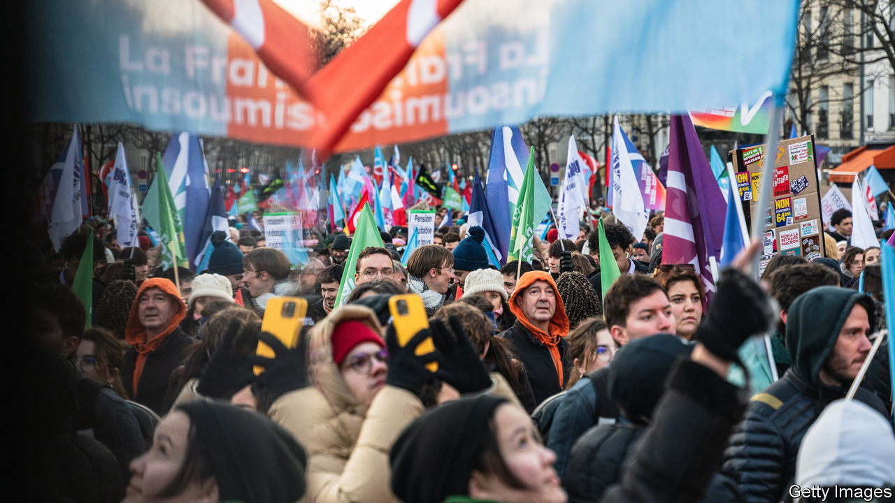
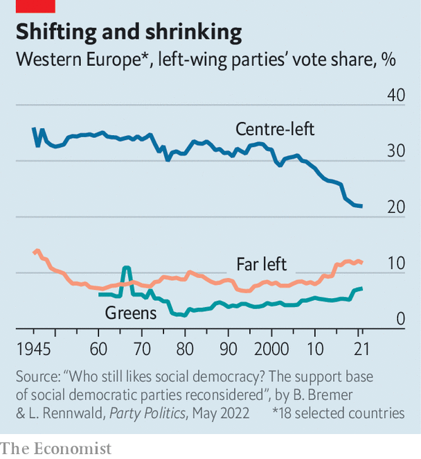

###### Left hanging

# The problems ailing Western Europe’s left are not just cyclical 

##### Battered by the populist right, progressives lack a vision for the future 

 

> Jun 15th 2023 

De Balie, a cosily chic cultural venue on Amsterdam’s Leidseplein, is the epicentre of Dutch liberal intellectual life. On May 3rd it played host to two thinkers representing ideas that are pulling the European left apart. Gloria Wekker is a black Dutch academic who argues that the Netherlands suffers from structural racism. Susan Neiman, an American-born German-Jewish philosopher, recently published a book (“Left Is Not Woke”) that calls for dropping identity politics and re-embracing universal values. The left, Ms Neiman says, must “come up with things that we’re moving towards”, rather than simply denouncing taxonomies of oppression.

Like many debates on the left, this one took place inside a bubble. Amsterdam is a multicultural city of cycling lanes and tolerant drug policies, run by a coalition of liberal (D66) and left-wing parties (Labour and GreenLeft). But in the rest of the Netherlands, politics has been transformed by anti-immigrant populism. In provincial elections on March 15th, populist parties on the right combined for more than a third of the national vote. The BoerBurgerBeweging (Farmer-Citizen Movement), a four-year-old outfit mainly devoted to fighting environmental regulations, drew 19%. On the left, Labour got just 8% and GreenLeft 9%.

The Dutch left’s problems are echoed across western Europe. (Eastern Europe’s leftist parties, descended from the Soviet-era communists, face different problems.) Social-democratic parties are in decline; voters see them as mushy and elitist. They face competition from green parties, and from radical outfits that offer socialist economics or woke politics. All are fighting over a shrinking pie, hemmed in by conservative populism. Most of the left faces the problem Ms Neiman identified: the lack of a credible vision.

This should be a propitious time for Europe’s left. Inflation is fuelling calls for more government benefits. Surveys show citizens are more concerned with climate change and the cost of living than with crime. Antipathy to the EU has faded since the 2010s. Belief in small government, declining since the financial crisis, was all but killed off by the covid pandemic. A recent study of six European countries by pollsters André Krouwel and Yordan Kutiyski found that big majorities everywhere agreed that “the state should play a larger role in the regulation of the economy.” 

Indeed, the left looked healthy as recently as 2021, when it governed all four Nordic countries as well as Portugal and Spain. At the end of that year Olaf Scholz’s Social Democrats (SPD) took power in Germany in coalition with the Greens and the liberal Free Democrats. But the moment proved fleeting. In France’s elections in 2022 the centre-left Socialists were all but wiped out. Hard-right parties now hold or share power in Italy and Sweden, and in Finland are in coalition negotiations. The centre-right seems poised to keep power in Greece, where leftist parties performed woefully in a general election on May 21st. Spain’s Socialists are heading into an early election they look likely to lose. In Germany Mr Scholz’s coalition is divided and increasingly unpopular. 

 


The left’s problems start with the once-great social democratic parties. In the early 2000s in western Europe they averaged nearly 30% of the vote. They have declined steadily since the global financial crisis in 2008, to just above 20% (see chart). Having embraced free-market economics during the “Third Way” period of the 1990s, most centre-left parties endorsed fiscal austerity after the financial crisis. That was a huge mistake, argues Björn Bremer of the Max Planck Institute in Cologne: voters could no longer see the difference between the centre-left and the centre-right. 

In some countries that has led to collapse. France’s Socialists governed indecisively from 2012-17, and when Emmanuel Macron founded his own movement to run for president he took many centrists with him. The party’s image has since become “gaseous and unfocused”, says one former Socialist politician. Its candidate won just 2% in last year’s presidential election. The Dutch Labour Party, meanwhile, joined the centre-right in government between 2012 and 2017, sharing responsibility for budget cuts. In the 2017 election it fell from 25% of the vote to 6%, and did little better in 2021. Such parties are now too centrist to offer an alternative, and too small for voters to believe they can win.

Centre-left outfits like Germany’s SPD are still big enough for voters to see them as contenders. In Spain and Portugal, Socialist governments have managed to hold power, buoyed by solid economies. Italy’s colourless Democratic Party is still the second-biggest in parliament. Finland’s Social Democrats, led by Sanna Marin, the outgoing prime minister (pictured), came close to winning their latest election, as did Sweden’s. But their voter bases are ageing. Sweden’s centre-left is “incredibly unpopular among young people”, says Max Jerneck of the Stockholm School of Economics. “The zeitgeist is against them.”

 


Voters dissatisfied with milquetoast social democrats often turn to more radical parties. Take France, where leadership on the left has passed to La France Insoumise (“Unsubmissive France”, or LFI), a hard-line outfit that aims to resurrect the working-class left of yore. In a café near the National Assembly filled with MPs in business suits, François Ruffin, one of LFI’s up-and-coming deputies, is the only one wearing a leather jacket. He lays out his plan to end the “neo-liberal parenthesis” which François Mitterrand, a Socialist president, launched 40 years ago by privatising state enterprises and deregulating financial markets. Mr Ruffin calls for protectionism and indexing state workers’ wages to inflation.

LFI’s vintage socialism and its 71-year-old leader, Jean-Luc Mélenchon, are surprisingly popular among young people. The wounded Socialists have joined LFI and France’s often feckless Greens in an alliance called NUPES, which forms the biggest opposition bloc in parliament. But although NUPES’s rejectionism gives it a clear profile, it makes it impossible to win a majority or join a broad coalition. 

Italy’s Democratic Party (PD) seems to be imitating the French turn to the left. In February it elected a young left-wing leader, Elly Schlein, who takes progressive stances on gay rights and immigration. She is seen as a breath of fresh air, and the PD is doing better in polls. But Italy’s left, too, is split: many left-leaning voters back the unpredictable, populist Five Star Movement.

Tensions with the radicals could spell the end of centre-left rule in Spain as well. Pedro Sánchez, the Socialist prime minister, has just called a snap election, in which he faces a challenge from a new leftist outfit called Sumar. The radical left elsewhere is doing poorly; Syriza, a far-left party that botched Greece’s response to the euro crisis while in power between 2015-19, was crushed in that country’s election on May 21st. Portugal’s long-sitting Socialist government has successfully teamed up with radicals, but it too is losing popularity.

Green parties, at least, have a clear vision of the future. Many leftists hope they will take over from social democrats and lead a national revival. But only in Germany has a green party come close to doing so. The German Greens did well in 2021, but have been badly damaged since by high energy prices and new rules mandating heat pumps in private homes. As the costs of the zero-carbon transition come due, voters are starting to rebel.

If not environmentalism, then what? Ideas about intersectional social justice that enthuse progressive Americans are less popular in Europe. They evoke thorny problems of integration, which since the migrant crisis of 2015-16 have been seen as vote losers. Some look to Denmark’s governing Social Democrats as a model. They have turned to punitive anti-immigrant policies. But studies show that imitating the right’s harshness towards immigrants does not win back voters for the left. At most, says Tarik Abou-Chadi of Oxford University, it discourages low-engagement voters from turning out.

A decade ago, when interest rates were negative and unemployment was high, Europe seemed ripe for a revival of Keynesian economics. Thinkers like Thomas Piketty, a French economist, argued for government stimulus to reduce inequality and pay for the green-energy transition. But few governments seized the moment. Nowadays leftist parties offering more government spending face two problems. 

The first is that with much higher inflation, interest rates and debt, they no longer have fiscal room. The second is that on state intervention they have won the argument. Nearly everyone in European politics, from right to left, now accepts that governments must play a big role in the economy. That makes it hard for leftist parties to stand out.

Optimistic progressives note that Europe’s centre-right is having difficulties, too. Yet the best argument that the western European left is not in crisis may be that it was never as strong as many imagined. Since 1960, outside the Nordic countries and Iberia, the right has held power far more often than the left. To remain a contender, the left will have to reinvent itself. The question is how. ■

