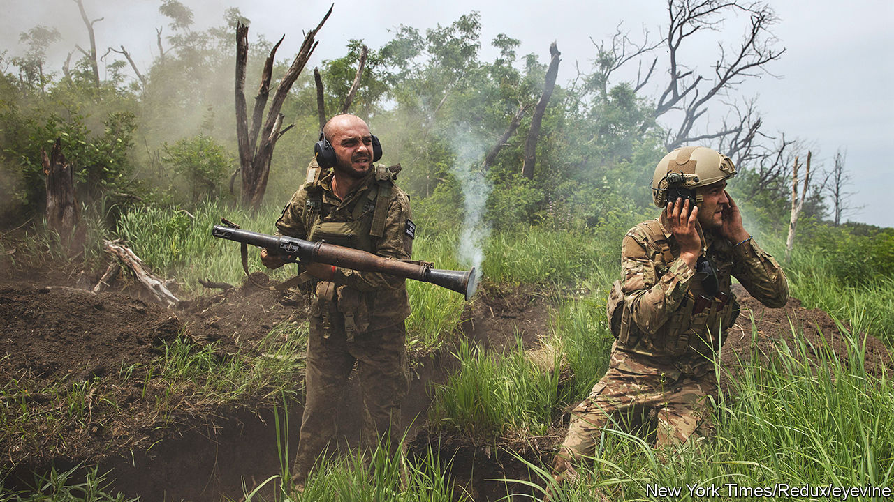
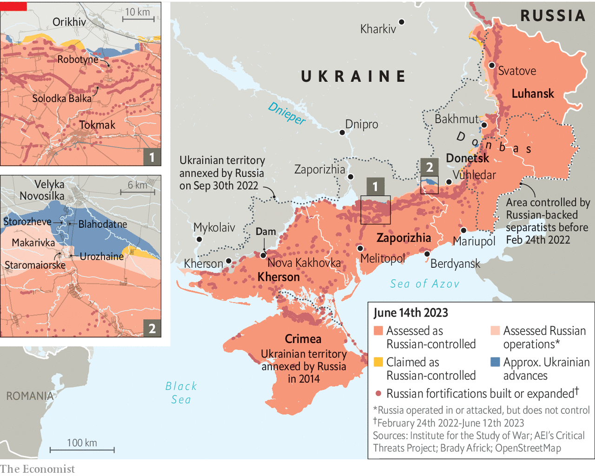

###### Going into hell

# Ukraine’s counter-offensive is making mixed progress 

##### Its real test will come when it hits Russia’s prepared defences 

 

> Jun 14th 2023 


UKRAINE’S COUNTER-OFFENSIVE is now into its second week. Its shape is gradually becoming clearer. One long-standing axis points east, at the area around the bloodily contested town of Bakhmut and in Luhansk province. A new one aims south and south-east from Velyka Novosilka and Vuhledar in Donetsk province. And a third has opened in the south, where Ukrainian troops are battling their way south around the town of Orikhiv in Zaporizhia province, which forms the central part of the war’s long front line. They are making progress. But neither side has committed its reserves and the most important fighting may not occur for another week or so. 

The thrust in Donetsk appears so far to have been the most successful. Ukraine used seven brigades near Velyka Novosilka to liberate around 60 sq km of territory within four days, says Konrad Muzyka of Rochan Consulting, a firm that tracks the war. That included a cluster of villages hugging the Mokri Yaly river, including Blahodatne, liberated on June 11th; Storozheve, where video footage showed marines walking through the village and brandishing a Ukrainian flag in the centre; and Makarivka to the south. The tiny villages of Urozhaine and Staromaiorske may be next.

 


That progress contrasts with less encouraging news from another counter-offensive operation taking place farther south and west, in the Zaporizhia region. Full-frontal fighting along the Orikhiv-Tokmak axis there has been hard going, a military source conceded, with Ukraine taking significant losses of armour and personnel. Images published by Russia showed German Leopard tanks and American Bradley armoured vehicles caught in minefields and struck by artillery. One video showed a Russian soldier next to a Leopard with its engine still running. Russia is taking a bruising, too. In a meeting with Russian military bloggers on June 13th, Vladimir Putin, Russia’s president, said that Russia had lost 54 tanks during the Ukrainian offensive. That figure far exceeds open-source estimates that are based on public numbers.

The scale of the deployment along the Tokmak axis—and the town’s strategic role as both a rail hub and a gateway to strike at Russia’s main road to Crimea—suggest that it might grow into the main push. But most of the attacks so far have been conducted with Ukrainian units that were already in place and are aimed at identifying weaknesses in the Russian line, rather than breaking through with overwhelming force. “The offensive has clearly started, but not I think the main attack,” notes Ben Hodges, a retired general who commanded America’s army in Europe. “When we see large, armoured formations join the assault, then I think we’ll know the main attack has really begun.”

Ukraine is thought to have thrown in only a few brigades in Zaporizhia so far. “We haven’t committed our main forces,” agrees a source in Ukraine’s general staff, “and the Russians haven’t committed their main forces.” Russia is mounting what military officers call a defence in depth: falling back to more favourable ground to the rear. Both sides are involved in a “chess game” to draw out each others’ reserves, says the source. He adds that Ukraine’s “immediate priority” is reducing Russian superiority in artillery by targeting its batteries with long-range fire. ’s analysis of data from NASA’s infrared satellites shows unusually intense fire activity across southern Ukraine. Russian military bloggers reported that one strike had killed Major General Sergei Goryachev, the chief of staff of Russia’s 35th Combined Arms Army—the first Russian general to die for a year. 

Aviation is playing an important role. More of it is now being used in the Zaporizhia sector than has been deployed at any time since the opening stages of the war. Russian attack helicopters are proving a particular hazard. Samuel Bendett of CNA, a think-tank, notes that Russian military bloggers are boasting of a new tactic: Russian air strikes are forcing Ukraine to push its scarce air-defence systems farther forward. Those systems can then be struck by Russia’s Lancet attack drones and their operators targeted by Russian snipers.

Denys Yaroslavsky, a special-forces officer fighting north of Bakhmut, reports a big increase in the use of drones there. Apart from Lancet strike drones, capable of destroying tanks and artillery systems, Russian forces have acquired significant numbers of commercial Chinese drones, he says. Mr Yaroslavsky is confident that Ukraine will continue to close the circle around Bakhmut. “It’s hard going, but we are moving constantly. Within a week we will have the high ground…and Bakhmut in the palm of our hands.” Ukrainian attacks in the east are probably intended to “fix” Russian positions there in place, preventing them from reinforcing the south. 

One unexpected variable could be the situation in the flooded plains of Kherson. The collapse of the Nova Kakhovka dam on June 6th created a humanitarian disaster. It also upended Ukrainian plans. The destruction of the bridge alongside the dam has allowed Russia to shift some units from Kherson to Zaporizhia—one possible motivation for the dam’s destruction. Its collapse almost certainly puts an end to any crossing by heavy weaponry. That said, Ukrainian military sources hint at a different type of operation. Flooding has washed away Russian defences on the eastern side of the Dnieper, one says, and that has created opportunities. “The conditions are arguably better for a limited assault using speedboats and special forces,” says another. The satellite data suggests that Ukraine is heavily pounding Russian positions across the river from Kherson city. 

Western officials say that on paper Ukraine has what it needs to make significant advances; enough to put Russian overland routes to Crimea within its rocket range, and Russian shipping in the Sea of Azov within range of its anti-ship cruise missiles. But they say that this will require luck on the part of the Ukrainians and blunders on the part of the Russians. Nature could also play a part. Rain is predicted for much of the next week, which may delay some of Ukraine’s advances, while also making Russian air operations and reconnaissance more difficult. The biggest risk, say officials, is Ukrainian units becoming caught in Russian “fire pockets”—patches of territory covered by Russian drones and artillery—as they breach defences, which include several lines of trenches, fortifications and minefields. 

Those defences are unlikely to be tested until around the last week of June, say officials tracking the fighting. Despite Ukraine’s advance south from Velyka Novosilka in Donetsk, it is still around 20km away, by road, to the first serious line of prepared Russian defences. In Zaporizhia, the town of Robotyne, which probably marks the farthest extent of Ukraine’s advance, is still 10km away from the east-west defences that cut through the villages of Ilchenkove and Solodka Balka to the south. Tokmak, ringed by its own dedicated defences, is then another 20km away.

“All I know is it’s going to plan,” said Ben Wallace, Britain’s defence secretary, on June 13th. “They’re being successful, they’ve maintained momentum.” Jack Watling of RUSI, a think-tank, agrees: “They are beating expectations.” But the real test is to come, says a Western official. “They are about to go into hell.” ■


