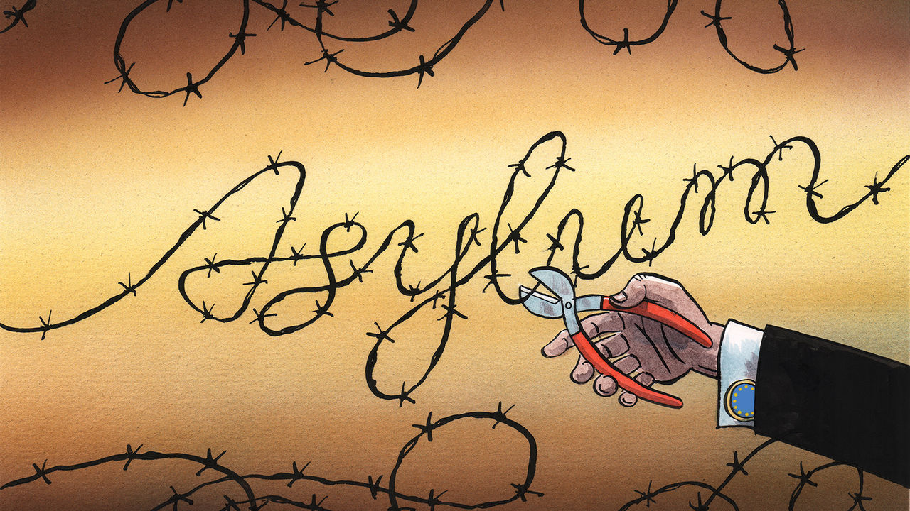

###### Charlemagne

# Why Europe’s asylum policy desperately needs rebooting 

##### A deadly shipwreck in Greek waters highlights its dangers 

 

> Jun 15th 2023 

If there is one thing Europeans like more than August off and coalition governments, it is a half-baked EU project. The euro brought much of the continent into a currency union, which ended up causing endless division when it turned out the requisite plumbing had not been installed. The single market is a triumph for goods like cars and widgets, but works poorly for the services that now dominate the economy. Migration has long been another will-complete- policy. Internal borders were scrapped within most of the bloc almost 30 years ago. But the messy business of how to deal with the external border—and the hundreds of thousands who cross it illegally year after year—was given too little thought. The upshot has been a chaotic asylum system, leaving thousands dead in the Mediterranean each year and fuelling the rise of populist politicians. On June 14th at least 78 migrants died when an overcrowded fishing vessel capsized in Greek waters; hundreds more remain unaccounted for.

Not before time, then, a stab has at last been made at completing the job. And, of course, nobody is happy. Europe is a magnet for migrants, being rich and easy to reach by lots of people from war-torn (or poor) places in Africa and the Middle East. Some migrants who enter on small boats or overland are entitled to asylum because they are fleeing persecution; but well over half of the arrivals are not. Many land in societies that have done a bad job of integrating previous waves of foreigners, often from past colonies. The system can be kind: a surge of some 4m or so Ukrainians fled to EU countries with few problems. More often it is dysfunctional, turning an emotive policy area into one where everyone casts blame widely but accepts none.

As often happens, the tangle of EU and national rules has left a mess (this will be familiar to those who recall how avidly national governments ignored EU budget strictures ahead of the euro crisis a decade ago). The corollary of internal borders being scrapped in 1995 as part of the Schengen agreement was that migration failures in one country—for example a leaky external border—would affect others in the passport-free zone. To ensure that governments properly guarded their frontiers with non-EU places, migrants crossing into the bloc illegally were to be processed by the country in which they had first set foot. Known as the Dublin convention, this placed huge burdens on front-line places such as Greece and Italy. Countries such as Sweden or Germany—where most migrants had hoped to settle—were able to send migrants who reached them back to where they first arrived.

This was manageable when flows were light. But in the 2010s the numbers spiked as a result of the Arab spring, war in Syria and chaos in Afghanistan. Mediterranean countries demanded help from their EU neighbours. None was forthcoming, notably because what was really needed was for countries to agree to take in migrants themselves, besides those—numbering more than 1m—who settled in Germany in an intense wave of arrivals in 2015-16. An attempt then at a new migration deal descended into acrimony that still endures. Several countries in central Europe simply refused to take in any asylum-seekers, denouncing EU plans to foist mass immigration on an unwilling populace. And thus the system all but broke down. Southern countries sometimes did little to intercept migrants, or treated them so nastily that northern authorities balked at sending them back. Schengen, one of the EU’s signature achievements, has teetered: six countries, including France and Germany, have restricted passport-free travel. 

Things might now change as a result of an unexpected deal between EU governments on June 8th. For the first time an element of “mandatory solidarity” will apply. Countries beyond the front lines of migration will have to take in at least 30,000 asylum-seekers a year; those who refuse will have to pay €20,000 ($21,600) per migrant into an EU fund. This will ease the burden on Italy and others. In return, the front-line countries will have to host camps in which some migrants’ asylum claims will be processed—so confirming their status as border guards for the whole EU, a role they resent. Europe will throw money at the root causes of migration. A delegation of EU leaders including Giorgia Meloni of Italy has just been in Tunisia with a promise of financial aid, in the hope of curbing migration if the fragile country collapses. 

Why, after so many years of acrimony, has an agreement suddenly become possible? Vit Novotny of the Wilfried Martens Centre, a think-tank in Brussels, says it is because the EU has gained experience in managing big, emotive crises, such as the pandemic, the war in Ukraine and climate change. In part, lessons have been learned from past failures, such as to give a way out for countries that refuse to take migrants. But the mood around migration has changed too. A buoyant labour market means migrants, legal or otherwise, are needed to staff factories and deliver pizzas.

Barriers to entry

Having shown generosity towards Ukrainians, Europeans are comfortable giving shorter shrift to others from the rest of the world. The mooted migration deal was possible in part because Europe is happier than before to be tough on those who reach its shores. Some migrants, for example those whose countries are not notably dangerous, will be sent back after a cursory check of their asylum claims, and could end up deported to countries far from their own. Human-rights groups are unhappy. The EU now talks openly of withholding aid or nixing trade deals with poor countries if they do not help with migration, for example by taking back failed asylum-seekers (currently, fewer than one in five of those denied asylum are successfully deported).

Migration is Europe’s Achilles heel. A place that sees itself as a force for good in the world resents having to play bad cop when it comes to keeping people out, as it must. But refusal to face up to the dysfunction of the old system has served nobody well. The agreement between governments still has some way to go before it becomes EU law—by the end of the year, it is hoped. An imperfect system that works will be better than a bad one that doesn’t. ■


