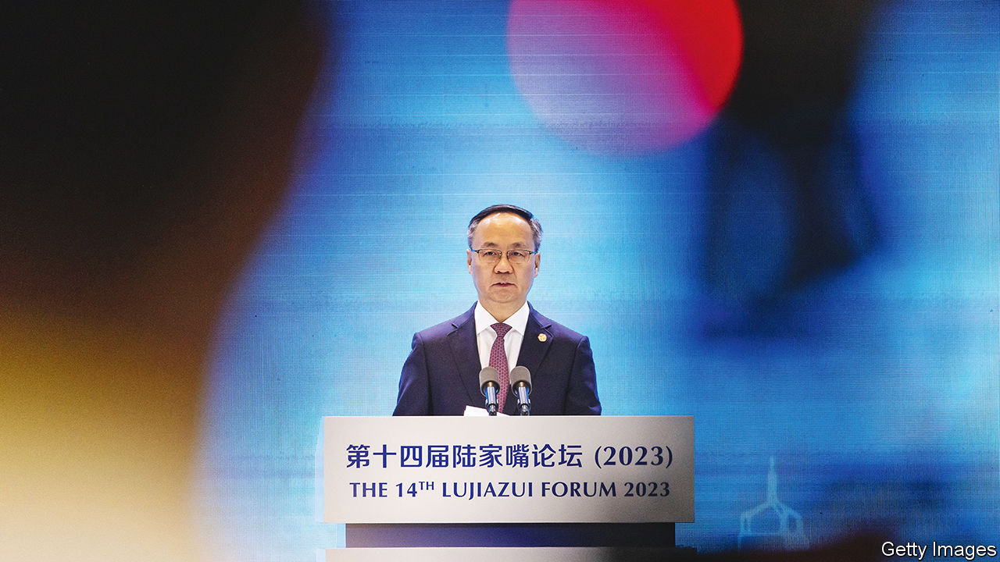
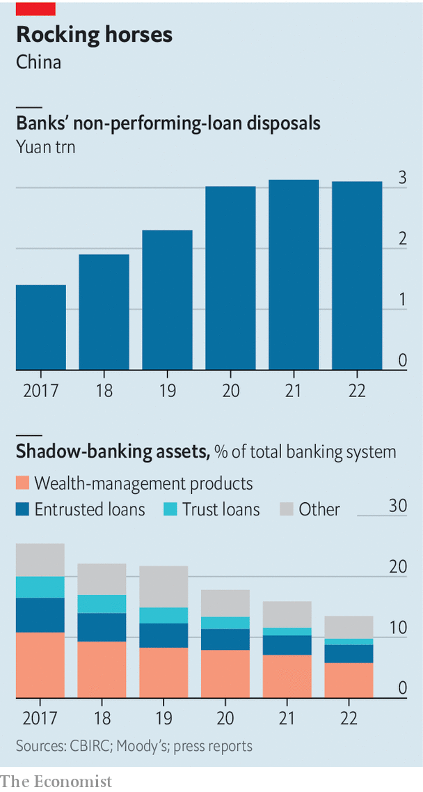

###### Graftbusters

# A new super-regulator takes aim at rampant corruption in Chinese finance 

##### Grim times for the country’s star moneymen 

 

> Jun 15th 2023 

Hardly a day passes without someone in Chinese finance “falling off his horse”, or coming under a corruption investigation. State media warned on June 5th that the banking industry is infested with “moths”—mid-level managers who slowly ingest lenders’ resources from the inside out. “Internal ghosts”, executives who use insider connections to pilfer billions from banks, often pose a greater danger. There are “nest cases”, where clusters of fraud spanning several banks are discovered at once, and “skewer cases”, in which the arrest of one banker leads to another, then another. After a recent spate of scandals an official newspaper dubbed smaller banks an “anti-corruption disaster zone”. 

Such parlance hints at pervasive graft throughout China’s vast financial system, which has assets of 400trn yuan ($56trn). Between January and May at least 60 financial institutions were hit with major investigations into personnel, according to official statements and press reports. Research by  shows that, over the past five years, 78 executives at China’s eight largest banks have been investigated or charged with corruption. Since 2018 authorities have also probed 385,000 shareholders of rural banks suspected of using the lenders as personal piggy banks.

The crackdown has shown no sign of ebbing as the Communist Party gains a much firmer grip over enforcement. In the biggest regulatory change in two decades, the central government announced earlier this year that it would create a super watchdog that oversees all areas of finance except the securities industry. How it applies its mega-powers is bound to remould a sector the health and stability of which matters hugely not just to China, but also to the global economy. 

The new system is modelled on America’s, which seeks to avoid overlapping mandates. The National Administration for Financial Regulation (NAFR), as the new watchdog is dubbed, has been granted status that moves it closer to the central government. That gives it stronger enforcement powers, similar to America’s Securities and Exchange Commission. It has gained investor-protection responsibilities, akin to America’s Financial Stability Oversight Council, and taken over financial oversight from the central bank (which, like the Federal Reserve, now focuses on macroprudential policy). 

NAFR is preparing to take forward what has perhaps been the most extensive financial clean-up campaign in history. Starting in 2017, its predecessor scrambled to slow down a dangerous rise in risky financial activities. It tightened rules on shadow banking, shrinking the stock of shadow loans from the equivalent of 25.3% of total banking assets in 2017 to just 13.5% last year. It subdued sprawling financial firms and powerful people that had sought to manipulate the system. Among them were Anbang, an insurance group, and Baoshang Bank, a mid-tier lender. It crushed a 1trn yuan peer-to-peer lending industry, where people lent to one another via online platforms. The central government also upended the fintech empire of Jack Ma, China’s most famous entrepreneur, after his company, Ant Group, built a mammoth lending business that received little regulatory scrutiny.

The new team will have to reckon with the costs of the clean-up, which are mounting. Many wealth-management products have gone bust, causing investors to protest. The bill for cleaning up urban banks and bailing out several large lenders has come to 10trn yuan. Rescuing Anbang alone cost $10bn. Tens of thousands of investors in peer-to-peer lending products have lost their savings. Nearly 630 small banks have been restructured. 

 


The cutting down of Mr Ma has hurt China’s reputation as a place safe for entrepreneurial experimentation. So has the recent detention of Bao Fan, one of China’s most famous investment bankers. Senior regulators bristle at such criticisms and feel that, at least in Mr Ma’s case, official actions were too timid for a risky business model. The new system will rectify that by giving NAFR regulatory control over financial holding companies such as Ant.

The vision for regulating the financial sector is becoming clear. Senior officials believe they have chosen the best features of the American system while rejecting the values of Wall Street, which, in their view, have seeped into China over two decades. The message to bankers is grim. Entrepreneurs will be allowed to continue to reap enormous fortunes. But the government does not want bankers to become exorbitantly wealthy. No celebrity financier, no matter how high-profile, appears immune from corruption probes.

NAFR has several pressing tasks ahead of it. First it must replace local financial regulators with its own teams and dismantle the connections between banks and local governments. The establishment of thousands of new banks since the 1990s and commands from politicians to build endlessly have helped feed a cesspool of bad assets. The small lenders that sprung up across the country often had close connections with local governments and the largest local companies, namely developers. In many cases tycoons who held shares in the banks, or controlled them outright, used them to fund their businesses. One result was a decade of high-speed economic growth. Another was rampant graft and poor allocation of funds.

So far the onslaught on corruption, the biggest threat to China’s financial stability according to many, is proving highly effective, says Sam Radwan of Enhance, a consultancy. The number of arrests will probably fall. But to purge the financial system of the bad assets revealed by the campaign will be a big job—and it is an urgent one. Tight links between banks, property developers and city governments have left the industry with masses of risky loans. Developers and local-government companies owe China’s banks 130trn yuan, or about 42% of total banking assets, according to Xing Zhaopeng of ANZ, a bank.

Most of those debts are deemed healthy. Li Yunze, who was recently appointed to lead NAFR, said on June 8th that the risks are controllable. In its most recent review of the banking system, the central bank said just 1.6% of total system assets are considered high-risk.

That could change if things get worse for developers and local governments. Both are finding it increasingly hard to pay back loans. A group of companies called local-government financing vehicles (LGFVs), which often borrow from banks on behalf of cities and provinces, have spooked markets in recent weeks as many show signs of impending failure. Such risks often emerge suddenly and have the potential to contaminate banks. Dalian Wanda, one of China’s top developers, has reportedly entered into talks with banks on a loan-relief plan. It has more than 90bn in outstanding loans. An LGFV in south-west China is rumoured to be paying back loans using local social-security funds.

Failure to handle this pile of debt threatens to mire the system in bad credit. Many such loans may not turn into toxic assets overnight. Instead, some will become long-term drags on bank profits. Another LGFV in southern China recently agreed with banks to restructure 15.6bn yuan in loans by lowering interest rates and pushing the maturity of the loans out by 20 years. In such situations banks have few other options than to extend.

Regulators have been experimenting with merging bad banks for years. So far 23 urban banks have been combined. But insiders say the process is cumbersome, can drag on for years and ultimately leads to the creation of larger bad banks. Another option is letting banks fail. This has been tested only a few times and risks causing runs on deposits—the opposite of the stability China’s leaders are trying to achieve.

Large banks are absorbing some bad debts from smaller ones. But their ability to do this is limited, and they are unlikely to take on equity in troubled banks. Some local state-owned firms have started injecting liquidity into rural lenders and taking shares in them, according to Chinese media. This type of recapitalisation is bolstering banks’ balance-sheets and giving them more room to dispose of bad debts.

The only way to heal the sector is to recognise and treat soured loans. Efforts to do so have been haphazard. In 2019 regulators said they would require banks to declare the true scale of bad loans instead of using fancy accounting to hide them. But the pandemic then forced watchdogs to enforce the rules less stringently; they also told banks to roll over loans. This avoided mass corporate defaults, but also added to the hidden accumulation of bad assets. Now, with the pandemic at an end, the long-delayed recognition of more bad debts is starting, says Ben Fanger of ShoreVest Partners, an investor in distressed debt. This means a vast flow of toxic assets is coming on to the market. 

State-owned asset managers will buy up some of that debt at discounted rates. Unlike 20 years ago, when the previous mountain of bad assets failed to lure bargain-hunters, there are now more local private investors willing to snap up non-performing loans from banks. Some corporate investors will also pick through the rubble of the property sector to search for distressed debts that allow them to take over projects on the cheap. As the economy slows and the extent of the financial rot is revealed, China’s new regulators can only hope there are enough of them. ■


