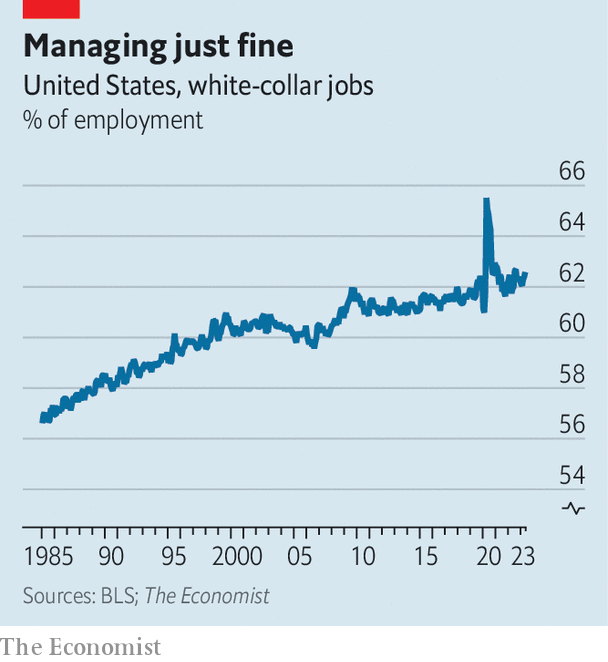

###### Boy cries wolf

# AI is not yet killing jobs 

##### White-collar workers are ever more numerous 

 

> Jun 15th 2023 

After astonishing breakthroughs in artificial intelligence, many people worry that they will end up on the economic scrapheap. Global Google searches for “is my job safe?” have doubled in recent months, as people fear that they will be replaced with large language models (llms). Some evidence suggests that widespread disruption is coming. In a recent paper Tyna Eloundou of Openai and colleagues say that “around 80% of the us workforce could have at least 10% of their work tasks affected by the introduction of llms”. Another paper suggests that legal services, accountancy and travel agencies will face unprecedented upheaval.

Economists, however, tend to enjoy making predictions about automation more than they enjoy testing them. In the early 2010s many of them loudly predicted that robots would kill jobs by the millions, only to fall silent when employment rates across the rich world rose to all-time highs. Few of the doom-mongers have a good explanation for why countries with the highest rates of tech usage around the globe, such as Japan, Singapore and South Korea, consistently have among the lowest rates of unemployment.

Here we introduce our first attempt at tracking ai’s impact on jobs. Using American data on employment by occupation, we single out white-collar workers. These include people working in everything from back-office support and financial operations to copy-writers. White-collar roles are thought to be especially vulnerable to generative ai, which is becoming ever better at logical reasoning and creativity. 

 


However, there is as yet little evidence of an ai hit to employment. In the spring of 2020 white-collar jobs rose as a share of the total, as many people in service occupations lost their job at the start of the covid-19 pandemic (see chart). The white-collar share is lower today, as leisure and hospitality have recovered. Yet in the past year the share of employment in professions supposedly at risk from generative ai has risen by half a percentage point. 

It is, of course, early days. Few firms yet use generative-ai tools at scale, so the impact on jobs could merely be delayed. Another possibility, however, is that these new technologies will end up destroying only a small number of roles. While AI may be efficient at some tasks, it may be less good at others, such as management and working out what others need. 

ai could even have a positive effect on jobs. If workers using it become more efficient, profits at their company could rise which would then allow bosses to ramp up hiring. A recent survey by Experis, an it-recruitment firm, points to this possibility. More than half of Britain’s employers expect ai technologies to have a positive impact on their headcount over the next two years, it finds.

To see how it all shakes out, we will publish updates to this analysis every few months. But for now, a jobs apocalypse seems a way off. ■


