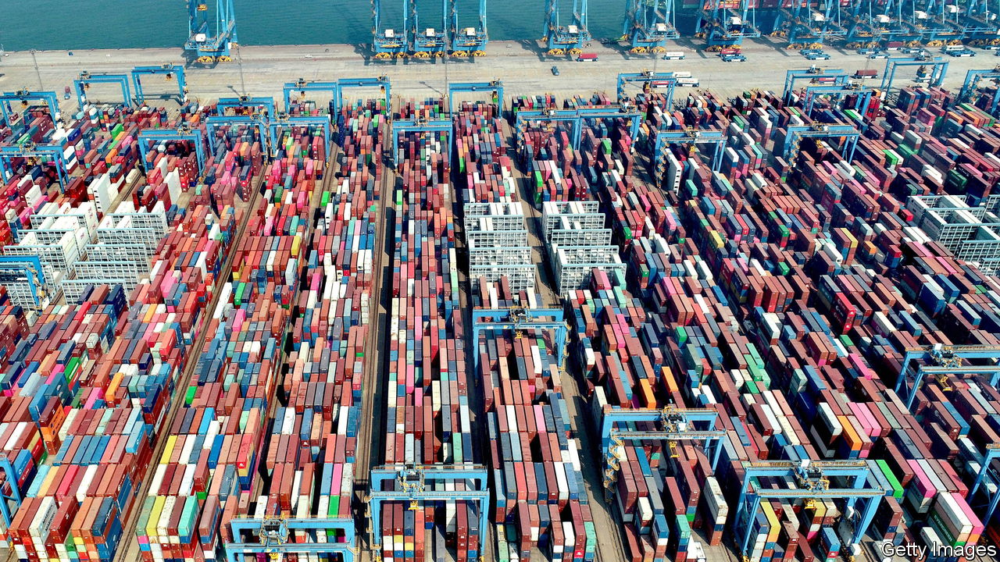

###### The great steeplechase

# America is losing ground in Asian trade 

##### China’s campaign to regionalise supply chains is doing better than appreciated 

 

> Jun 15th 2023 

The intensifying rivalry between America and China has not been kind to open markets. Letting defence or foreign ministers dictate trade policy, it turns out, is not conducive to making goods move more smoothly across borders. Yet even as globalisation crumbles, a race to gain commercial clout in the world’s most populous and fastest-growing region has kicked off. It is a race China is quietly winning.

Both America and China are keen to trumpet to Asian countries the benefits of the regional pacts they sponsor (each of which excludes their rival power). On May 27th a group of 14 countries agreed to set up an early-warning system over supply-chain problems—the first building block of the Indo-Pacific Economic Framework (IPEF), President Joe Biden’s flagship offering. On June 2nd the Regional Comprehensive Economic Partnership (RCEP), a China-backed trade deal which includes Australia, Japan, New Zealand, all of South-East Asia (bar East Timor) and South Korea, came into force in the Philippines, the last of the pact’s 15 members to ratify it. 

At first blush the two pacts look mostly insubstantial. American negotiators are not interested in offering greater market access for Asian exporters, robbing IPEF of the raison d’être of a trade deal. Critics dismiss RCEP as broad but shallow because it does not cover labour rights, the environment and state-owned enterprises.

Despite those limitations, however, RCEP is already expanding China’s commercial heft. Whereas the value of Chinese exports to America and the EU dropped by 15% and 5% respectively in the five months to June, compared with the same period in 2022, exports to the Association of South-East Asian Nations grew by 8% over the period. The ten-member bloc is now China’s largest trading partner.

It helps that the area where RCEP has made most progress—harmonising rules of origin for goods exports—matters a lot to the complex supply chain that runs across the world’s biggest manufacturing hub. The deal, in effect, creates a single market in the intermediate goods that go into final products, helping RCEP to prevent the so-called “noodle-bowl” of dozens of overlapping trade deals that exporters struggle to digest. 

That makes the region “a kind of tariff-free supply web”, says Aditya Gahlaut of HSBC, a bank. The reduced complexity is more attractive to Asia’s countless small businesses and encourages investment in production that takes place in RCEP countries, instead of elsewhere. 

Another selling point is that RCEP may well make its members richer. That will not be thanks to tariff reductions, which are too puny to matter. A recent World Bank study projects that they will raise local real incomes by only 0.07% by 2035. Instead gains will come in the form of improvements in productivity brought about by fewer trade frictions and more liberal rules of origin. The bank reckons trade between RCEP countries could rise by a whopping 12% over the same period, compared with a no-deal scenario.

There is still time for IPEF to catch up. Some of America’s Asian allies hope a Biden win at next year’s presidential election will change the mood music in Washington, enabling faster progress. For now that looks optimistic. One former trade negotiator jokes that the fact that India is a member of IPEF is a signal that any future agreements will be toothless. Its government, which opted out of both the Trans-Pacific Partnership (IPEF’s bolder predecessor) and RCEP, is studiously avoiding multilateral trade agreements that genuinely mean business. By casting a wide net, America has ensured that IPEF can advance only at the pace of its slowest member. ■


