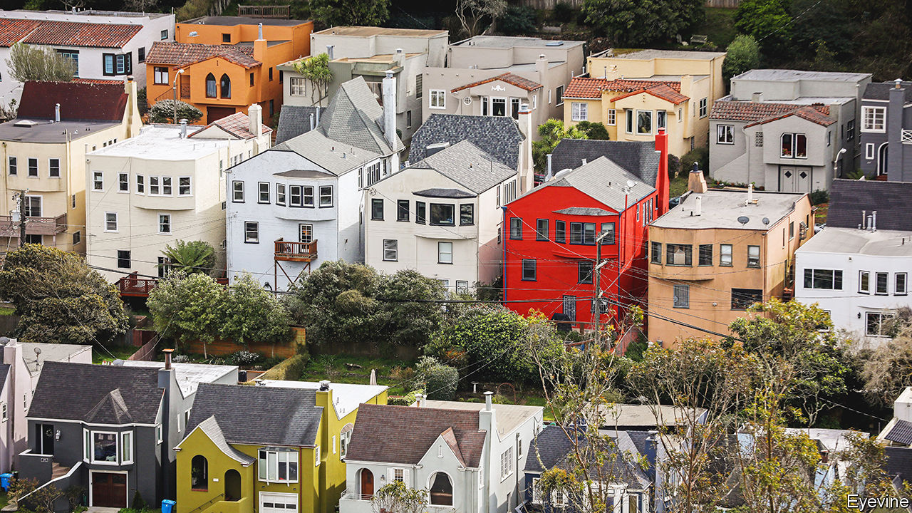

###### The great escape

# Is the global housing slump over? 

##### Why rising interest rates have not yet triggered property pandemonium 

 

> Jun 12th 2023 

In Australia house prices have risen for the past three months. In America a widely watched index of housing values has risen by 1.6% from its low in January, and housebuilders’ share prices have done twice as well as the overall stockmarket. In the euro area the property market looks steady. “[M]ost of the drag from housing on gdp growth from now on should be marginal,” wrote analysts at JPMorgan Chase, a bank, in a recent report about America. “[W]e believe the peak negative drag from the recent housing-market slump to private consumption is likely behind us,” wrote wonks at Goldman Sachs, another bank, about South Korea. 

Economists had expected a house-price bloodbath. In March 2022, when the Federal Reserve first started raising interest rates to combat resurgent inflation, the average value of a house in a rich country was 41% higher than five years earlier. Prices had bounced back from the financial crisis of 2007-09, then rocketed during the covid-19 pandemic (see chart). Since then central-bank policy rates have risen by more than three percentage points on average globally, making mortgages costlier and slowing the economy. 

 


Global house prices have certainly come off the boil. They are 3% below their recent peak, or 8-10% lower once adjusted for inflation. This is in line with the average correction since the late 19th century. Yet this slump should have been different because it followed a boom when prices rose at their fastest rate of all time. The upshot is that real house prices remain miles above the level of 2019. Many millennials and Gen-Zers, who had dreamt that a crash would allow them to buy their first house, are no doubt disappointed. 

During a typical global housing slump some countries have a torrid time. After the financial crisis Irish house prices fell by half. American house prices dropped by 20%. This time the underperformers are doing better. In San Francisco house prices are a tenth off their peak, as tech types have decamped to Florida and Texas. Yet they have stopped falling—and the average house will still set you back more than $1.1m, around ten times the median income in the city.

Having gone bananas in 2020-21, house prices in Australia have since fallen by 7%. But, as a recent auction hinted, the market is recovering. A two-bedroom bungalow in Double Bay, a greying suburb on Sydney’s harbour, recently opened at A$4m ($2.7m). It represents, the auctioneer declares, an “outstanding opportunity to come along and add a lot of value”. Translation: it needs some work. That does not deter the well-heeled crowd which jostles outside its gate—the bidding is frantic. The gavel finally drops at more than A$6m.

By contrast with previous housing slumps, there is no hint that lower house prices have created financial contagion. Banks do not seem worried about a surge in bad mortgages. They have fewer risky loans and have not binged on dodgy subprime securities. In New Zealand mortgage arrears have risen, but remain below their pre-pandemic norm. In America delinquencies on single-family mortgages recently hit a post-financial-crisis low. In Canada the share of mortgages in arrears is close to an all-time low. 

Nor do property woes appear to be throttling the wider economy. Weaker housing investment is dragging on economic growth, but the effect is small. In previous housing busts the number of builders declined sharply long before the rest of the labour market weakened. Yet today there is still red-hot demand for them. In South Korea construction employment has dropped slightly from its pandemic highs but now seems to be growing again. In America it is rising by 2.5% a year, in line with the long-run average. In New Zealand construction vacancies remain well above historical levels.

Three factors explain the rich world’s surprising housing resilience: migration, household finances, and people’s preferences. Take migration first, which is breaking records across the rich world. In Australia net migration is running at twice pre-pandemic levels, while in Canada it is double the previous high. Demand from the new arrivals is supporting the market. Research suggests that every 100,000 net migrants to Australia raise house prices by 1%. In London, the first port of call for many new arrivals to Britain, rents for new lets rose by 16% last year.

Strong household finances, the second factor, also play a role. Richer folk drove the housing boom, with post-crisis mortgage regulations shutting out less creditworthy buyers. In America in 2007 the median mortgagor had a credit score of around 700 (halfway decent), but in 2021 it was close to 800 (pretty good). Wealthier households can more easily absorb higher mortgage payments. But many borrowers will also have locked in past low interest rates. From 2011 to 2021 the share of mortgages across the eu on variable rates fell from close to 40% to less than 15%. Even as rates have risen, the average ratio of debt-service payments to income across the rich world remains lower than its pre-pandemic norm. As a result fewer households have had to downsize, or sell up, than during previous slumps. 

The pandemic itself has played a role. In 2020-21 many households drastically cut back on consumption, leading to the accumulation of large “excess savings” worth many trillions of dollars. This stash of savings has also cushioned families from higher interest rates. Analysis by Goldman Sachs suggests a positive correlation across countries between the stock of excess savings and resilience in house prices. Canadians accumulated vast savings during the pandemic; home prices there have recently stabilised. Swedes amassed smaller war chests, and their housing market is a lot weaker.

The third factor relates to people’s preferences. Research published by the Bank of England suggests that shifts in people’s wants—such as the desire for a home office, or a house rather than a flat—explained half of the growth in British house prices during the pandemic. In many countries, including Australia, the average household size has shrunk, suggesting that people are less willing to house-share. And at a time of higher inflation, many people may want to invest in physical assets, such as property, infrastructure and farmland, that better hold their value in real terms. All this could mean that housing demand will remain higher than it was before the pandemic, limiting the potential fall in prices.

Could the housing bust be merely delayed? Perhaps. Some past house-price declines, including in the late 19th century, were grinding rather than spectacular. Central bankers may also be minded to raise rates or keep them high until the higher cost of money truly starts to bite. Making homeowners feel poorer is one way of getting them to cut spending, which would help trim inflation.

Yet there is reason to believe the worst is over. After reaching an all-time low last year, consumer confidence across the rich world is rising again. Households on average still have plenty of excess savings. A structural shortage of housing means that there is almost always someone willing to buy if someone else cannot. And there is little sign that people are losing their taste for home offices and weight-lifting in the attic. The housing boom has ended with a whimper, not a bang. ■


