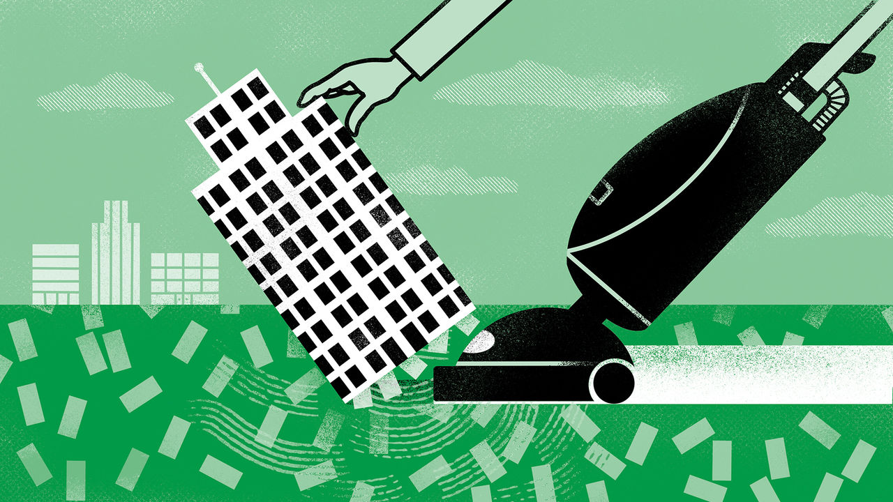

###### Buttonwood

# Sooner or later, America’s financial system could seize up 

##### The Federal Reserve must soon decide when to stop shrinking its balance-sheet 

 

> Jun 15th 2023 

Masterly inactivity is back in vogue at the Federal Reserve’s rate-setting committee. After its meeting on June 14th it kept its benchmark rate on hold, rather than raising it, for the first time since January 2022. One or two more rate rises may lie ahead: Jerome Powell, the Fed’s chairman, suggested so in his post-meeting press conference, and that is what investors expect. Gradually, though, the main debate among Fed watchers has shifted from how high the rate will go to how long it will stay there before being cut.

That is a knotty problem, made knottier by the fact that core prices in America (excluding volatile food and energy) rose by 5.3% in the year to May. It is also not the only one facing Mr Powell and his colleagues. They have spent the past year steadily shrinking the Fed’s huge stock of Treasuries and mortgage-backed securities (MBS), the face value of which has fallen from $8.5trn to $7.7trn. Each month the Fed allows up to $60bn-worth of Treasuries, and $35bn of MBS, to mature without reinvesting the proceeds. Now it must decide when to stop.

This vast portfolio was amassed via the Fed’s quantitative-easing (QE) programme, through which it bought bonds with newly created money. Conceived amid the global financial crisis of 2007-09, it was put into overdrive during the covid-19 pandemic. QE flooded markets with liquidity and nudged nervous investors into buying riskier assets—because the Fed was already buying the safest ones, which pushed their yields down. That kept the supply of credit and other risk capital flowing into the real economy. Critics decried all this as reckless money printing. But with inflation low and deflation more of a threat, they were easy to dismiss.

The return of high inflation makes QE’s reversal (quantitative tightening, or QT) desirable on several counts. Just as buying Treasuries brings long-term rates down, the disappearance of a buyer should raise them, complementing the tightening effect of the Fed’s short-term rate rises. And if the Fed is not buying Treasuries, someone else must be holding on to them. That means they are not buying a riskier asset such as a stock or corporate bond, reducing the supply of capital to an overheated economy. Both effects should dampen price rises.

QT also bolsters the Fed’s credibility. If it only ever conducted QE, and never reversed the process, accusations of money printing and currency debasement would be much harder to brush off. Inflation expectations could rise, self-fulfillingly and perhaps disastrously. So the Fed must prove it is willing to hoover up dollars as well as pump them out.

In that case, why stop at all? The simplest reason is that the Fed’s tightening cycle is approaching its end. Eventually it will consider cutting short-term rates again, especially if economic cracks appear. To still be pushing long-term ones up at that point would be akin to a driver pressing the accelerator and the brake at the same time.

The more troubling reason is that, just like raising short-term rates, QT can inflict its own damage. Having been tried only once before, from 2017 to 2019 and at a much slower pace, its side-effects are poorly understood. That does not make them less dangerous. By sucking cash out of the system, the previous bout of QT prompted a near-failure of the money markets—the place where firms borrow to meet immediate funding needs and one of the world’s most important pieces of financial plumbing. The Fed cleared the blockage with an emergency lending facility that it has since made permanent. It also had to halt QT.

This time it would be something else that breaks. The stockmarket is an obvious, if unthreatening, candidate: only a devastating crash would threaten financial stability. A broader liquidity crunch would be worse. Credit markets, already tight following several bank failures and rising defaults, are more likely to seize. America’s Treasury, meanwhile, is set to soak up yet more liquidity. It must sell more than $1trn of debt over the coming three months to rebuild its cash buffers after the latest debt-ceiling drama. By increasing the risk of sudden market moves, that raises the odds of participants suddenly needing to raise cash for margin calls—and the risk that they cannot.

However small the ideal size of the Fed’s balance-sheet, ever more shrinking could be dangerous. So QT must stop before it risks sparking a crisis that requires a return to QE. But when? That is the central bank’s next big dilemma.■


