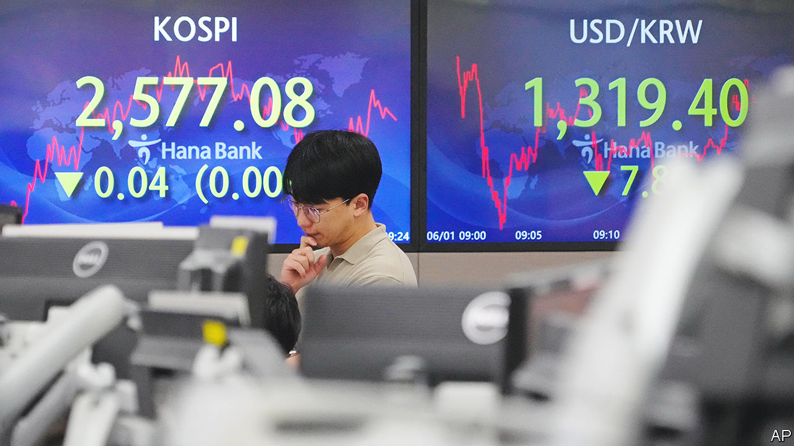
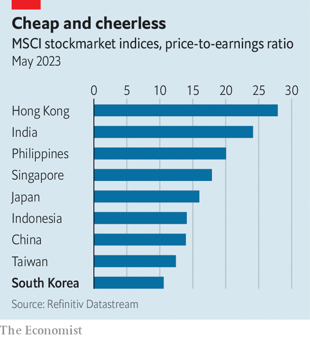

###### Lost and won

# South Korea has had enough of being called an emerging market 

##### And yet it may fail to join the top league of global bourses once again 

 

> Jun 15th 2023 

In the 1960s South Korea was a poor, backward country recovering from a devastating war. Now it is the 12th-largest economy in the world. Its 52m people earn an average of $35,000 a year, nearly as much as Italians and way more than Iberians. Its stockmarket is the 16th-biggest globally, with a capitalisation of $1.8trn, and the seventh-busiest by daily traded volumes. The IMF has deemed South Korea an advanced economy since 1997. Anyone still describing it as an emerging market might therefore appear to have been asleep for the past half-century. 

And yet this is what MSCI, a company that creates market benchmarks, has been doing for three decades. South Korea was the 13th country to join its Emerging Market Index, which now counts 24 members. Some have since been relegated to a “frontier” basket (Croatia, Morocco), shunted to “standalone” markets (Argentina) or even dropped altogether (Venezuela). Less glitzy economies than South Korea’s, such as Greece and Portugal, were elevated to MSCI’s Developed Market index years ago. South Korea therefore thinks it is overdue a promotion. It may hope to achieve one on June 22st, when MSCI announces which countries stand a chance to receive the accolade next year. 

The index provider has long pointed out that investing in South Korean assets is often an unnerving experience. Shareholders’ rights are weak. Ownership structures are byzantine. Repeated scandals expose lapses in governance. And state interventions routinely warp markets. 

 


To address such misgivings the government in January announced a raft of ambitious reforms. Rules governing the distribution of dividends, for years clear as mud, will be brought closer to Western standards. Procedures for takeovers and spin-offs will be revamped to better protect minority shareholders. An arduous registration process for foreign investors will be abolished by the end of the year, with large South Korean companies required to release filings in English from then on (smaller firms are slated to follow in 2026). Most important for MSCI, South Korea has pledged to open up its foreign-exchange market and to extend its working hours, which should help make the won more tradable internationally.

Such reforms aim to make South Korea’s financial markets more dynamic—a worthy goal in itself. But the government reckons inclusion in MSCI’s elite benchmark is also worth angling for, because it would bring with it a vast influx of cash from foreign investors. About $3.5trn of assets under management, spread across the globe, currently track MSCI’s Developed Market index—nearly twice as much as the money following its emerging-market cousin, according to Goldman Sachs, an investment bank. Analysts estimate that a promotion could lure some $46bn-56bn of fresh capital into South Korean assets. 

Moving on up could also help put an end to the “Korean discount”—the persistently lower valuation of South Korean firms relative to foreign ones with similar earnings and assets. Investors had to contend with poor governance and shareholders’ rights, along with the nagging risk of a conflict with North Korea; they often received meagre dividends for their trouble. By signalling that the regime is becoming friendlier, the logic goes, an msci upgrade would help dispel investors’ doubts.

The trouble is that South Korea has been there before. It made it on to MSCI’s coveted watchlist in 2009, only to be crossed off in 2014 after the index provider alleged it was not sufficiently upping its game. Various administrations have since aimed for the promotion but failed to set adequate reforms in motion. 

Some critics paint even the latest batch of measures as half-hearted. South Korea has ruled out some changes the MSCI would like, such as removing limits on foreign ownership in key industries and loosening restrictions on short-selling. And political whims continue to make investors queasy. Last year bond markets experienced a wild few days after a provincial governor refused to honour the region’s debts. In February the country’s president, Yoon Suk-yeol, ordered the markets watchdog to keep a lid on banks’ profits, because they are “part of the public system”. Investors were unimpressed.

MSCI has already indicated that this might still not be South Korea’s year. On June 8th it hinted that it would wait until the capital-market reforms were fully implemented and see how investors react to them before considering adding the country to its premier league.

That might be a blessing in disguise. South Korea should not rush into an upgrade, says Hwang Sun-woo of Korea University. Its economy, which depends heavily on exports, could be rocked in the event of a hasty opening of its foreign-currency markets. And the potential rewards should be put into perspective. The expected capital inflows, small relative to the size of South Korea’s markets, would mostly benefit big companies. They could also be reversed. After luring money upon its promotion in 2010, Israel, the country to most recently graduate to developed-market status, suffered $2.5bn in net outflows the next year, which erased all earlier gains.

Membership of elite clubs will not in itself cure South Korea’s reputational ills; after all, these have persisted despite its inclusion in top indices created by other blue-chip providers, such as Dow Jones and FTSE Russell. To do so, the reforms will have to convince a wider public. ■


