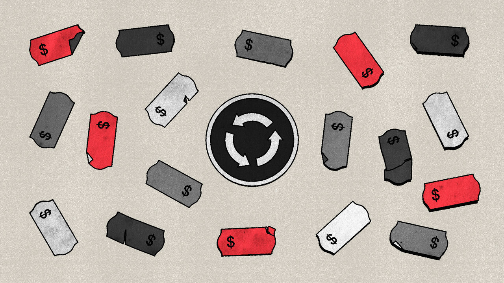

###### Free exchange

# Wage-price spirals are far scarier in theory than in practice 

##### Rising salaries are a poor predictor of future inflation 

 

> Jun 15th 2023 

A wage-price spiral is the stuff of inflationary nightmares. It refers to a situation when prices gallop higher—perhaps because of a sudden shock or policy missteps, or both—and wages race upward to keep pace with them, in turn feeding through to yet more price rises and yet more wage increases, and so on in a vicious circle. It can seem as if the world’s economies have been living this horror: in America hourly earnings rose by about 6% last year, the biggest annual increase in four decades. In Britain wages excluding bonuses are rising at an annual clip of about 7%. On June 14th, when the Federal Reserve elected to leave interest rates unchanged after ten consecutive increases, Jerome Powell, its chairman, warned that he was watching wage trends as one test of whether the central bank might resume raising rates in July. 

But the dangers that appear in nightmares usually bear little resemblance to the threats worth worrying about in reality. The world’s uncomfortable ride with inflation over the past two years seems to point to a similar conclusion about wage-price spirals: they are a caricature of what happens to an economy with an inflation problem.

The historical parallel often trotted out in discussing wage-price spirals is the 1970s. Price and wage inflation seemed to interact throughout that decade, much as the spiral framework suggests. Each surge in general price inflation was followed by a surge in wage inflation, which was followed by more price inflation—and on it went. But the 1970s are flawed as evidence for the existence of spirals. The repeated waves of inflation stemmed more from successive oil-price shocks (in 1973 and 1978) than from prior wage gains. To the extent that wages and prices moved in lockstep, this reflected trade unions’ practice back then of pegging salaries to the cost of living, guaranteeing a ratchet effect. Spirals were a feature of contracts rather than proof of an economic concept.

Late last year a group of economists at the IMF interrogated the historical record, creating a database of wage-price spirals in advanced economies dating back to the 1960s. Applying a fairly low bar—they looked for accelerating consumer prices and rising nominal wages in at least three out of four consecutive quarters—they identified 79 such episodes. But a few quarters of high inflation is not all that scary. A few years is far more frightening. Judged by this longer standard, the IMF economists offered a more upbeat conclusion: the “great majority” (they omitted the exact percentage) of short-term spirals were not followed by a sustained acceleration in wages and prices.

In a note in March, Gadi Barlevy and Luojia Hu, economists with the Fed’s Chicago branch, took a closer look at the role of wages in the current episode of inflation. They focused on “non-housing services”, a category that covers everything from car washes to medical check-ups and which Mr Powell regularly cites as a useful indicator because of its tight association with wages. Mr Barlevy and Ms Hu concluded that wages do help to explain this segment of inflation: nominal wage gains have outstripped productivity growth by a sizeable margin over the past year. Facing that cost squeeze, service providers would naturally want to raise prices.

However, the spiral thesis claims not merely that wages matter, but that they predict future inflationary trends. On this count, the Chicago Fed economists found the relationship unidirectional: inflation helps to forecast changes in labour costs, but changes in labour costs fail to predict inflation. Service providers, in other words, raised prices before rising wage costs hit their bottom line. Mr Barlevy and Ms Hu posit that employers may have been ahead of the curve in anticipating the effects of a tight labour market. That makes wages a lagging, not a leading, indicator for inflation. 

Adam Shapiro, an economist with the San Francisco Fed, has been even more critical of the wage worries. In a note in May, he isolated unexpected changes in wages to argue that rising labour costs were only a small driver of non-housing service inflation and a negligible one in broader inflation. Like his Chicago colleagues, he concluded that wage growth was following inflation. 

None of this means that wage-price spirals are a total myth, which some overeager commentators have written. As the IMF‘s study noted, serious spirals can occur; it is just that they are extremely unusual. Were inflation to stay very high for a long time, people might start to view fast-rising prices as a basic fact of life and incorporate that assumption into their wage demands. It is possible that this process has begun in Britain.

But in America what is striking about the past two years is how relatively moderate inflation expectations have remained, despite price pressures. In a paper last month for the Brookings Institution, a think-tank, Ben Bernanke, a former chairman of the Fed, and Olivier Blanchard, a former chief economist of the IMF, decomposed the drivers of pandemic-era inflation. They concluded that a triumvirate of shocks (commodity-price spikes, strong demand for goods and supply shortages) accounted for most of the inflation overshoot since 2020. There was scant evidence that inflation itself had triggered higher wage demands. Wages shot up simply because demand for workers outstripped supply.

Dreaming spirals

Wages and prices can be driven up by the same force: excessive spending in the economy compounded by shortages of both products and the workers to produce them. Overheated economies are worth worrying about regardless of whether prices and wages are feeding on each other.

For their part, Messrs Bernanke and Blanchard argue that as pandemic shocks fade away, overheated labour markets are likely to contribute more to inflation. To stop that, central bankers need to make sure that the demand for workers cools off. Only if inflation persists once the labour market is back in balance will fear of a self-sustaining spiral be worth losing sleep over. ■


