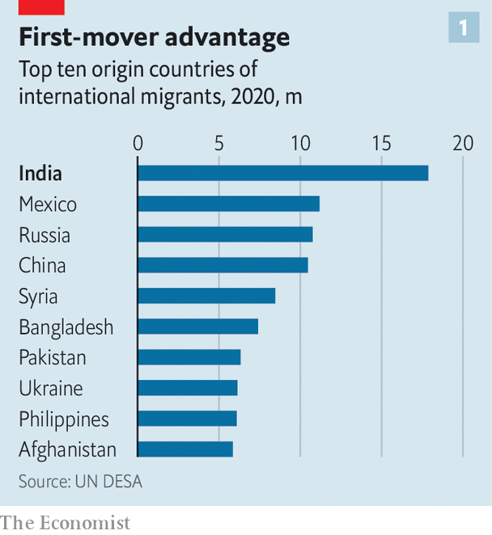

###### Making it as migrants

# India’s diaspora is bigger and more influential than any in history 

##### Adobe, Britain and Chanel are all run by people with Indian roots 

 

> Jun 12th 2023 

HAVING JUST surpassed China as the world’s most populous country, India contains more than 1.4bn people. What’s more, its migrants are both more numerous and more successful than their Chinese peers. The Indian diaspora has been the largest in the world since 2010, and is a powerful resource for India’s government. 

Of the 281m migrants spread around the globe today—generally defined as people who live outside the country where they were born—almost 18m are Indians, according to the latest UN estimates from 2020 (see chart 1). Mexican migrants, who comprise the second-biggest group, number some 11.2m. Chinese abroad come to 10.5m. 

 


Understanding how and why Indians have triumphed abroad, whereas Chinese have tended to sow suspicion, illuminates geopolitical faultlines. Comparing the two groups also reveals the extent of Indian achievement. The diaspora’s wins both promote India’s image and benefit its prime minister, Narendra Modi. 

Migrants have stronger ties to their motherlands than their descendants born abroad, and so build vital links between their adopted homes and their birthplaces. In 2022 India’s inward remittances hit a record of almost $108bn, around 3% of GDP, more than in any other country. And overseas Indians with contacts, language skills and know-how boost cross-border trade and investment.

Huge numbers of second-, third- and fourth-generation Chinese live abroad, notably in South-East Asia, America and Canada. But in many rich countries, including America and Britain, the Indian-born population exceeds the Chinese-born.

 


Indian-born migrants are found across the world (see chart 2), with 2.7m living in , more than 835,000 in Britain, 720,000 in Canada, and 579,000 in Australia. Young Indians flock to the Middle East, where low-skilled construction and hospitality jobs are better paid. There are 3.5m Indian migrants in the United Arab Emirates and 2.5m in Saudi Arabia (where the UN counts Indian citizens as a proxy for the Indian-born population). Many more dwell in Africa and other parts of Asia and the Caribbean.

India has the essential ingredients to be a leading exporter of talent: a mass of young people and first-class higher education. Indians’ mastery of English, a legacy of British colonial rule, probably helps, too. Only 22% of Indian immigrants in America above the age of five say they have no more than a limited command of English, compared with 57% of Chinese immigrants, according to the Migration Policy Institute (mpi), an American think-tank. 

The way things were

Since Indian independence in 1947 there have been several waves of migration to the rich world, enabling the diaspora to grow in number and might. The first, in the years following the second world war, involved low-skilled workers largely from the states of Gujarat and Punjab. A multitude went to Britain, which was facing acute labour shortages. They worked in tough places, such as textile mills and other industrial outfits. Many Indians whose families had moved to eastern Africa in the colonial period as indentured labourers later went west, too. America managed to attract a host of talented individuals by overhauling its immigration laws in 1965. Quotas that barred Indian nationals were out, new rules that favoured highly skilled migrants were in. Australia and Canada then followed suit with batches of similar regulations.

As the Indian diaspora has grown, it has also become more diverse. An increasing number of Indians from poor and marginalised backgrounds are moving abroad. Of Indian-Americans that identify with a caste group, in a 2020 survey published by the Carnegie Endowment for International Peace, a think-tank in Washington, DC, 17% described themselves as lower-caste. Migrants no longer come mainly from Gujarat and Punjab. South Indians are emigrating in droves. The American consulate in the southern city of Hyderabad is the largest outpost that America has in southern Asia. Meanwhile, the fastest-growing language in America is Telugu, which is spoken almost exclusively in the south of India.

Brains on the move

As India’s population expands over the coming decades, its people will continue to move overseas to find lucrative jobs and to escape its ferocious heat. Immigration rules in the rich world filter for graduates who can work in professions with demand for more employees, such as medicine and information technology. In 2022 73% of America’s H-1B visas, which are given to skilled workers in “speciality occupations” such as computer scientists, were won by people born in India. 


Many of India’s best and brightest seem to prepare themselves to migrate. Arvind Subramanian, a former economic adviser to the Indian government, says that they are, in the economic jargon, “highly positively selected migrants”. Consider the findings of a paper soon to be published in the  by Prithwiraj Choudhury of Harvard Business School, Ina Ganguli of the University of Massachusetts Amherst and Patrick Gaule of the University of Bristol. It analysed the results of students who took the highly competitive entrance exams for the Indian Institutes of Technology, the country’s elite engineering schools, in 2010. Eight years later, the researchers found that 36% of the 1,000 best performers had migrated abroad, rising to 62% among the 100 best. Most went to America. 

Another study looked at the top 20% of researchers in artificial intelligence (defined as those who had papers accepted for a competitive conference in 2019). It found that 8% did their first degree in India. But only a tiny number of researchers now work there. 

In America almost 80% of the Indian-born population over school age have at least an undergraduate degree, according to number-crunching by Jeanne Batalova at the mpi. Just 50% of the Chinese-born population and 30% of the total population can say the same. It is a similar story in Australia, where almost two-thirds of the Indian-born population over school age, half the Chinese-born and just one-third of the total population have a bachelor’s or higher degree. Other rich countries do not collect comparable data. But looking at the figures that are available, the same pattern seems to hold almost everywhere.

Joseph Nye, a Harvard professor who coined the term “soft power“ more than three decades ago, notes that such power is not automatically created by the mere presence of a diaspora. “But if you have people in the diaspora who are successful and create a positive image of the country from which they came, that helps their native country.” And, as he adds, “India has a lot of very poor people, but they are not the people coming to the United States.” According to Henley and Partners, a consultancy, more dollar millionaires (about 7,500) emigrated from India last year than from anywhere but China and Russia. 

Indeed Indian migrants are relatively wealthy even in the countries they have moved to. Indians are the highest-earning migrant group in America, with a median household income of almost $150,000 per year. That is double the national average and well ahead of Chinese migrants, with a median household income of over $95,000. In Australia the median household income among Indian migrants is close to $87,000 per year, compared with an average of roughly $62,000 across all households and about $58,000 among the Chinese-born. 


The might of the Indian diaspora is increasingly on display at the pinnacle of business and the apex of government. Devesh Kapur and Aditi Mahesh at Johns Hopkins University totted up the number of people with Indian roots in top jobs, including those born in India and those whose forebears were. They identified 25 chief executives at S&P 500 companies of Indian descent, up from 11 a decade ago. Given the large number of Indian-origin executives in other senior positions at these companies, that figure is almost sure to rise further.

Up at the top

It is only recently that Indians abroad have begun to win such prestigious posts. Meghnad Desai was one of a handful of Indians at American universities when he won a scholarship to the University of Pennsylvania in 1960. He points out that the diaspora wasn’t rich or powerful back then. “I remember people saying: ‘Americans will never have Indians in top positions’,” he recalls. 

In the tech industry, Vinod Khosla, co-founder of Sun Microsystems, a computer-maker, explains that it was difficult for Indian entrepreneurs to raise money in 1980s America. “You were people with a funny accent and a hard-to-pronounce name and you had to pass a higher bar,” he says. Now Adobe, Alphabet, Google’s corporate parent, IBM and Microsoft are all led by people of Indian descent. The deans at three of the five leading business schools, including Harvard Business School, are as well.

The Indian diaspora is also thriving in the world of politics and policy. The Johns Hopkins researchers counted 19 people of Indian heritage in Britain’s House of Commons, including the prime minister, Rishi Sunak. They identified six in the Australian parliament and five in America’s Congress. America’s vice-president, Kamala Harris, was raised by her Tamil Indian mother. And Ajay Banga, born in Pune in western India, was chosen to lead the World Bank last month after running MasterCard for more than a decade. 

The Chinese diaspora is the only other group with comparable influence around the world. An analysis by conducted as the covid-19 pandemic began estimated that more than three-quarters of the total $369bn of billionaire wealth in South-East Asia is controlled by , a Mandarin term for the ethnic Chinese who are citizens of other countries. 

In Europe and across North America the picture is somewhat different. There are fewer bosses of Chinese descent running S&P 500 companies than there are bosses of Indian descent. That may be because many of the most successful business types choose to stay in China, working for Chinese funds and investing in fast-growing Chinese businesses, like Xiaomi, a smartphone-maker, Baidu, an internet-search giant, and ByteDance, the Beijing-based parent company of TikTok, a social-media app crammed with videos. 

Indian rules

Moreover, as America drifts towards a new cold war with China, Westerners increasingly see the country as an enemy. The covid-19 pandemic, which began in the Chinese city of Wuhan, probably made matters worse. Recent scares—the appearance of a Chinese spy-balloon over America in late January, and reports this month that China had reached an agreement with the Cuban government to set up an electronic-eavesdropping station on the island—have further sharpened the image of China as a hostile adversary. In a recent survey of Americans’ attitudes by Gallup, a pollster, 84% of respondents said they viewed China mostly or very unfavourably. On India, only 27% of people asked said they held the same negative views.

This mistrust of China percolates through policy. Huawei, a Chinese telecoms-equipment manufacturer suspected in the past of embargo-busting and of being a conduit for Chinese government spying, has been banned in America. Some European countries are following suit. Stringent reviews of foreign investments in American companies on national-security grounds openly target Chinese money in Silicon Valley. Individuals found to be doing China’s bidding, including one ex-Harvard professor, have been punished. Indian firms do not face such scrutiny. 

 


The Indian government, by contrast, has been—at least until Mr Modi and his Hindu nationalist Bharatiya Janata Party (BJP) took over—filled with people whose view of the world had been at least partly shaped by an education in the West. India’s first prime minister, Jawaharlal Nehru, studied at Cambridge. Mr Modi’s predecessor, Manmohan Singh, went to both Oxford and Cambridge. When Mr Modi took the reins, the central bank was run by Raghuram Rajan, a former IMF official and professor at the University of Chicago.

India’s claims to be a democracy steeped in liberal values help its diaspora integrate more readily in the West. The diaspora in turn then binds India to the West. A stunning example of this came in 2005, when America struck an agreement that, in effect, recognised India as a nuclear power, despite its refusal to sign the Nuclear Non-Proliferation Treaty (along with Pakistan and Israel). Lobbying and fundraising by Indian-Americans helped push the deal through Congress.

The Indian diaspora gets involved in politics back in India, too. Ahead of the 2014 general election, when Mr Modi first swept to power, one estimate suggests more than 8,000 overseas Indians from Britain and America flew to India to join his campaign. Hordes of others used text messages and social media to turn out BJP votes from afar. They contributed unknown sums of money to the campaign. 

It is Mr Modi himself that interests many. When he visited Australia in May the highlight of his trip was a rally for the Indian diaspora held at a 21,000-seat stadium fit for a rock star. In his speech, Mr Modi celebrated Indian-Australians as a “living bridge” between the two countries. Courting the diaspora is likely once again to be at the top of Mr Modi’s agenda during his forthcoming state visit to America. His previous audiences with Indian-Americans include a rally for 18,000 at Madison Square Garden in New York in 2014 and a “Howdy Modi” rally for 50,000 in Houston back in 2019.

Away from any crowds, Joe Biden will play host to talks with Mr Modi on June 22nd. The pair will discuss their countries’ “commitment to a free, open, prosperous and secure Indo-Pacific”, among several other topics. The  may be difficult. Under Mr Modi, India’s ties to the West have been tested. Reasserting its status as a non-aligned power, India has refused to condemn  invasion of Ukraine, and stocked up on cheap Russian oil and fertiliser. India has talked loudly of promoting the interests of developing countries as chair of the G20 forum this year. It is also an important voice in the BRICS grouping, a forum which includes Brazil, Russia, China and South Africa alongside India. The club is considering whether to let Saudi Arabia and Iran join. 

Mutually assured attraction

At home, officials spew reams of nationalist rhetoric that pleases right-wing Hindu hotheads. And liberal freedoms have come under attack. In March Rahul Gandhi, who is the leader of the opposition Congress party, was disqualified from parliament on a spurious defamation charge after an Indian court convicted him of criminal defamation. Meanwhile journalists are harassed and their offices raided by the authorities. 

Mr Nye of Harvard warns that the chauvinist brand of Hindu nationalism Mr Modi is pushing in India puts the country’s reputation at risk. Next year’s elections are likely to see rising religious tensions and a further erosion of democratic norms. “India likes to boast that it is the largest democracy in the world,” Mr Nye says. “To the extent that it doesn’t live up to that, it hurts Indian soft power.”

But overseas Indians help limit the damage and ensure neither India nor the West gives up on the other. Mr Modi knows he cannot afford to lose their support and that forcing hyphenated Indians to pick sides is out of the question. At a time when China and its friends want to face down a world order set by its rivals, it is vital for the West to keep India on-side. Despite its backsliding, it remains invaluable—much like its migrants. ■

