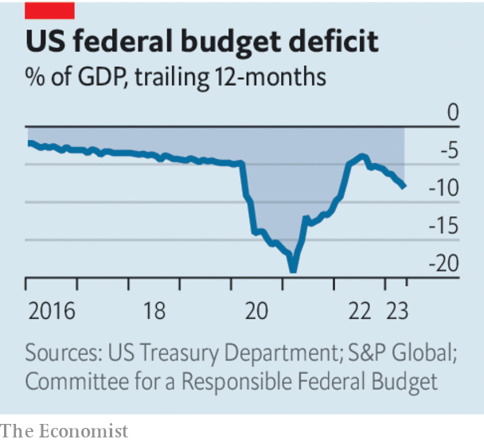

###### Recklessly red

# Fiscal policy in the rich world is mind-bogglingly reckless 

##### High inflation and low unemployment require tighter budgets not looser ones 

 

> Jun 14th 2023 

The dire state of rich-world governments’ budgets would make even the luxury-loving Madame Bovary wince. America has avoided a , but in the year to May the federal government’s revenue fell short of its spending by $2.1trn, or 8.1% of GDP. In the European Union politicians are finding that rising interest rates mean the debts financing much of the bloc’s €800bn ($865bn) in post-pandemic recovery spending threaten to drain the common budget.  government recently omitted from its economic-policy framework a timetable for balancing its primary budget, which excludes interest payments but is still in the red by more than 6% of GDP. And on June 13th Britain’s cost of borrowing for two years rose above the levels reached after its calamitous “” in September.

 


Global fiscal policy does not only look reckless—it is also unsuited to today’s economic circumstances. High inflation and low unemployment mean the world needs tight policy, not loose. On June 14th the Federal Reserve held interest rates steady while it waited for more signals about the health of the economy. But with underlying inflation above 5%, few believe it will stand pat for long. As we published this leader, the  was poised to raise interest rates again. The Bank of England will almost certainly follow on June 22nd; with nominal pay rising at an annual rate of 6.5%, Britain is uniquely exposed to the threat of a . 

Politicians’ failure to get the memo is astonishing. America’s deficit has previously exceeded 6% only in periods of turmoil: during the second world war, after the global financial crisis and, most recently, following covid-19 lockdowns. Today no such disaster makes vast emergency spending necessary. Even the energy crisis in Europe that resulted from Russia’s invasion of Ukraine is in abeyance. The main effect of all this lavish borrowing has been to stimulate economies, forcing interest rates higher than they would otherwise need to go.

 make financial instability more likely. They also affect government budgets. For every one-percentage-point rise in rates, the British government’s debt-service costs rise by 0.5% of GDP within a year. One reason America faces a revenue shortfall is that the Fed’s profits, which flow into the Treasury’s coffers, have turned to losses as the central bank has had to pay more interest on the money it created to buy bonds during the stimulus years. These feedback effects matter. Monetary policy controls inflation only if budgets are prudent, which becomes less likely as interest bills mount.

Yet politicians’ efforts to change course have been paltry. Even after the “Fiscal Responsibility Act”, which lifted America’s debt ceiling and trimmed spending, net public debt is forecast to rise from 98% of GDP today to 115% by 2033. The British government, having planned to tighten its belt last year, now reportedly hopes to cut taxes. The euro zone looks solid enough as a whole but many of its member states are fragile. At the interest rates now priced in—and they could yet rise further—bringing down Italy’s already huge debt-to-GDP ratio at the glacial pace of one point per year over several decades probably requires surpluses before interest payments of 2.4% of GDP.

All the while, pension and health-care systems face the strain of an ageing population; reaching net-zero carbon emissions requires public investments; and defence spending needs to rise to counter the threat posed by autocracies. These demands on the state are not unworthy. But if governments want to satisfy them, they will need to raise taxes to do so—or accept the eventual inflationary consequences. ■

