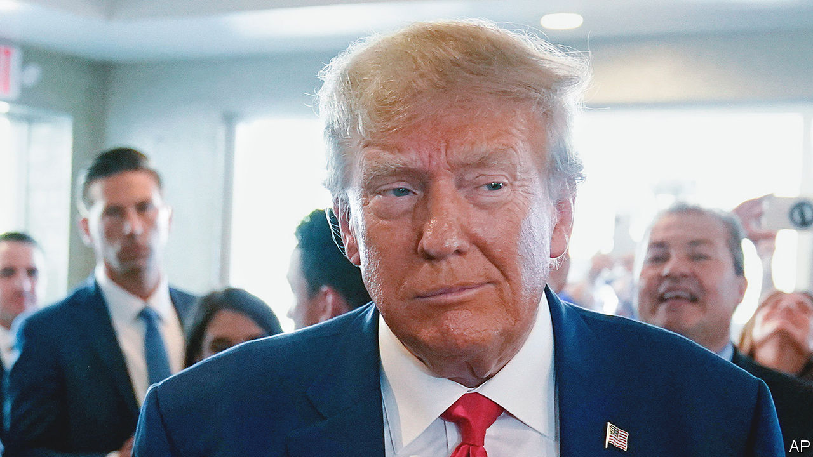

###### Leaders

# The real injustice would have been not to indict Donald Trump 

##### The former president must be subject to due process 

 

> Jun 13th 2023 

THE ARRaIGNMENT of  at a court in Miami on June 13th marks a first in American history. The current president’s administration believes that the previous president endangered national security, by wilfully mishandling classified documents. Even more extraordinary, the defendant is the front-runner in the Republican primary. Thus the 2024 election could turn into a campaign for Mr Trump to .

Such a fight would suit Mr Trump. Before the indictment was even unsealed, his campaign seized on it as a fundraising opportunity. His people lashed out against , Mike Pence and Hillary Clinton. All hung on to classified documents or were reprimanded for carelessness with official secrets. But only Mr Trump has been indicted—proof, they say, that he is the victim of a witch-hunt.

Nonsense. America’s security bureaucracy classifies so many documents that lots of officials and politicians inadvertently end up holding secret files. In practice, they are prosecuted only when the most secret papers are involved; when those who possess them refuse to hand them back or obstruct justice; and when they leave them vulnerable to snoops or share them with others. Mr Trump is alleged to be guilty of all three. 

Some of the documents in his indictment are highly secret. Others are marked “HUMINT”, which means they have been gathered by sources who could be in grave peril if caught. 

Mr Trump’s handling of the documents is worrying, too. Lawyers for Mr Biden and Mr Pence found classified papers and handed them to the Justice Department. Mr Trump left the White House with at least 15 boxes of documents, containing at least 30 top-secret files. These are not in the indictment because Mr Trump’s office returned them. The problem was that even then, Mr Trump hung on to more secret files and told his lawyers to hide or destroy them. “Why don’t you take them with you to your hotel room and if there’s anything really bad in there, like, you know, pluck it out,” he reportedly told one. Earlier this month a retired air force lieutenant-colonel was sentenced to three years in prison for “wilfully retaining” top-secret information. 

Mr Trump’s documents were also vulnerable to being seen or stolen. Mr Biden left classified documents in his garage next to his Corvette—which was both sloppy and on brand. Mrs Clinton’s were kept on a personal email server that she used for work. Mr Trump’s were at Mar-a-Lago—whose several hundred members can take guests for a swim or a club sandwich and fries. According to the indictment, many boxes were in a storage room, which could be reached from the pool through a door that was often open.

Mr Trump is also alleged to have shared documents. His need to brag is so strong that he let a writer, his publisher and two staff members look at what was probably a plan for bombing Iran’s nuclear-enrichment facility at Fordow. “This is secret information,” he is recorded saying. “See, as president I could have declassified it. Now I can’t, you know, but this is still a secret.”

So serious are these allegations that not to have charged Mr Trump would have been to single him out for special treatment. Bill Barr, Mr Trump’s former attorney-general, told Fox News that the indictment is “very, very damning” and concluded that “If even half of it is true, then he’s toast.” 

That Mr Trump could be brought down by vanity, paranoia, chaos and conceitedness seems tragicomically apt. The trial and appeals may well drag on past next year’s presidential vote. If he were elected, that might well spare him a trial until 2029. But if he were convicted, a second-term President Trump could seek to pardon himself. That really would be unfair. ■


