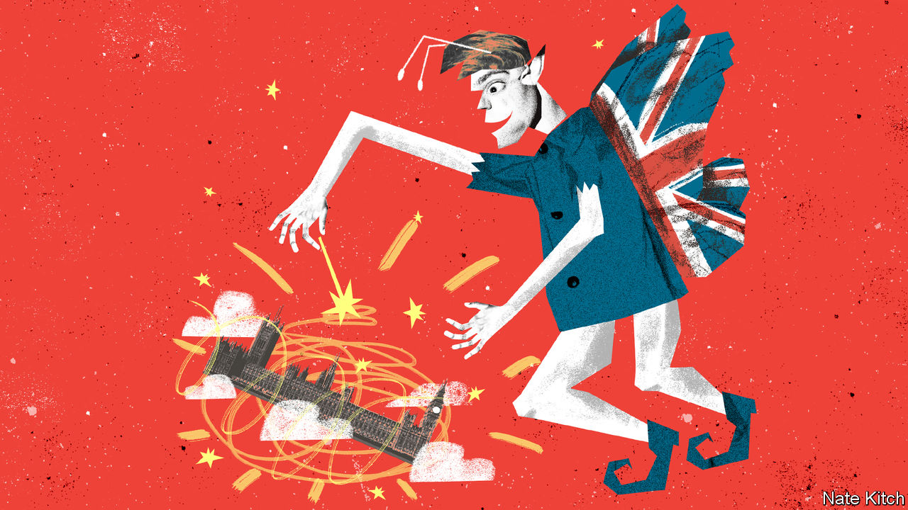
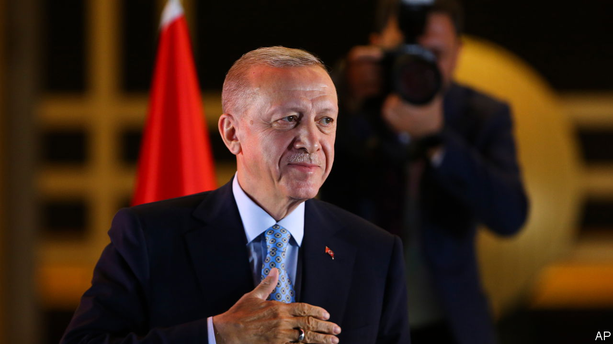

###### On the English language, oil prices, Pakistan, digital payments, productivity, Henry Kissinger, Monty Python, pronouncing Erdogan

# Letters to the editor 

##### A selection of correspondence 

 

> Jun 15th 2023 

The dominance of English

 (May 27th) claimed that Anglophone peoples must accept that the English language no longer belongs to them but to non-native speakers of English. The empirical evidence does not support this claim. Most speakers of English as a second language have an elementary or intermediate knowledge of it that is by no means comparable with that of native speakers. A study for the European Parliament that I co-wrote shows that only 11% of adults of working age in the EU claim to know English very well, far less than the 40% claimed by Johnson.

Native Anglophones hold the “monopoly of legitimate competence”, to paraphrase Max Weber. This is evident in academic journals, where authors are always asked to write in American or British English, and to have their articles proofread by a native speaker in order to avoid rejection. ELF (English as a lingua franca) is not accepted.

The economic and symbolic advantages for native Anglophones are immense, and this raises a problem of global linguistic justice that should be tackled, for example, through a language tax, or by reducing the extent of the legal protection of copyrights and patents published in English. Since native English speakers do not have to learn other people’s languages and thereby make huge savings, it is fair that the rest of the world should freely appropriate some intellectual products published in English.

Michele Gazzola

Lecturer

Ulster University


The entire history of English is that of mergers and acquisitions. As Jorge Luis Borges observed, in English there are two words for every idea: one Saxon and one Latin (credit the Norman conquest in 1066 for the latter). “Dark” versus “obscure”, “regal” v “kingly”, “spirit” v “ghost” were among his favourite examples. Fast forward to William Dalrymple’s chronicle of the East India Company, which notes upfront that “loot” comes from a Hindustani word for plunder. The evolution of English takes the path of least resistance. Expect a few Ukrainian words to be appropriated next.

Yacov Arnopolin


 


Oil-price benchmarks

You summarised the significant work that has been done over the past several years to ensure sufficient physical crude oil will remain deliverable against the Brent benchmark for many years to come (“”, June 3rd). Platts, a part of S&amp;P Global Commodity Insights, has led many such initiatives in Brent since we launched the Dated Brent benchmark in 1987. This includes the introduction of the Forties and Oseberg crude streams in 2002, Ekofisk crude in 2007, Troll crude in 2018 and now Midland crude in 2023. 

We are proud of our role in the evolution of commodity benchmarks so that they remain reflective of the markets we serve. Far from “needlessly raising questions” about benchmark robustness, our forward-looking work on commodity benchmarks has ensured that they have been robust through every cycle in the global economy. 

Saugata Saha

President

S&amp;P Global Commodity Insights


 


Pakistan and Imran Khan

Your leader and article on Pakistan (“”; “”, June 3rd) failed to take the viewpoint of the government. We object to you labelling Pakistan as a “global menace” without providing any substantial evidence to support such a damning claim. Furthermore, the assertion that Imran Khan is under “de facto” house arrest is false. He enjoys unrestricted access to the media and is free to express his views openly. 

The claim that the army orchestrated the vote of no confidence in April 2022 is unfounded. The removal of Mr Khan’s government was carried out through a universally acknowledged constitutional process. Contrary to your speculation, there is no evidence of the army’s involvement in framing the charges Mr Khan faces in the courts.

And comparing Pakistan’s economy to India’s is unfair. You conveniently overlooked Pakistan’s sacrifices as a front-line state in the war on terror, which have had a significant impact on the economy. Political polarisation and instability caused by Mr Khan’s party only worsened the economy.

Attacking state institutions, as was done recently in Pakistan, is widely condemned.  knows this. The perpetrators of violence will be brought to justice by various courts. These include military courts, established in 1952, and their decisions go through multiple layers of appeals to ensure justice is served.

Muneer Ahmad

First secretary (press)

Pakistan High Commission


 


Cash and illegal drugs

Discussions about digital currencies typically remark that cash is in serious decline (, May 20th). That may be true for its legitimate usage, but crooks haven’t stopped using it. America’s horrific drug plague feeds almost exclusively on cash. Cartels extract some $300bn of it each year. Cash to buy pernicious drugs motivates high percentages of robbery, burglary and thefts. 

The assumption that society could rely on cash should payment systems fail is as unrealistic as relying on horses should petrol supplies fail. Digital-payment reliability has a stellar history. Smartphones that span disaster areas are the future and an incomparably superior solution.

Dismayingly, a retrograde movement has gained foothold in America and parts of Europe that characterizes cash as a “public good” and proselytises that it is “in the public interest” to force banks to maintain currency availability and retailers to accept it. Protagonists have an ambitious plan to keep bills and coins as a permanent alternative to digital monies.

David Warwick


 


The Productivity Genie

Congratulations to Bagehot for calling out British politicians who fall under the spell of the “” (June 3rd). Perhaps Bagehot could turn his attention to the Productivity Genie. Both Conservative and Labour politicians firmly believe that productivity will lift economic growth and tax revenues, thereby reducing the need to choose between higher taxes or reduced public services. Alas some of your writers seem to believe in this genie too. I have lost count of the number of “this time it is different” stories on the latest innovation that will lift economic growth. But it always ends the same way. 

Productivity may rise, but output doesn’t. Instead the gains go to more low-productivity activities, like health care, or a reduced workforce, or early retirement, or more messing about (surfing social media). 

Matthew Green


 


Kissinger on Ukraine

I find Henry Kissinger’s view that the West provoked Russia’s aggression in Ukraine to be preposterous (“”, May 20th). The reality is that the West became less confrontational after the fall of the Soviet Union, which was an unalloyed good. Most European countries reduced the size of their armed forces and defence budgets. America was preoccupied by other regions and reduced its military presence in Europe. Ukraine gave up its nuclear weapons. The withdrawal of America from Afghanistan reduced the presence of Western arms in areas close to Russia. Europe tied itself closer to Russia through its natural gas. Russian external savings washed through the European financial system. 

Given these facts, Vladimir Putin took the decision to invade Ukraine because he thought he could get away with it, rather than any provocation by the West.

Lars Schonander


Mr Kissinger is “reviled by many as a warmonger for his part in the Vietnam war” you say. That includes his illegal and secret bombing campaign in Cambodia that killed tens of thousands of civilians. An action that helped sow the seeds of the Cambodian genocide, as it drove Cambodians into the arms of Khmer Rouge. 

Rather than sitting down with Mr Kissinger to hear him pontificate on matters of diplomacy, perhaps  could have asked him whether he felt guilty celebrating his 100th birthday, when many of the Cambodian victims of his statesmanship died very young.

Thomas Pratt


Always look on the bright side of life

After mentioning a hyperactive American industrial policy, robust export controls, onshoring of critical supply chains, de-risking from China, a diplomatic commitment to rebuild America’s leadership, unwavering military support for Ukraine and a mission to strengthen democracy around the world, you then ask, what is so bold about America’s leadership (“”, May 20th)? It reminded me of the scene in Monty Python’s “Life of Brian”: what have the Romans ever done for us? 

Ingo Steinhaeuser

, 

 


Phonetic victory

The word plays in your headlines are often witty. However, the title of your leader on the Turkish president’s re-election, “Erdogain” (), fell flat. The pronunciation of Erdogan is not Er-do-ghan but rather Er-do-wan. Er-do-won may have been more appropriate, or perhaps Er-do-wane, given his rather meagre majority vote and the state of the Turkish economy.

Jem Eskenazi


