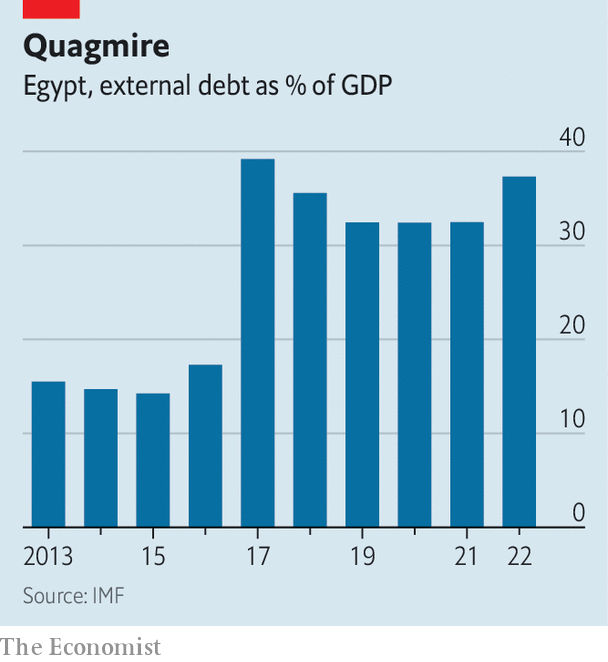

###### Ten hard years

# Egyptians are disgruntled with President Abdel-Fattah al-Sisi 

##### But they are scared of the chaos another uprising would bring 

 

> Jun 15th 2023 

He promised so much. He built a new capital. He cut the Suez Canal through the Sinai desert. He spanned his kingdom with railways and bridges. But  pursuit of modernisation bankrupted Egypt. First he had to sell his prized palaces. Then his stake in the canal went too. Finally Egypt lost its sovereignty altogether. All that remains of the grand palace in the old city of Cairo where he was born in 1830 are mounds of rubble hiding stray dogs and youngsters injecting drugs.

Today’s Egyptians fear they may be reliving the sad tale of a dictator with a similar . , a field-marshal who took over in a coup ten years ago next month, once declared he would create “a new republic”. He has built a second Suez Canal parallel to the first, as well as two dozen , railways costing $23bn, hundreds of bridges and a shiny new capital on Cairo’s outskirts with a price tag of $58bn. Though Africa’s tallest building is nearly finished, Mr Sisi has been driving the economy into the ground. Debt servicing consumes over half the budget. Food inflation is running at 60%. “We can’t eat bridges,” curses a retired bank manager whose family, like many in the middle class, is sliding towards poverty.

To give him his due, Mr Sisi has fulfilled much of what he promised. He rescued Egypt from the turbulence of the Arab spring, when his people narrowly elected an Islamist whose reign of barely a year was marked by chaos and incompetence. Mr Sisi has also hauled Egypt out of the 30 years of sclerosis under a previous military leader, Hosni Mubarak, and has frenetically tackled the country’s decayed infrastructure. He has opened the first stage of a high-speed railway that is set to run from the Mediterranean to the Red Sea. A billboard on the airport road proclaims: “4,800km of highway”. 

He has made the country function better in other respects, too, despite the rise in population by nearly 3m a year: it now tops 106m. Traffic jams are less frequent. Digital government services are speeding up applications that used to be tangled in red tape and long queues. Waiting lists at state-run hospitals have fallen, officials say.

Mr Sisi has bucked some bad old traditions. For instance he has junked regulations that restrict church repairs: Coptic cupolas are rising above small towns in the Nile delta. The genital mutilation of infant girls is falling because of tougher penalties. And though he is deeply religious, Mr Sisi has backed reforms of Koranic prescriptions that would give women half a man’s share of inheritance. More women are dropping the once common , the full-face veil; many are removing the veil entirely. Thanks to phone apps in big cities, “Ana nazil date (I’m off on a date)“ is a trendy new expression. 

 


The costs, though, are hard to bear. Under Mr Sisi external debt as a proportion of GDP has more than doubled (see chart ). Dwindling business confidence has triggered capital flight. Foreign investors withdrew $20bn in the first nine months of. Under Mr Sisi the Egyptian pound has lost five-sixths of its value against the dollar; it has halved in the past year. In a country that imports many essentials, inflation is soaring. The cost of antidepressants has doubled since April.

Hard currency is so scanty that last month Egypt had to defer payment for wheat. Large debt repayments are pending, shrinking the dismal share of the budget that is devoted to education and health. By some calculations more than half of Egyptians can be deemed to be poor. Police in starched uniforms ask for (bribes). Judges tend to obey the ruler.

While billboards display happy homes in Mr Sisi’s sparkling new cities, Egyptians are becoming more disgruntled—and outspoken. Mr Sisi cannot jail all the people all the time: at least 60,000 are thought to be for political reasons. His campaign for a third term has already begun in the provinces. But his unpopularity is everywhere palpable. “He controls everything,” says a Cairene father of five. “So why can’t he control prices?”

Some say that if Gamal Mubarak, a son of the late president ousted in 2011, were allowed to stand against him, Mr Sisi would lose. Others quietly promote the virtues of Hazem Abu Ismail, an Islamist who is in prison. Football fans half-seriously suggest Mo Salah, a clean-living star who plays for Liverpool. Even the 71-year-old Ahmed Fouad, the son of the late King Farouk who resides in Switzerland and speaks broken Arabic, is occasionally mentioned. 

The anger is also aimed at the army, the state’s backbone since the monarchy’s fall in 1952. Army engineers claim to be more public-spirited, less corrupt, more efficient and cheaper than their counterparts in the private sector. Their access to conscript labour, after all, gives them a competitive edge. But the generals who have replaced technocrats to run key state enterprises have been an avaricious bunch. A study by Yezid Sayigh of the Carnegie Centre in Beirut found that the armed forces have been expanding their economic and commercial activities. “They’re seen as serving themselves, not the country,” says a journalist, echoing a standard view.

Last month, after trailing the idea for nearly a year, Mr Sisi launched a “national dialogue”, an old trick. In theory he ponders suggestions from the people. Handpicked participants, excluding bodies like the Muslim Brotherhood, which in 2012 won the last free election, have a few minutes to speak. It is plainly a charade.

Meanwhile would-be investors, donors and the IMF are losing patience. Last year the fund was assured that 32 companies owned by the army would soon be privatised. It has yet to happen. “We have to protect jobs for Egyptians,” explains a loyalist. “The army is a Frankenstein,” says a seasoned foreign observer. “It won’t give up its economic control.” 

Islamist desires for revenge may still lurk. “This president killed our president,” says the suffering bank manager, referring to Muhammad al-Morsi, the overthrown Islamist president who died in prison in 2019. A liberal group has drafted a manifesto, “The last of the generals”, proposing a transition back to civilian rule. But most Egyptians are wary of the chaos that followed the uprisings of 2011 and 2013.

Mistrusting his own generals, Mr Sisi regularly rotates their jobs. He may want to curb the ambition of Mahmoud Hegazy, a former head of intelligence who is his son’s father-in-law. The president is thought to sleep in a different place every night. After all, he has enough fine houses to choose from.

Egypt has often looked for economic salvation to the Gulf, which is estimated to have extended almost $100bn in soft loans, grants and cheap fuel since he took power. But of late the sheikhs have despaired. In the past few years they have sent little, says a Western diplomat. Instead of bail-outs, they talk of acquisitions. Khedive Ismail’s charming Gezira Palace in Cairo may be back on the market. It is whispered that for a trillion dollars or so Egypt may even have to offer a 99-year lease of the Suez Canal. ■

