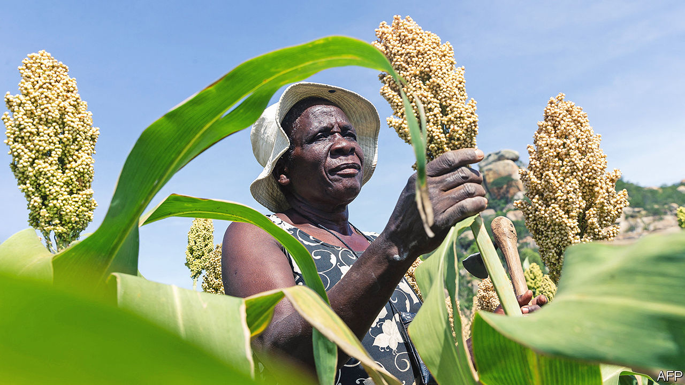

###### Pastures new

# Rural Africans are finding work beyond their farms 

##### Land pressure and markets are transforming the countryside 

 

> Jun 15th 2023 

To understand the changing economics of the African countryside, talk to Jovelence Kemizano. Her banana garden slopes into a bucolic valley in Bushenyi, western Uganda. It is too small to feed her family. So when planting time comes, she works for wages in another’s field, until she has earned enough to rent an extra plot of her own for the season ahead.

The forces of supply and demand are against her. Rents in her village are rising, because each year there are more people on the same amount of land. She cannot bargain for better pay, as there is always someone else willing to dig in her place. This season she has earned too little to rent a plot. She will work as a casual labourer throughout, buying a kilo of maize flour with her daily wage.

Outsiders often view the African countryside as a sea of self-sufficient peasant farmers, who grow what they eat and eat what they grow. But that romantic picture is long outdated. Rural workers have to hustle and take paid work. Much of their time is spent trading goods or running small shops. This unfolding transformation is driven by both poverty and relative prosperity, existing side by side. Scholars call it the deepening of rural capitalism.

Africa is at an earlier stage of this transition than Asia or Latin America. Nearly all rural Africans still till some land of their own, which often remains their chief source of income. Half of them can be considered farming specialists, in that they earn more than three-quarters of their income from their fields. But household surveys show that people spend just two-fifths of their working time farming their plots. A quarter is spent processing, transporting and selling farm produce.

Most of their remaining time goes on small and informal activities such as artisanal mining, making charcoal, brewing beer and driving motorbike taxis. This is to earn cash to pay hospital bills and school fees, as well as to buy foods that they cannot grow themselves. In a swampy hollow near Ms Kemizano’s home in Bushenyi a dozen young men press clay into bricks, which they bake in kilns. “We don’t have enough land for farming,” says Richard Baguma, his palms grey with earth.

The quickening of commerce is also creating opportunities. Traders in Bushenyi buy jerry cans of mudfish and transport them along a chain that stretches across Lake Victoria to Tanzania, where fishermen prize them as bait. A local women’s group is making cooking pots. Gordon Ahimbisibwe rides door-to-door on his motorbike, buying coffee beans which he sells to an exporter. He has reinvested the profits in a shop, a lawn-mowing business and a machine for milling maize, as well as snapping up several plots of land.

In places the bustle of trade is boosting demand for local goods and services. Thriving wholesalers and truckers are connecting farms to urban markets. Indeed, workers are leaving their fields at a faster rate in those areas where land is bountiful, because there is more money swilling around to create jobs. “Productive agriculture sheds labour,” says Felix Kwame Yeboah of Michigan State University. 

Class distinctions are thus becoming sharper, as those with land and capital hire the labour of others. The World Bank’s household surveys typically find that wage work in rural Africa is rare. But that may reflect biases in the way that questions are asked, argues Bernd Mueller of the International Labour Organisation. Respondents often conflate the concept of employment with formal salaried work only. And local terms for casual labour, such as the Swahili word , which has its origins in the hiring of slaves, come with stigma attached. When Mr Mueller conducted his own survey in north-east Tanzania he found that 60% of households had members engaged in wage labour, far higher than conventionally estimated.

Where people come from or their gender often determines what work they can get. The expansion of cash crops, such as groundnuts in Senegal and flowers in Ethiopia, pulls in migrant workers from afar, notes Carlos Oya of the School of Oriental and African Studies. Women face particular barriers in patriarchal cultures where they are expected to work within the household. Those who take on paid work are often widowed or divorced.

Workers are improvising new livelihoods almost everywhere. In Zimbabwe the acquisition of land by white settlers created a class of black workers, many from abroad, employed on commercial farms. That system was upended by Robert Mugabe’s land-grabs and the economic collapse they caused. Former farmworkers now eke out a precarious living, by mixing small-scale farming, temporary wage work and informal enterprise, says Toendepi Shonhe of the University of South Africa. In that regard, Zimbabwe increasingly resembles other parts of Africa.

The idea of the subsistence farmer isolated from markets is a myth. Surveys of rural households in southern and east Africa find that they purchase more than 40% of their food, rather than growing it themselves. Uganda’s President Yoweri Museveni tours the countryside exhorting villagers to “join the money economy”. He is wasting his breath. The money economy is coming, whether they wish it or not. ■

