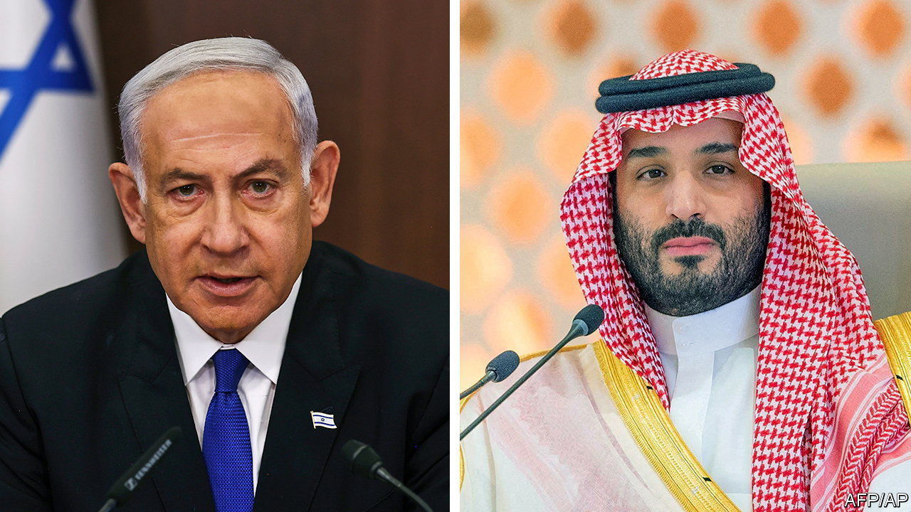

###### Breaking a taboo

# Saudi Arabia may accept normal relations with Israel 

##### Binyamin Netanyahu may be getting close to a historic deal 

 

> Jun 15th 2023 

FOR YEARS Israel and Saudi Arabia have been partners in all but name. The leaders of the two countries confer in secret, share a rival in Iran, plan joint telecoms infrastructure, do quiet business deals and are members of American-led defence alliances. But while five  already have agreed to full diplomatic relations with Israel, it has not been that simple for the Saudi kings to break 75 years of taboo against “normalisation” with the oft-reviled Jewish state. 

The Saudis’ conservative 87-year-old king, Salman bin Abdelaziz, has been loth to make any public overture to Israel while the Palestinian people remain stateless. The Saudis have long backed the Arab Peace Initiative of 2002, which stipulates that normalisation can come only after Israel vacates the territories it conquered in the war of 1967 and allows a Palestinian state there to be born. 

No progress has been made on the Palestinian front since the initiative was first published, so some Arab countries have stopped waiting. In 2020 Bahrain and the United Arab Emirates (UAE) agreed to establish formal ties with Israel, a step they are unlikely to have taken without tacit Saudi support. A flurry of diplomatic activity between the Saudis, Israelis and Americans suggests that the kingdom may be ready to come out into the open, too. 

“We believe that normalisation is in the interest of the region, that it would bring significant benefits to all,” said the Saudi foreign minister, Faisal bin Farhan, in June. It is the closest that the Saudis have come to acknowledging in public their desire to have formal relations with Israel. 

The main reason is a change in President Joe Biden’s attitude to the Saudis. In 2019, before coming to office, he said he intended to treat them as “the pariah that they are”. This was in the wake of the murder and dismemberment of a Saudi columnist for the , , by agents presumed to be working for the kingdom’s crown prince and de facto ruler, Muhammad bin Salman. 

Mr Biden has his stance for fear that America’s standing in the Middle East is eroding. Since Russia invaded Ukraine, he has failed to get the region’s oil-producers to agree to an energy policy that would help Western countries ride out the shortages caused by their cutting links with Russia. This year China also stole a march on America by mediating an agreement between the Saudis and Iran to resume diplomatic relations with each other.

Achieving an Israeli-Saudi deal is part of America’s wider strategy to renew and enhance its alliance with the Saudis, while once again seeking an agreement with Iran to limit its nuclear programme in return for economic-sanctions relief. Midwifing improved relations between Israel and the Saudis would serve a dual purpose. 

Binyamin Netanyahu makes no secret of his desire to be the Israeli prime minister who signs a treaty with one of the Arab world’s chief powers. Such a feat might soften his opposition to an American deal with Iran, which could soon be able to build nuclear bombs. Mr Netanyahu is revered by many Republicans in America, so having him on board would help Mr Biden sell an agreement with Iran to his foes at home. With America’s presidential election only a year and a half away, he would present it as a major foreign-policy coup.

Obstacles remain, however. The crown prince, known as MBS, has a long list of demands, including the supply of advanced weapons systems, American support for a civilian nuclear programme and a strategic defence treaty beefed up by assurances the Americans are reluctant to grant. Were these demands to be at least partially met, the Palestinian issue would nonetheless fester. Israel would have to make some kind of concession over it, even one amounting to little more than lip-service, to appease the Saudis. ■

