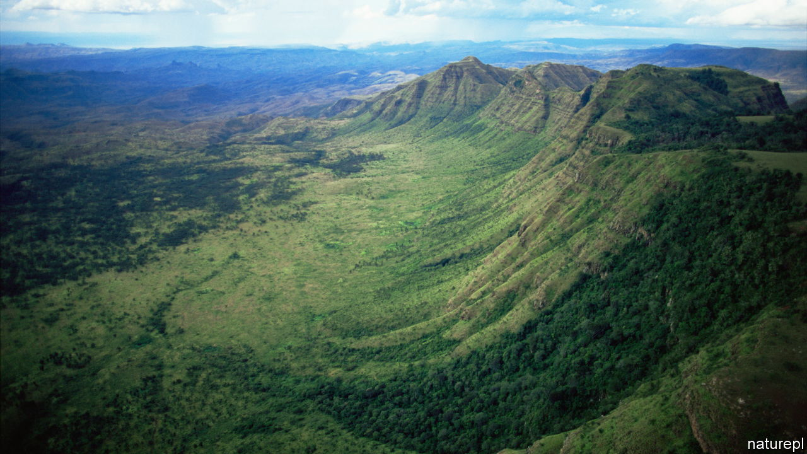

###### The Great Carbon Valley

# Why Kenya could take the lead in carbon removal 

##### Geothermal energy and cheap talent offer comparative advantage 

 

> Jun 15th 2023 

East Africa’s Rift Valley, which runs for thousands of kilometres from the Red Sea to Mozambique, provides a unique window into the evolutionary history of humanity. The shifting of tectonic plates that formed its deep lakes and sheltered canyons created conditions that first nurtured the ancestors of modern humans and then preserved their bones. Those geological forces may also push open a door to the future by making it possible to capture and store global-warming carbon dioxide cheaply from the air. 

That, at least, is the hope of James Irungu Mwangi, a Kenyan environmentalist and development expert, who talks of the opportunity that could be afforded by what he calls “the Great Carbon Valley”. The rift, he argues, has the key attributes that make it attractive for “direct air capture” (DAC) stations to suck carbon dioxide from the air: renewable-energy potential and the right geology for storing carbon. 

DAC plants need huge amounts of energy. Some of this is in the form of electricity, which is used to run fans blowing air through or over chemicals that absorb carbon dioxide. Much more energy is then needed in the form of heat to make these chemicals belch the gas, which is then compressed for use or storage. 

Because the earth’s crust is thinner than usual along the rift, it has vast geothermal potential. The American government reckons Kenya alone could generate 10,000MW of geothermal power, more than ten times the amount it currently produces. A by-product of such power stations is plenty of waste steam, which can then be used to heat DAC machines. Moreover, since close to 90% of Kenya’s power is renewable, the electricity these machines consume does not contribute to more global warming.

Capturing carbon dioxide is just part of the process. Next it has to be safely locked away. The rift’s geology is particularly good for this, too. It has bands of porous basalt (a volcanic rock) that stretch across thousands of square kilometres. This makes the region “ideal” for carbon capture and storage, according to a paper published in 2021 by George Otieno Okoko and Lydia Olaka, both of the University of Nairobi. After carbon dioxide has been sucked from the air it is dissolved in water (in the same way one would make sparkling water). This slightly acidic and bubbly liquid is then injected into the rock. There it reacts with the basalt to form carbon-rich minerals—in essence, rocks—which means the gas will not leak back into the atmosphere. 

A similar combination of geothermal energy and volcanic rock has already attracted companies elsewhere. Climeworks, a Swiss firm, opened the world’s biggest DAC plant in Iceland in 2021. It can remove some 4,000 tonnes of carbon dioxide a year from the atmosphere at a cost of $600-800 a tonne.

Martin Freimüller, the founder of Octavia Carbon, a Kenyan startup, is working to build the world’s second-biggest DAC plant in the Rift Valley. He hopes it will be able to sequester carbon dioxide far more cheaply than Climeworks can, in part thanks to cheap renewable electricity and geothermal steam, and in part because hiring skilled engineers and chemists costs less in Kenya than in the rich world.

Octavia’s pilot plant, scheduled for completion next year, is forecast to have costs of well below $500 a tonne. Mr Freimüller aims to cut this to below $100 within five years. That is far cheaper than industry-wide forecasts of $300-400 by BCG, a consulting firm. As this new market matures, nascent firms and technologies will have to evolve quickly, or die out. ■

